## 개요
이번 글은 기능경기대회 사이버보안 직종을 공부하며,<br>
DHCP에 대해서 정리한 글이다!<br>
재밋게 봐주길 바란다!

## DHCP란?
우리는 네트워크 토폴로지를 구성하면서, 항상 하는것이 있다!<br>
그것은 바로 기기의 `아이피 설정이다!` 특히, PC의 아이피를 설정할땐<br>
`아이피, 서브넷마스크, 게이트웨이, DNS 주소를` 모두 설정해야하기에,<br>
넘무 넘무 귀찮다. 그렇기에 바로 `DHCP가` 존재하게 되는거시다!!

DHCP란 `Dynamic Host Configuration Protocol` 의 줄인말로<br>
PC를 키면 설정한대로 `아이피가 자동으로 할당되는 프로토콜을` 말한다!

## DHCP 설정 (L3 장비를 이용한 설정)
DHCP를 사용하기 위해선, 여러가지 방법이 존재한다!<br>
처음으로 `L3 장비를 이용한 DHCP 설정에` 대해서 알아보도록 하자!

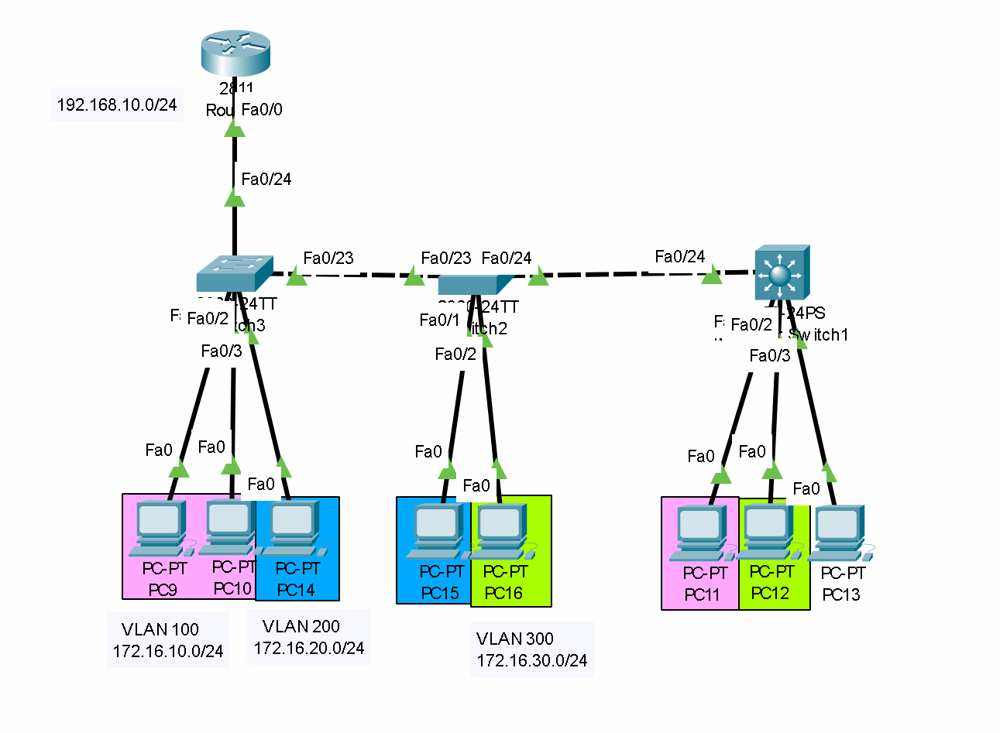
일단 실습을 위해 위와 동일하게 토폴로지를 세팅하고, <br>
`VLAN, 트렁킹까지 모두 해준후,` 따라오길 바란다!<br>
(`핑크색은` VLAN 100, `파란색은` VLAN 200, `초록색은` VLAN 300)

이제 DHCP 설정을 하기 위해선,<br>
L3장비인 라우터에서 `직접 아이피 할당을 해주도록 설정 할 수 있다!`<br>
아래는 관련 명령어이다!
```network
Router> enable
Router# configure terminal
Router(config)# ip dhcp excluded-address 192.168.10.1
Router(config)# ip dhcp excluded-address 172.16.10.1
Router(config)# ip dhcp excluded-address 172.16.20.1
Router(config)# ip dhcp excluded-address 172.16.30.1

Router(config)# ip dhcp pool main
Router(dhcp-config)# network 192.168.10.0 255.255.255.0
Router(dhcp-config)# default-router 192.168.10.1
Router(dhcp-config)# dns-server 8.8.8.8

Router(config)# ip dhcp pool vlan100
Router(dhcp-config)# network 172.16.10.0 255.255.255.0
Router(dhcp-config)# default-router 172.16.10.1
Router(dhcp-config)# dns-server 8.8.8.8

Router(config)# ip dhcp pool vlan200
Router(dhcp-config)# network 172.16.20.0 255.255.255.0
Router(dhcp-config)# default-router 172.16.20.1
Router(dhcp-config)# dns-server 8.8.8.8

Router(config)# ip dhcp pool vlan300
Router(dhcp-config)# network 172.16.30.0 255.255.255.0
Router(dhcp-config)# default-router 172.16.30.1
Router(dhcp-config)# dns-server 8.8.8.8
```
이제 명령어를 해석해보도록하자!

일단 `ip dhcp excluded-address 아이피`<br>
명령어를 통해 dhcp를 통해 `할당되지 않을 아이피를 설정할 수 있다!`<br>
기본적으로 이 명령어는 `게이트웨이 주소가 나오지 않게 하기 위해` 사용된다!<br>
위 명령어를 통해 게이트웨이가 못나오도록 만들어줬으면,<br>
이후에는 `ip dhcp pool 이름`을 통해 dhcp의 아이피 할당 규칙을 생성할 수 있다!<br>
생성한 이후엔, `network 아이피 서브넷`을 통해 생성할 아이피의 범위를 지정해주고,<br>
`default-router 아이피`를 통해 생성될 게이트웨이를 지정,<br>
`dns-server 아이피`를 통해 dns서버를 지정해줄수 있는것이다!

이제 게이트웨이 블록킹과 아이피 범위, 기본 게이트웨이, DNS 주소를<br>
`기본 아이피 대역, VLAN 대역에 모두 설정해주면` DHCP 설정이 끝나게된다!

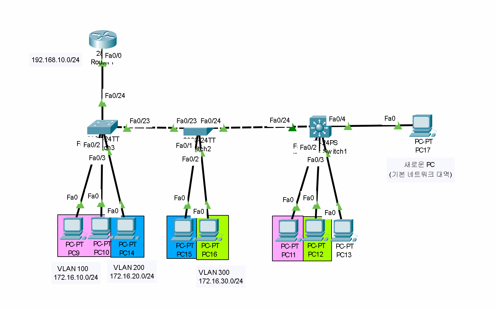

이제 새로운 PC를 올려서 케이블에 연결한후,<br>
아이피를 DHCP로 설정하면 `물리적 네트워크 대역인 192.168.10.0/24의`<br>
남는 아이피가 나오는걸 알 수 있다!

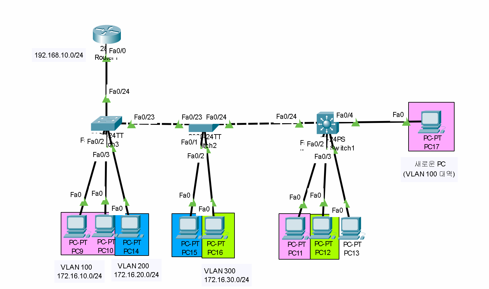
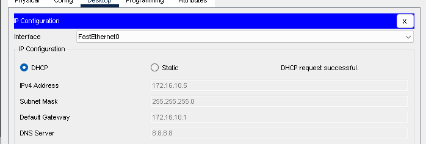
이제 연결했던 PC를 다시 없에고,<br>
새로운 PC를 올려서 케이블에 연결한후,<br>
아이피를 할당하기전 `PC의 인터페이스인 fa0/4를 VLAN을 100으로 설정하고,`<br>
아이피를 DHCP로 설정하면 `VLAN 100의 네트워크 대역인 172.16.10.0/24의`<br>
남는 아이피가 나오는걸 알 수 있다!

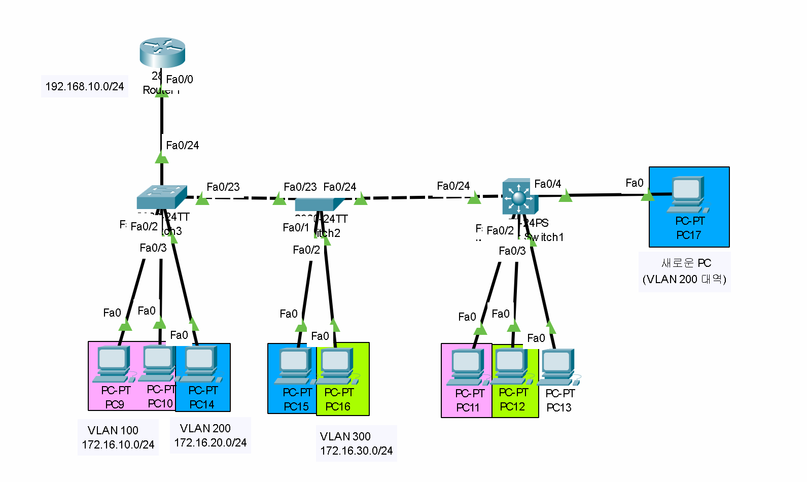
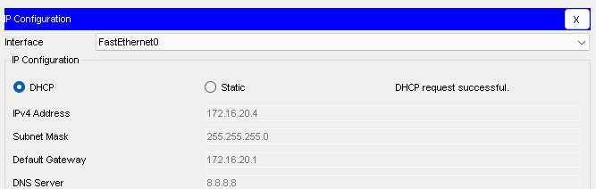
이후 또 다시 연결했던 PC를 다시 없에고,<br>
새로운 PC를 올려서 케이블에 연결한후,<br>
아이피를 할당하기전 `PC의 인터페이스인 fa0/4를 VLAN을 200으로 설정하고,`<br>
아이피를 DHCP로 설정하면 `VLAN 100의 네트워크 대역인 172.16.20.0/24의`<br>
남는 아이피가 나오는걸 알 수 있었다!

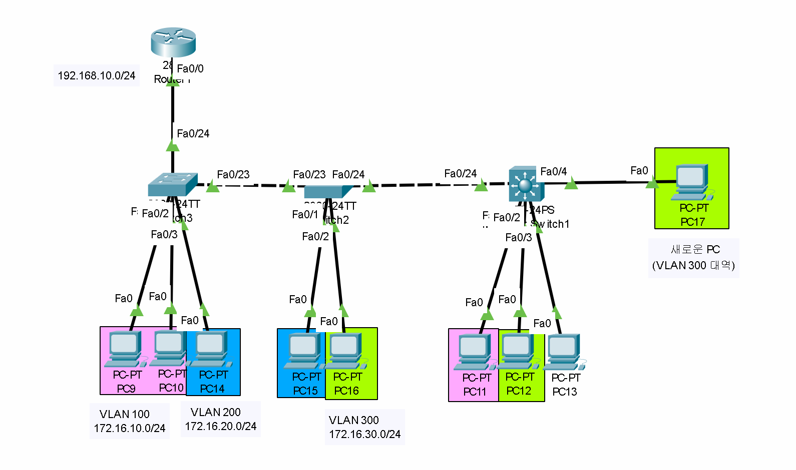
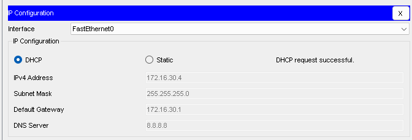
이제 또 다시 연결했던 PC를 다시 없에고,<br>
새로운 PC를 올려서 케이블에 연결한후,<br>
아이피를 할당하기전 `PC의 인터페이스인 fa0/4를 VLAN을 300으로 설정하고,`<br>
아이피를 DHCP로 설정하면 `VLAN 100의 네트워크 대역인 172.16.30.0/24의`<br>
남는 아이피가 나오는걸 통해 모든 DHCP가 잘 작동하는걸 알 수 있었다!

이제 간단히 위에 DHCP의 흐름을 정리해보도록 하자!

일단, 기본적으로 PC가 DHCP 요청을 보내기전<br>
즉, 케이블을 연결하며 테스트하기 전에<br>
이미 VLAN들과 물리 네트워크의 게이트웨이와,<br>
DHCP 설정들이 `이미 라우터에 정의되어있는 상황이었다!`

이후 PC에 케이블을 연결해 `DHCP 옵션을 키게되면,`<br>
그 즉시 `PC는 라우터에게 DHCP 요청을 보내게된다!`<br>
또한 여기서 만약 PC가 VLAN에 소속되어있다면,<br>
`VLAN을 식별할 수 있는 헤더가 딸려서` 같이 보내지는것이다!

이후, 라우터가 요청을 받으면, 헤더를 통해<br>
현재 VLAN이 무엇인지를 확인한후,<br>
그 `VLAN의 게이트웨이의 대역을 확인해서` 동일한 대역대의 `DHCP 설정을 찾게된다!`<br>
이후 설정을 찾으면 IP 주소를 다시 `PC에게 보내줌으로써 아이피가 할당되는것이다!`

## DHCP 설정 (서버를 이용한 설정)<br>
앞서, DHCP를 사용하기 위해선, 여러가지 방법이 존재한다고 했었다!<br>
이제 그 두번째인 서버를 이용한 DHCP 설정에 대해서 알아보도록 하자!

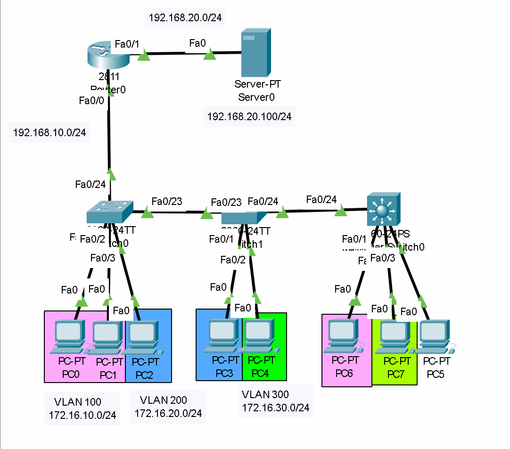
일단 실습을 위해 위와 동일하게 토폴로지를 세팅하고, <br>
`VLAN, 트렁킹까지 모두 해준후,` 따라오길 바란다!<br>
(`핑크색은` VLAN 100, `파란색은` VLAN 200, `초록색은` VLAN 300)<br>
(`라우터 기준 fa0/0는` 192.168.10.0/24 대역)<br>
(`라우터 기준 fa0/1은` 192.168.20.0/24 대역, `서버 아이피는` 192.168.20.100)

이제 모든 트렁킹, VLAN 설정이 끝났으면,<br>
서버를 클릭해 `"Service"` 탭을 누른후, `DHCP 탭에` 들어가보도록 하자!

이제 DHCP 탭에 들어가보면 아래와 같이 뜨는걸 알 수 있다!

이제 이 탭에서 설정할 `게이트웨이, 할당해줄 IP 범위, DNS 서버, 서브넷 마스크`<br>
등을 설정할수 있는걸 알 수 있다!

이제 아래는 모든 DHCP에 관한 설정이다!
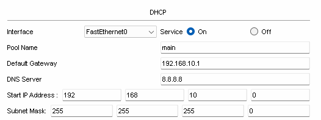
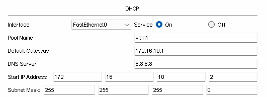
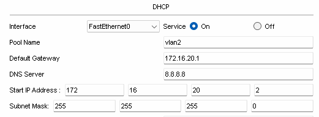
이제 DHCP 설정을 해석해보도록 하자!<br>
(설명은 main을 기준으로 하도록 하겠다)<br>
일단 `Pool name 칸은` 라우터의 DHCP 설정에서 `ip dhcp pool main` 명령어의<br>
`"main"` 부분이라고 생각하면 되며, `DHCP 설정의 이름을 뜻한다! `<br>
그렇기에 스샷도 그대로 main을 사용하였다!

또한 `default gateway 칸은` 라우터의 DHCP 설정에서<br>
`default-router 192.168.10.1` 명령어와 동일하다고 생각하면 되며,<br>
`DHCP에서 받아올 게이트웨이 주소를 뜻한다!`<br>
그렇기에 스샷도 192.168.10.1를 그대로 사용하였다!

그리고 `dns server 칸은` 라우터의 DHCP 설정에서<br>
`dns-server 8.8.8.8` 명령어와 동일하며,<br>
받아올 dns 주소를 뜻하기에 그대로 8.8.8.8을 사용하였다!

또한 `Start IP Address와 Subnet Mask칸에` 대해서 알아보자면,<br>
Start IP Address에서 `지정된 아이피부터` 시작해서,<br>
`브로드캐스트 주소 바로 전까지의` 주소 범위를 지정하는 칸으로,

현재 토폴로지에 `라우터 물리 인터페이스의 주소`<br>
즉, 게이트웨이 주소를 `192.168.10.1로` 지정해주었기에,<br>
그 주소 바로 뒷 주소 즉, `192.168.10.2 부터`<br>
`브로드 캐스트 주소 바로 전까지` 지정을 해주기 위해<br>
192.168.10.2로 설정하였다!

이제 게이트웨이 블록킹과 아이피 범위, 기본 게이트웨이, DNS 주소를<br>
`기본 아이피 대역, VLAN 대역에` 모두 설정해주면 DHCP 설정이 끝나게된다!

`하지만`

DHCP 설정이 끝난후 PC에 케이블을 연결했을때,<br>
놀랍게도 아래와 같이 에러가 뜨며 `쓰레기 아이피가 반환되는걸 알 수 있다!`
(젠장!)
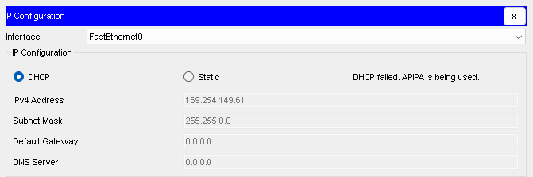 
왜냐하면, `기본적으로 DHCP 요청은 브로드캐스트 형식으로 보내지게 되고,`<br>
당연하게도 서버는 `다른 네트워크 대역이기에,` DHCP요청이 서버까지 닿지 않아,<br>
서버의 `응답을 받을 수 없는걸` 알 수 있었다!

즉, 라우터에서 브로드캐스트 요청이<br>
`서버까지 갈 수 있도록` 설정을 해줘야하는것이다!

아래는 관련 명령어이다!
```network
Router> enable
Router# configure terminal

Router(config)# interface fa0/0
Router(config-if)# ip helper-address 192.168.20.100

Router(config-if)# interface fa0/0.100
Router(config-if)# ip helper-address 192.168.20.100

Router(config-if)# interface fa0/0.200
Router(config-if)# ip helper-address 192.168.20.100

Router(config-if)# interface fa0/0.300
Router(config-if)# ip helper-address 192.168.20.100
```
이제 간단하게 명령어를 해석해보면,<br>
기본적으로 `ip helper-address` 아이피 명령어를 통해<br>
브로드캐스트가 오면 `지정한 아이피까지 도달할 수 있도록` 라우팅할수 있다.<br>
또한 interface 포트를 통해 `인터페이스를 지정해줌으로써,`<br>
특정 인터페이스에 `브로드캐스트 패킷이` 도착했을때<br>
`지정한 아이피로 요청을 보내도록` 설정할 수 있는것이다!

이제 위 명령어를 친 후, `간단히 아이피를 할당해보면?`
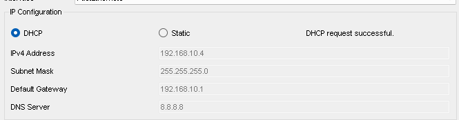
정말 잘 되는걸 알 수 있다!<br>
(VLAN에 관련된 DHCP 테스트는 넣을시 글이 너무 길어져서 생략함)

끗이다!