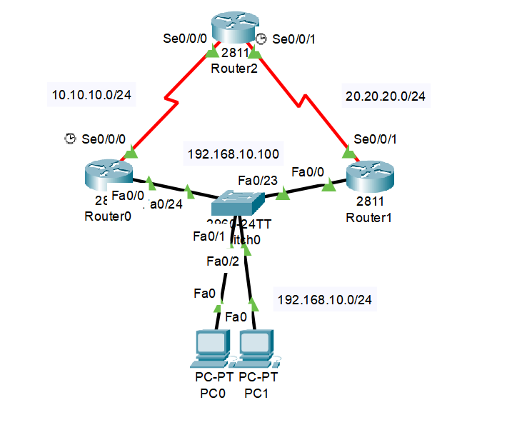
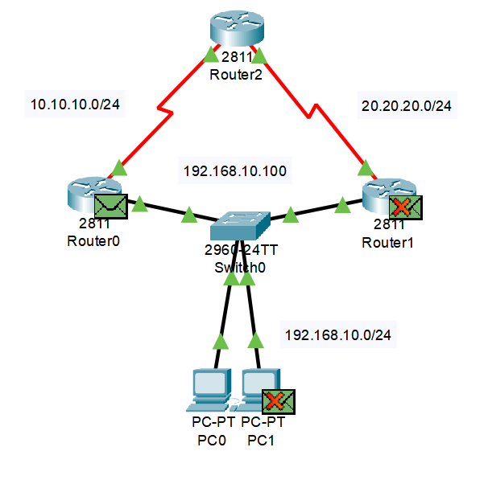
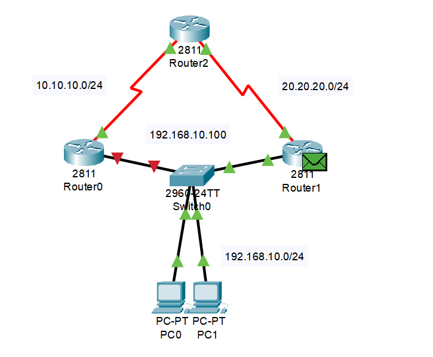
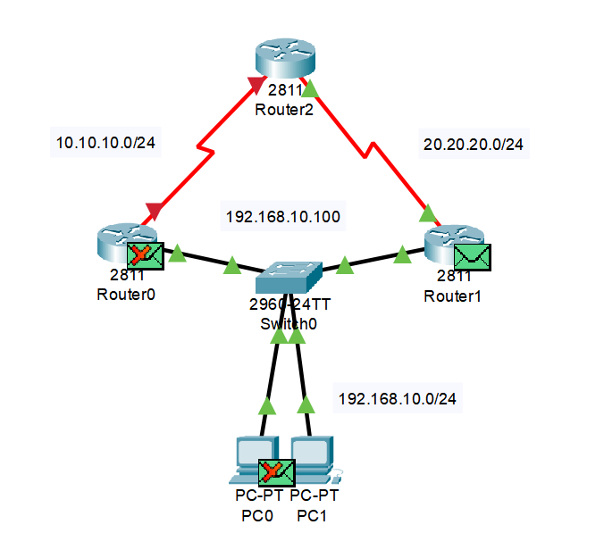

## 개요
이번 글은 기능경기대회 사이버보안 직종을 공부하며,<br>
HSRP에 대해서 정리한 글이다!<br>
재밋게 봐주길 바란다!

# HSRP란?
기본적으로 회사와 같은 네트워크에서, `게이트웨이 경로가 다운되게되면`,<br>
그 즉시 `모든 장비의 네트워크는 죽게된다.`

물론, 예비 게이트웨이 경로를 미리 하나 만들어놓고,<br>
게이트웨이가 죽으면, `게이트웨이를 예비 게이트웨이로 변환해서`<br>
사용하는 방법이 존재하긴하나,

만약 컴퓨터가 200대가 넘는 대형 네트워크에서<br>
`게이트웨이를 직접 모두 바꾼다는건 매우 매우 귀찮아진다!`

그렇기에 `HSRP`가 나오게된거시다!!

HSRP는 간단히 말해, 게이트웨이 경로가 죽으면,<br>
`게이트웨이 경로를 직접 바꿔` 네트워크 전체가 죽어버리는<br>
`대참사를 막는 프로토콜이다!`

근데 이렇게 말하면 잘 안와닿기 때문에<br>
직접 설정하며 이해해보도록 하자!

## HSRP 설정
이제 앞서 말했던 HSRP를 직접 설정해보도록 하자!<br>
이제 설정하기 앞서 아래와 같이 토폴로지를 구성해보도록 하자!<br>
추가로 간단한 라우팅과 아이피 설정은 미리 한 후 따라오길 바란다!<br>
(라우팅은 `RIP를` 사용했으며, `PC의 게이트웨이는` 192.168.10.100으로 설정함)<br>
(`PC 대역은` 192.168.10.0/24, `라우터0 대역은` 10.10.10.0/24, `라우터1 대역은` 20.20.20.0/24)


이제 아이피 설정을 마쳤으면 NAT 설정을 해보도록 하자!<br>
아래는 관련 명령어이다!
```network
<Router0>
Router> enable
Router# configure terimnal
Router(config)# interface fa0/0
Router(config-if)# ip add 192.168.10.1
Router(config-if)# standby 1 ip 192.168.10.100
Router(config-if)# standby 1 preempt
Router(config-if)# standby 1 priority 109
Router(config-if)# standby 1 track s0/0/0
Router(config-if)# no shutdown

<Router1>
Router> enable
Router# configure terminal
Router(config)# interface fa0/0
Router(config-if)# ip add 192.168.10.254
Router(config-if)# standby 1 ip 192.168.10.100
Router(config-if)# standby 1 preempt 
Router(config-if)# standby 1 priority 109
Router(config-if)# standby 1 track s0/0/1
Router(config-if)# no shutdown
```
일단 명령어를 해석하기전 간단히 정리를 하고 가도록 하자!<br>
기본적으로 HSRP는 `"우선 순위"`를 통해 관리된다!<br>
또한 라우터의 `기본 우선 순위는 100으로` 설정되어있으며,<br>
다운되었다는걸 감지하면, `우선순위가 10 깎이게된다.`

이제 처음으로 Router0의 명령어를 해석해보도록 하자!<br>
`standby 1 ip 192.168.10.100` 이 명령어는<br>
가상 게이트웨이의 주소를 설정하는것으로, <br>
우선순위에 따라 유동적으로 게이트웨이 경로가 바뀌는<br>
`가상 게이트웨이 주소라고` 보면 된다!<br>
또한 `standby 1 preempt` 이 명령어는 <br>
우선순위가 바뀌면 게이트웨이 경로를 `뺏기거나 뺏을 수 있는 옵션이라고` 보면 된다!<br>
그리고 `standby 1 priority 109` 이 명령어는<br>
`우선순위를 109로`바꾸는 명령어로, 혹시나 우선순위가 깎이게되면,<br>
99로 바뀌게 되며, 기본 우선순위가 100인 나머지 라우터로<br>
`경로가 바뀌도록 우선 순위를 설정하는` 명령어이다!<br>
마지막으로, `standby 1 track s0/0/1` 이 명령어는<br>
스위치와 라우터간 인터페이스 뿐만 아니라, 시리얼 인터페이스가 죽어도,<br>
그걸 감지하고 우선순위를 깎는 명령어이다!

이제 Router1의 명령어를 해석해보도록 하자!<br>
`standby 1 ip 192.168.10.100` 이 명령어는 <br>
앞서 말했다 싶이 가상 게이트웨이 주소를 설정하는 명령어로,<br>
PC가 192.168.10.100 게이트웨이를 사용했다고 가정하면,<br>
유동적으로 Router1과 Router2로 게이트웨이 경로가 바뀌도록 하기 위해<br>
같은 주소를 사용하였다!<br>
또한 `standby 1 preempt` 이 명령어는<br>
앞서 말했다싶이 `선점형으로` 변환하는 명령어로,<br>
가상 게이트웨이 경로가 유동적으로 변하게 하기 위해 설정하였다!<br>
마지막으로 `standby 1 track s0/0/1` 이 명령어는<br>
앞서 말했다싶이 스위치와 라우터간 인터페이스 뿐만 아니라,<br>
시리얼 인터페이스가 죽어도, 그걸 감지하고 우선순위를 깎는 명령어이다!<br>
(우선순위는 기본이 100이므로, `우선순위 1 차이로 유동적으로 바뀌게하기 위해` 설정하지 않음)

이제 우선순위가 잘 작동하는지 확인해보기 위해<br>
시뮬레이션을 키고 `핑을 날려보면?`

스위치가 브로드캐스트를 날린후, 가장 우선순위가 높은<br>
Router0를 제외한 모든 장비들은 패킷을 드롭하는걸 알 수 있었다!

추가로 Router0의 `fa0/0 포트를` 셧다운한후, 핑을 날려보면,

그대로 패킷이 Router1로 이동하는걸 알 수 있었다!

마지막으로 Router0의 `s0/0/0 포트를 셧다운한후,` 핑을 날려보면,

s0/0/0가 꺼진걸 인식해서, Router0의 우선순위가 99가 되었기에,<br>
우선순위가 1 높은 Router1을 제외한 모든 장비의 패킷이 다운되는걸 알 수 있었다!

끗이다!