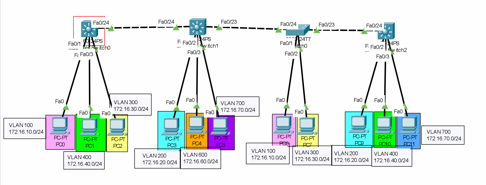
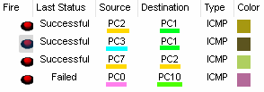

## 개요
이번 글은 기능경기대회 사이버보안 직종을 공부하며,<br>
L3 Switch를 쓰는법에 관해서 정리한 글이다!<br>
재밋게 봐주길 바란다!<br>
(이 글 보기전에 [VLAN](https://www.servelt.kr/posts/vlan)글을 먼저 보고 오는걸 추천한다)

## L3 스위치란?<br>
L3 스위치란 지난 글에서 `엄청난 스위치` 라고 소개한 바 있다.<br>
하지만 너무 대강 설명한거 같아서 이번에 완벽하게 정리해보고자 한다!

L3 스위치란, VLAN끼리의 통신을 할 수 있게 해주는 장비라고 보면 된다!<br>
기본적으로 VLAN끼린 라우터로도 충분히 통신할수 있지만, `L3 스위치를 사용하면,`<br>
`스위치 하나만 가지고 VLAN끼리 통신할수` 있는거시다!

하지만 여기서 헷깔리면 안되는것은, L3 스위치는 `VLAN끼리의 통신`을<br>
대부분 담당하고, 왠만하면 `물리적인 네트워크` 간의 통신은 <br>
`라우터가` 담당하는 경우가 많기에 알아두면 좋을것같다!<br>
(L3 스위치로 물리적 네트워크까지 담당하기엔 기능이 부족하기 때문!)

## L3 스위치 설정
이제 L3 스위치를 설정해보도록 하자!

기본적으로 L3 스위치는 기본적으로 `스위치 기능만 켜져있고`,<br>
VLAN끼리 통신할수 있도록, `게이트웨이를 설정하는 기능은`<br>
따로 명령어를 통해 `활성화 해줘야` 한다!

아래 명령어가 바로 L3 기능을 활성화하고, 게이트웨이 아이피를 설정하는 명령어이다!
```network
Switch> enable
Switch# configure terminal
Switch(config)# ip routing (L3 활성화)
Switch(config)# interface vlan 100 (VLAN 100의 인터페이스 설정 모드 진입)
Switch(config-if) ip add 172.16.10.1 255.255.255.0 (게이트웨이 설정)
```
이제 명령어를 해석해보도록 하자!

일단, L3 기능을 활성화하려면, 설정 모드로 변환해야한다.<br>
설정 모드로 변환한 이후에, `ip routing` 이라는 명령어를 적게되면,<br>
L3 기능이 켜지며, VLAN에 관한 `게이트웨이들을 설정해줄수 있게된다!`

이후, `interface vlan (넘버)` 명령어를 통해, VLAN에 관한<br>
게이트웨이 설정으로 들어가 아이피를 설정할수 있게되는거시다!

## 직접 실습

이제 위 토폴로지를 설정해보도록하자!

일단, 시작하기전 빨간색 테두리로 둘러져있는<br>
L3 스위치를 L3 기능이 켜져있는 스위치<br>
즉, `L3 스위치`라고 부르고,<br>
나머지 스위치를 왼쪽에서부터 `스위치1, 스위치2, 스위치3`<br>
라고 부르도록 하겠다<br>
(밑에 명령어를 치기전, PC의 아이피는 미리 설정해주길 바란다.)

### L3 스위치 설정
아래는 L3 스위치를 설정하는 명령어이다
```network
Switch> enable
Switch# configure terminal
Switch(config)# ip routing (라우팅 기능 활성화)

Switch(config)# vlan 100 (vlan 100~700 모두 생성)
Switch(config-vlan)# vlan 200
Switch(config-vlan)# vlan 300
Switch(config-vlan)# vlan 400
Switch(config-vlan)# vlan 500
Switch(config-vlan)# vlan 600
Switch(config-vlan)# vlan 700

Switch(config-vlan)# interface fa0/1 (PC0 VLAN 할당)
Switch(config-if)# switchport mode access
Switch(config-if)# switchport access vlan 100

Switch(config-if)# interface fa0/2 (PC1 VLAN 할당)
Switch(config-if)# switchport mode access
Switch(config-if)# switchport access vlan 400

Switch(config-if)# interface fa0/3 (PC2 VLAN 할당)
Switch(config-if)# switchport mode access
Switch(config-if)# switchport access vlan 300

Switch(config-vlan)# int vlan 100 (vlan 100 게이트웨이 설정)
Switch(config-if)# ip address 172.16.10.1 255.255.255.0

Switch(config-if)# int vlan 200 (vlan 200 게이트웨이 설정)
Switch(config-if)# ip address 172.16.20.1 255.255.255.0

Switch(config-if)# int vlan 300 (vlan 300 게이트웨이 설정)
Switch(config-if)# ip address 172.16.30.1 255.255.255.0

Switch(config-if)# int vlan 400 (vlan 400 게이트웨이 설정)
Switch(config-if)# ip address 172.16.40.1 255.255.255.0

Switch(config-if)# int vlan 500 (vlan 500 게이트웨이 설정)
Switch(config-if)# ip address 172.16.50.1 255.255.255.0

Switch(config-if)# int vlan 600 (vlan 600 게이트웨이 설정)
Switch(config-if)# ip address 172.16.60.1 255.255.255.0 

Switch(config-if)# int vlan 700 (vlan 700 게이트웨이 설정)
Switch(config-if)# ip address 172.16.70.1 255.255.255.0

Switch(config-if)# interface fa0/24 (트렁킹)
Switch(config-if)# switchport trunk encapsulation dot1q
Switch(config-if)# switchport mode trunk
```
이제 위 명령어를 간단히 설명하도록 하겠다!

일단, 모든 설정을 하기위해선 기본적으로 `설정모드에 들어가야 하므로,`<br>
enable, configure terminal 순서로 명령어를 쳐서 설정 모드로 변환할 수 있다!<br>
이후, `vlan 100~700`을 써줘서 현재 네트워크에 존재하는 `모든 vlan을 만들어주고`,<br>
`fa0/1~3` 인터페이스에 `각각의 vlan`을 할당시켜준 뒤<br>
`int vlan 숫자`, `ip add 아이피` 명령어를 통해 `각 vlan의 게이트웨이를` 설정해줄수 있었다!<br>
그 뒤, `24번 포트는 트렁킹을 해주었다`.<br>
왜냐하면, 모든 스위치의 `패킷이 모두 날아올 인터페이스이기에,` 모든 vlan 패킷들이 날라올수 있도록<br>
`트렁킹을` 해서 패킷들을 허용해줘야만 한다!

### 스위치1 설정
이제 스위치 1번을 설정해보도록 하자.<br>
아래는 스위치 1번을 설정하는 명령어이다!
```network
Switch> enable
Switch# configure terminal

Switch(config)# vlan 100 (vlan 100~700 모두 생성)
Switch(config-vlan)# vlan 200
Switch(config-vlan)# vlan 300
Switch(config-vlan)# vlan 400
Switch(config-vlan)# vlan 500
Switch(config-vlan)# vlan 600
Switch(config-vlan)# vlan 700

Switch(config-vlan)# interface fa0/24 (24번 포트 트렁킹)
Switch(config-if)# switch trunk encapsulation dot1q
Switch(config-if)# switch mode trunk

Switch(config-if)# interface fa0/23 (23번 포트 트렁킹)
Switch(config-if)# switch trunk encapsulation dot1q
Switch(config-if)# switch mode trunk

Switch(config-if)# interface fa0/1 (PC3 VLAN 할당)
Switch(config-if)# switchport mode access 
Switch(config-if)# switchport access vlan 200

Switch(config-if)# interface fa0/2 (PC4 VLAN 할당)
Switch(config-if)# interface
Switch(config-if)# switchport mode access vlan 600

Switch(config-if)# interface fa0/3 (PC5 VLAN 할당)
Switch(config-if)# interface
Switch(config-if)# switchport mode access vlan 700
```
이제 위 명령어를 간단히 설명하도록 하겠다!

일단, 모든 설정을 하기위해선 기본적으로 `설정모드에 들어가야 하므로,`<br>
`enable`, `configure terminal` 순서로 명령어를 쳐서 설정 모드로 변환할 수 있다!<br>
이후, `vlan 100~700`을 써줘서 현재 네트워크에 존재하는 `모든 vlan을 만들어주었다!`<br>
또한 vlan을 만든 이후엔 `fa0/24, fa0/23`의 포트를 트렁킹 해주었다!<br>
왜냐하면 모든 스위치의 `패킷이 모두 이동할 인터페이스이기` 때문에 모든 vlan 패킷이 날라올수 있도록<br>
`트렁킹을` 해서 패킷들을 허용해주었다!<br>
그 뒤에는, `fa0/1~3에` 각각의 `vlan을 할당해줌으로써` 스위치 1번의 설정을 모두 완수하였다!

### 스위치2 설정
이제 스위치 2번을 설정해보도록 하자.<br>
아래는 스위치 2번을 설정하는 명령어이다!
```network
Switch> enable
Switch# configure terminal

Switch(config)# vlan 100 (vlan 100~700 모두 생성)
Switch(config-vlan)# vlan 200
Switch(config-vlan)# vlan 300
Switch(config-vlan)# vlan 400
Switch(config-vlan)# vlan 500
Switch(config-vlan)# vlan 600
Switch(config-vlan)# vlan 700

Switch(config-vlan)# interface fa0/23 (23번 포트 트렁킹킹)
Switch(config-if)# switch mode trunk

Switch(config-if)# interface fa0/1 (PC6 VLAN 할당)
Switch(config-if)# switchport mode access 
Switch(config-if)# switchport access vlan 100

Switch(config-if)# interface fa0/2 (PC7 VLAN 할당)
Switch(config-if)# interface mode access 
Switch(config-if)# switchport mode access vlan 300
```
이제 위 명령어를 간단히 설명하도록 하겠다!

일단, 모든 설정을 하기위해선 기본적으로 `설정모드에 들어가야 하므로,`<br>
enable, configure terminal 순서로 명령어를 쳐서 설정 모드로 변환할 수 있다!<br>
이후, `vlan 100~700`을 써줘서 현재 네트워크에 존재하는 `모든 vlan을 만들어주었다!`<br>
또한 vlan을 만든 이후엔 `fa0/23`의 포트를 트렁킹 해주었다!<br>
왜냐하면 모든 스위치의 `패킷이 모두 이동할 인터페이스이기` 때문에 모든 vlan 패킷이 날라올수 있도록<br>
`트렁킹을` 해서 패킷들을 허용해주었다!<br>
여기서, `24번 포트를` 설정하지 않은 이유는, 스위치1의 `23번 포트에 이미 트렁킹을 해주었기에`,<br>
자동으로 스위치 1번의 24번 포트는 `트렁킹 인터페이스로 인식하고 모든 패킷을 허용하기` 때문이다!<br>
그 뒤에는, `fa0/1~2번에 각각의 vlan을 할당해줌으로써` 스위치 2번의 설정을 모두 완수하였다!

### 스위치3 설정
이제 스위치 2번을 설정해보도록 하자.<br>
아래는 스위치 2번을 설정하는 명령어이다!
```network
Switch> enable
Switch# configure terminal

Switch(config)# vlan 100 (vlan 100~700 모두 생성)
Switch(config-vlan)# vlan 200
Switch(config-vlan)# vlan 300
Switch(config-vlan)# vlan 400
Switch(config-vlan)# vlan 500
Switch(config-vlan)# vlan 600
Switch(config-vlan)# vlan 700

Switch(config-if)# interface fa0/24 (24번 포트 트렁킹)
Switch(config-if)# switch trunk encapsulation dot1q
Switch(config-if)# switch mode trunk

Switch(config-if)# interface fa0/1 (PC9 VLAN 할당)
Switch(config-if)# switchport mode access 
Switch(config-if)# switchport access vlan 200

Switch(config-if)# interface fa0/2 (PC10 VLAN 할당)
Switch(config-if)# interface mode access 
Switch(config-if)# switchport mode access vlan 400

Switch(config-if)# interface fa0/3 (PC11 VLAN 할당)
Switch(config-if)# interface mode access 
Switch(config-if)# switchport mode access vlan 700
```
이제 위 명령어를 간단히 설명하도록 하겠다!

일단, 모든 설정을 하기위해선 기본적으로 `설정모드에 들어가야 하므로,`<br>
enable, configure terminal 순서로 명령어를 쳐서 설정 모드로 변환할 수 있다!<br>
이후, `vlan 100~700`을 써줘서 현재 네트워크에 존재하는 `모든 vlan을 만들어주었다!`<br>
또한 vlan을 만든 이후엔 `fa0/24`의 포트를 트렁킹 해주었다.<br>
여기서 `의문점이` 드는게 있다. 그것은 바로 옆 스위치에 인터페이스에서 트렁킹을 하면<br>
자동으로 트렁킹 인터페이스를 인식해서 패킷들을 허용해주는데 `왜 굳이 설정을 하냐`는것이다<br>
`왜냐하면`, 기본적으로 일반 스위치는 `자동으로 트렁킹을 인식해 바꿔주지만,`<br>
L3 스위치의 경우는, `자동으로 트렁킹 해주는 기능이 없기 때문에` 따로 해주어야만한다.<br>
그 뒤에는, `fa0/1~3에 각각의 vlan을 할당해줌으로써` 스위치 3번의 설정을 모두 완수하였다!

이제 모든 네트워크 설정이 끝났으니 핑을 날려서 확인해보도록 하자!


`와!`

정말 잘 되는걸 확인할 수 있다!

끗