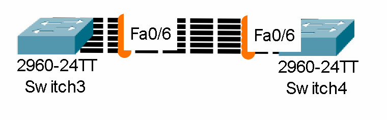
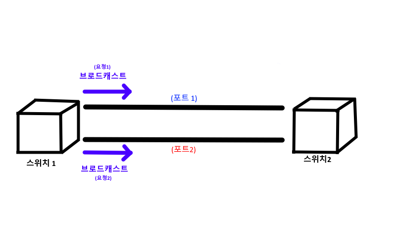
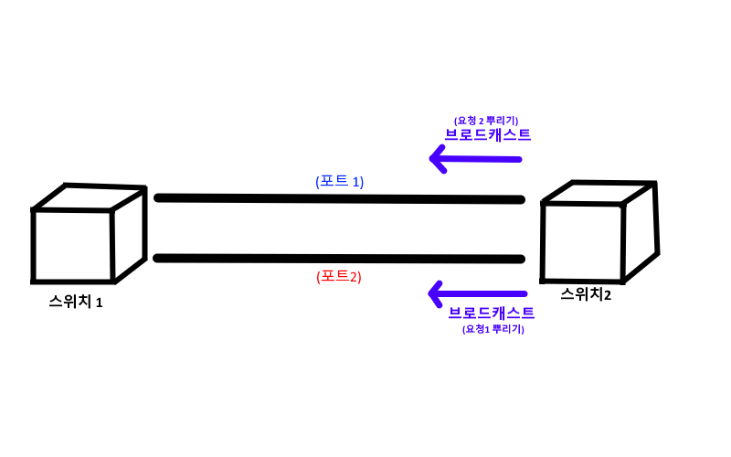
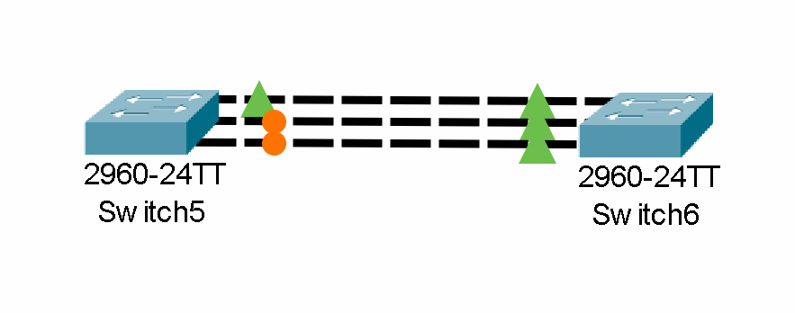
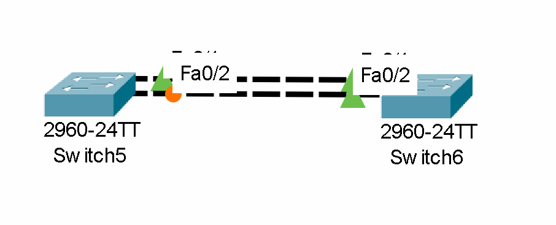
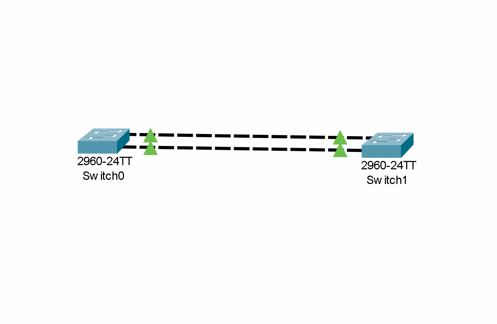

## 개요
이번 글은 기능경기대회 사이버보안 직종을 공부하며, <br>
루핑과 STP 프로토콜, 그리고 그룹화에 대해서 정리한 글이다!<br>
재밋게 봐주길 바란다!

## 루핑이란?
기본적으로 `스위치와 스위치` 사이에는 아래와 같이<br>
`여러개의 선을 동시에` 연결할수 있다.

하지만, 아래 상황에서 모든 포트가 열리게 된다면,<br>
`브로드캐스트를` 할 때 `엄청난 일이` 일어나버린다.

그거시 바로 `"루핑"` 인것이다!!

일단 루핑이란, `브로드캐스트 요청을 보낼때,`<br>
연결된 `랜선이 여러개라면,` 계속해서 요청을 보내,<br>
CPU와 메모리 대역폭을 미친듯이 올리며<br>
`정상적인 트래픽을 처리하지 못하는 상황을` 말한다!<br>
근데 이렇게 말하면 뭔소린지 모르겠기 때문에 <br>
자세하게 알아보도록 하자!


일단 스위치 1이 `브로드캐스트 요청을 보낼 때`<br>
열린 `포트가 여러개이기에,` 스위치 1은 `모든 포트에게`<br>
브로드캐스트 요청을 보내버리게 된다!


이제 스위치 2는 `브로드캐스트 요청을 받게 된다.`<br>
하지만 여기서, 스위치는 기본적으로 브로드캐스트를 받으면<br>
`받았던 인터페이스를 제외한 모든 인터페이스에`<br>
브로드캐스트 요청을 보내버리는식으로 운영한다.<br>
즉, `포트 1번으로 날라온 요청 1은 요청 2로써 재전송되고,`<br>
`포트 2번으로 날라온 요청 2는 요청 1로써 재전송이 되어버린다,`

그럼 스위치 1은 `다시 자신이 보낸` 브로드캐스트 요청을<br>
`다시 받아버리게 되어` 또 다시 전송하는식으로, <br>
`무한 루프에` 빠지게 되어버리는거시다!!

## STP이란?
`STP`이란 `Spanning Tree Protocol`의 약자로,<br>
앞서 말한 `루핑을 방지하기 위해` 만들어진 프로토콜이다!<br>
STP는 만약 스위치 간 `포트가 여러개가 된다면,`<br>
하나의 포트를 제외하고 `모두 블록킹 시켜버림으로써` 루핑을 막게되는것이다!

아래는 스위치간의 포트를 여러개 만들고 지켜본 사진이다!

사진을 보게되면, 왼쪽 스위치에서,<br>
하나의 포트를 제외한 `모든 포트가 블록킹 된 것을 알 수 있었다!`<br>
이 이유는 바로 `STP가 개입해서` 하나의 포트를 제외한 모든 포트를 블록킹 시켰기 때문이다!

## 그룹핑
앞서 `루핑을 막기위해` STP가 탄생하였다고 했다.<br>
또한 STP는 `하나의 포트만 살림으로써,` 이 루핑을 해결하였다.

**`하지만`**

기본적으로 요즘 `하나의 포트에는 1Gbps 정도의 트래픽을 수용할 수 있지만,`<br>
대형 네트워크의 경우 1Gbps만 가지곤 `트래픽이 부족해지는 경우가 생겨버린다.`<br>
또한, 하나의 포트만 살아있는 경우, `그 포트가 죽어버리면`<br>
그 네트워크는 `모두 다운되어버리는 대참사가` 일어날수도 있는거시다!!

즉, 이런 단점들을 보완하기위해 `그룹핑이라는게` 생겨나게 된다!

그룹핑이란, 물리적으로 `여러개가 연결된 포트들을,`<br>
논리적으로 `하나의 포트로써 보게` 만드는것이다!

이를 통해 브로드캐스트를 보낼때도 앞서 말했던 상황에서<br>
`포트 1과 포트 2를 같은 포트로써 인식해,` 물리적인 포트를 여러개 만들면서,<br>
다시 요청을 되돌려주는 `루핑까지 막을수 있는것이다!`

이제 이 그룹핑을 직접 설정해보도록 하자!

일단 간단하게 아래와 같이 토폴로지를 구성해보도록 하자!

일단 위 토폴로지를 설정하기 전, `그룹핑 모드에` 대해서 짚고 넘어가도록 하자!

기본적으로 그룹핑을 시작하는 모드로는 여러가지가 있다!<br>
바로 `on, active, desireable, passive, auto` 이다!

`on 모드란,` 상대 스위치가 `뭘하던지`<br>
일단 현재 스위치를 `그룹화하고 끝내는 모드를` 말한다!

또한 `active, desireable 모드란,`<br>
일단 현재 스위치를 그룹화하고 옆에<br>
`스위치에게 현재 그룹화를 했다고 요청을` 보내주는 모드를 말한다!<br>
(`active는` 국제 표준, `desireable은` 시스코에서 만든 규격이다!)

마지막으로 `passive, auto 모드란,`<br>
active, desireable로써 보내진 `요청이 자신의 스위치에게 도착했을때,`<br>
지정해놨던 그룹화 설정을 `활성화시키는 모드를 말한다!`<br>
여기서 유의해야할점은 양쪽의 스위치 `모두 passive, auto라면`<br>
둘다 요청을 기다리다가 `아무것도 하지 않는 상황이 일어날수 있으니` 꼭 확인해야한다!<br>
(추가적으로 `passive는` 국제 표준, `auto는` 시스코에서 만든 규격이다!)

이제 설정을 해보도록 하자!
아래는 관련 명령어이다!
```network
Switch> enable
Switch# configure terminal
Switch(config)# interface range fa0/1-2
Switch(config-if)# channel-group 1 mode
```
이제 명령어를 해석해보도록 하자!<br>
일단, 위 토폴로지에서 왼쪽 스위치를 기준으로 `fa0/1~2를`<br>
모두 `그룹화 시킴으로써` 루핑을 막을것이기에,<br>
range를 통해 `두개의 포트를 선택해주었다.`

이후 `channel-group 1 mode`을 통해 그룹 1번에<br>
두 인터페이스를 소속시켜줌으로써 설정을 마치게 되었다!<br>
(추가적으로 그룹은 총 7개까지 만들수 있다!)

이제 두개의 스위치에 각각 위 명령어를 친후,<br>
스위치를 확인해보면?!

모든 포트가 열린걸 통해 잘 된걸 확인할수 있었다!!

`끗이다!`