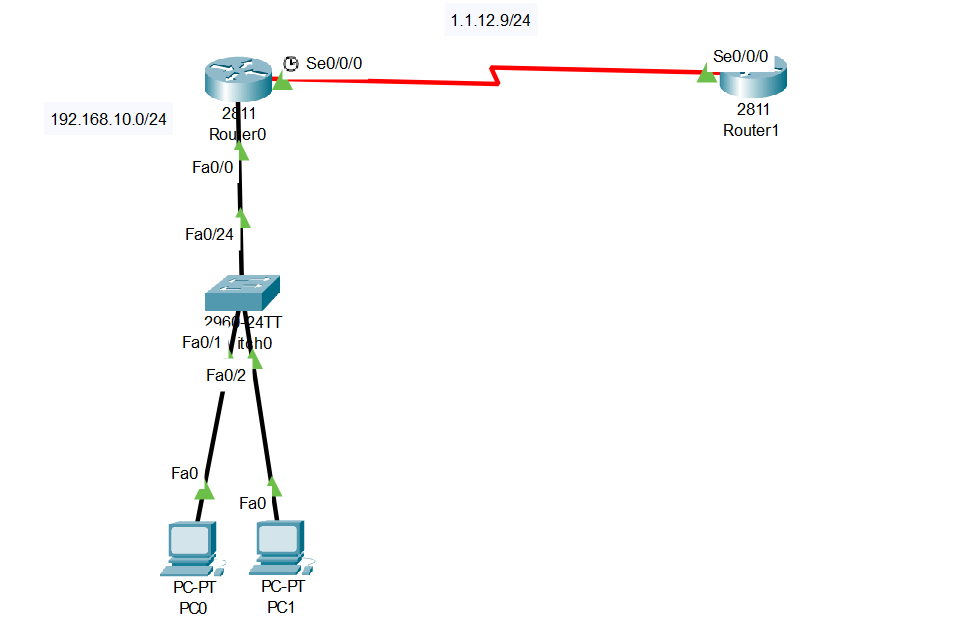
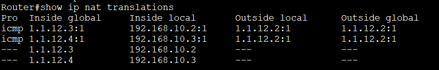
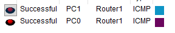
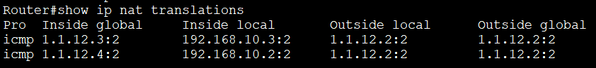
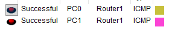
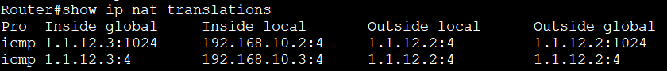

## 개요
이번 글은 기능경기대회 사이버보안 직종을 공부하며,<br>
NAT 기법에 대해서 정리한 글이다!<br>
재밋게 봐주길 바란다!

## NAT이란?
기본적으로, `IPV4의` 모두 다른 아이피가 나올 경우의 수는 `약 43억개이지만`,<br>
사람의 인구수는 `80억이 넘으므로`,<br>
이론적으로 보면 아이피가 엄청나게 부족하게 되는거시다!<br>
그렇기에 `IPV6, NAT 등의 기술이` 탄생하였다!<br>
일단 이번 글에선 NAT에 대해서 알아보도록 하자!

`NAT이란,` `내부 네트워크에서 사용하는 아이피를`<br>
다른 네트워크로 나갈때 `새로운 아이피로`<br>
다시 할당해주는 기법을 말한다!

기본적으로 `같은 네트워크 안에서` 사용하는 아이피를 `사설 아이피`,<br>
`외부로 나갈때` 사용하는 아이피를 `공인 아이피 라고` 부르며,

추가적으로 사설 아이피는 `내부 네트워크 안에서만` 사용하기에,<br>
내부 네트워크마다 `사설 아이피가 같은 가능성도` 존재하게 된다!<br>
예를 들어 `네트워크 1과 네트워크 2가 둘 다 NAT를 사용한다고` 하면,<br>
사설 아이피로 `192.168.10.2를` 두 네트워크가 사용할 수 있다는거시다!

또한, NAT에는 총 3가지의 종류가 존재하는데 그것은 바로,<br>
`Static NAT, Dymanic Nat, PAT` 이다!

일단 `Static NAT란,` 사설 아이피와 공인 아이피를<br>
`영구적으로 1대1 매칭 시키는 방법으로,` 외부 네트워크로 나가는건 쉽지만,<br>
외부 네트워크에서 내부 네트워크로 진입은 매우 힘들기 때문에 `보안성이 좋다!`

그리고 `Dynamic NAT란,` 사설 아이피를 리스팅 해놓은 공인 아이피로<br>
`유동적으로 할당해서` 사용하는 NAT이다.<br>
기본적으로 모든 PC가 `같은 시간의 아이피를 사용할 가능성이` 적기 때문에<br>
대부분 PC수에 `60%의 공인 아이피를` 넣어놓게 된다.

`마지막으로 PAT란`, 외부 네트워크로 나갈때<br>
오직 `하나의 공인 아이피만` 가지고 사용하는 기법으로,<br>
여러개의 기기가 `하나의 아이피만을 사용하면` 충돌이 날 수도 있기에,<br>
`포트를 통해` 장비들을 구분하게된다!

## Static NAT 설정
이제 앞서 말했던 NAT 종류중 하나인 `Static NAT를` 직접 설정해보도록 하자!<br>
이제 설정하기 위해, 아래와 같이 토폴로지를 구성해보도록 하자!<br>
추가로 기본적인 `아이피 설정과 게이트웨이 설정은` 알아서 한 후 따라오길 바란다!<br>
(`라우터간 대역은` 1.1.12.0/24, `PC 대역은` 192.168.10.0/24)


이제 아이피 설정을 마쳤으면 NAT 설정을 해보도록 하자!<br>
아래는 관련 명령어이다!
```network
Router> enable
Router# configure terminal

Router(config)# interface fa0/0
Router(config-if)# ip nat inside

Router(config-if)# interface s0/0/0
Router(config-if)# ip nat outside

Router(config-if)# exit
Router(config)# ip nat inside source static 192.168.10.2 1.1.12.3
Router(config)# ip nat inside source static 192.168.10.3 1.1.12.4
```
이제 명령어를 해석해보도록 하자!<br>
일단, NAT를 하기위해선, 어느 인터페이스가 `내부로 들어가는 인터페이스이고`,<br>
어느 인터페이스가 `외부로 나가는 인터페이스인지` 지정해주어야한다!<br>
그렇기에, `내부로 들어가는 인터페이스인 fa0/0에는` 내부 인터페이스로<br>
지정해주기 위해 `ip nat inside` 를 통해 지정해주었고,<br>
`외부로 나가는 인터페이스인 s0/0/0에는` 외부 인터페이스 라고 지정해주기 위해<br>
`ip nat outside` 를 통해 지정해주었다!

이후, `PC의 아이피를 매핑해주기 위해` 설정 모드로 들어가서,<br>
`ip nat inside source static [PC 아이피] [나갈 공인 아이피]`<br>
로 매핑해주었다!

이제 모든 설정을 마치고 `핑을 날려 통신을 확인해보면?`<br>
<br>
위와 같이 잘 통신이 되는 걸 알 수 있었따!

또한, 라우터에서 `show ip nat translations`를 쳐서<br>
사설 아이피가 어떻게 매핑되었는지 확인해보면?<br>
<br>
위에서 설정한대로 `192.168.10.2`은 `1.1.12.3`,<br>
`192.168.10.3`은 `1.1.12.4`로 매핑된걸 알 수 있었다!

## Dynamic NAT 설정
이제 두번째로 `Dynamic NAT를` 설정 해보도록 하자!<br>
일단 실습을 위해아래와 같이 토폴로지를 구성해보도록 하자!<br>
추가로 기본적인 `아이피 설정과 게이트웨이 설정은` 알아서 한 후 따라오길 바란다!<br>
(`라우터간 대역은` 1.1.12.0/24, `PC 대역은` 192.168.10.0/24)


이제 아이피 설정을 마쳤으면 NAT 설정을 해보도록 하자!<br>
아래는 관련 명령어이다!
```network
Router> enable
Router# configure terminal

Router(config)# interface fa0/0
Router(config-if)# ip nat inside

Router(config-if)# interface s0/0/0
Router(config-if)# ip nat outside

Router(config-if)# exit
Router(config)# access-list 1 permit 192.168.10.0 0.0.0.255
Router(config)# ip nat pool cisco 1.1.12.3 1.1.12.4 netmask 255.255.255.0
Router(config)# ip nat inside source list 1 pool cisco 
```
이제 명령어를 해석해보도록 하자!<br>
일단, `Dynamic NAT도` Static NAT와 동일하게<br>
NAT를 하기위해선, 어느 인터페이스가 `내부로 들어가는 인터페이스이고,`<br>
어느 인터페이스가 `외부로 나가는 인터페이스인지` 지정해주어야한다!<br>
그렇기에, `내부로 들어가는 인터페이스인 fa0/0에는` 내부 인터페이스로<br>
지정해주기 위해 `ip nat inside` 를 통해 지정해주었고,<br>
`외부로 나가는 인터페이스인 s0/0/0에는` 외부 인터페이스 라고 지정해주기 위해<br>
`ip nat outside` 를 통해 지정해주었다!

이후엔 `사설 아이피의 리스트들과 공인 아이피 리스트들을` 만들고,<br>
그걸 통해 `유동적으로 공인 아이피와 사설 아이피를 매핑하도록` 설정할수 있다!

일단, `access-list` 명령어는 기본적으로 라우터에서 `막을 아이피 대역과`,<br>
`허용할 아이피 대역을` 지정할때 사용되지만,<br>
`NAT에서` Dynmaic NAT의 `사설 아이피 리스트를 만드는데도` 사용하기 때문에<br>
`access-list [번호] permit [아이피 대역] [와일드카드 마스크]` 명령어를 통해<br>
`리스트를` 만들어주었다!

이후 `ip nat pool [이름] [아이피 범위 시작] [아이피 범위 끝] netmask [서브넷마스크]`<br>
명령어를 통해 `매핑할 공인 아이피 리스트를` 만들 수 있었다!

이제 리스트를 만들었으니 `리스트들을 매핑하도록` NAT를 설정해야한다!<br>
그 명령어가 바로 `ip nat source list 1 pool [이름]` 이다!

이제 모든 설정을 마쳤으니 `핑을 날려 통신을` 확인해보면?

위와 같이 잘 통신이 되는 걸 알 수 있었따!

또한, 라우터에서 `show ip nat translations`를 쳐서<br>
사설 아이피가 어떻게 매핑되었는지 확인해보면?

위에서 설정한대로 `192.168.10.3`은 `1.1.12.3`,<br>
`192.168.10.2`은 `1.1.12.4`로 매핑된걸 알 수 있었다!

## PAT 설정
이제 마지막으로 `PAT를` 설정해보도록 하자!<br>
일단 실습을 위해 아래와 같이 토폴로지를 구성해보도록 하자!<br>
추가로 기본적인 `아이피 설정과 게이트웨이 설정은` 알아서 한 후 따라오길 바란다!<br>
(`라우터간 대역은` 1.1.12.0/24, `PC 대역은` 192.168.10.0/24)


이제 아이피 설정을 마쳤으면 NAT 설정을 해보도록 하자!<br>
아래는 관련 명령어이다!
```network
Router> enable
Router# configure terminal

Router(config)# interface fa0/0
Router(config-if)# ip nat inside

Router(config-if)# interface s0/0/0
Router(config-if)# ip nat outside

Router(config-if)# exit
Router(config)# access-list 1 permit 192.168.10.0 0.0.0.255
Router(config)# ip nat pool cisco 1.1.12.3 1.1.12.3 netmask 255.255.255.0 
Router(config)# ip nat inside source list 1 pool cisco overload
```
이제 명령어를 해석해보도록 하자!<br>
일단, `PAT도` Dynamic NAT, Static NAT`와 동일하게<br>
NAT를 하기위해선, 어느 인터페이스가 `내부로 들어가는 인터페이스이고,`<br> 
어느 인터페이스가 `외부로 나가는 인터페이스인지` 지정해주어야한다!<br>
그렇기에, `내부로 들어가는 인터페이스인 fa0/0에는` 내부 인터페이스로<br>
지정해주기 위해 `ip nat inside` 를 통해 지정해주었고,<br>
`외부로 나가는 인터페이스인 s0/0/0에는` 외부 인터페이스라고 지정해주기 위해<br>
`ip nat outside` 를 통해 지정해주었다!

이후엔 `사설 아이피의 리스트들과 공인 아이피 리스트들을` 만들고,<br>
그걸 통해 `유동적으로 공인 아이피와 사설 아이피를 매핑하도록` 설정할 수 있다!

일단, `access-list` 명령어는 기본적으로 라우터에서 `막을 아이피 대역과,`<br>
`허용할 아이피 대역을` 지정할때 사용되지만,<br>
NAT에서 PAT의 사설 아이피 리스트를 만드는데도 사용하기 때문에<br>
`access-list [번호] permit [아이피 대역] [와일드카드 마스크]` 명령어를 통해<br>
리스트를 만들어주었다!

이후 `ip nat pool [이름] [아이피 범위 시작] [아이피 범위 끝] netmask [서브넷마스크]`<br>
명령어를 통해 매핑할 `공인 아이피 리스트를` 만들 수 있었다!<br>
이때, 시작과 끝 범위를 동일하게 함으로써 하나의 아이피만 할당할 수 있다!

이제 리스트를 만들었으니 `리스트들을 매핑하도록` NAT를 설정해야한다!<br>
그 명령어가 바로 `ip nat source list 1 pool [이름] overload`이다!<br>
여기서 `overload` 옵션은, 공인 아이피로 나갈때, `포트를 사용함으로써`, <br>
오직 하나의 `공인 아이피만 가지고도 충분히 통신할수 있게` 하는 옵션이다!

이제 모든 설정을 마쳤으니 핑을 날려 통신을 확인해보면?

위와 같이 잘 통신이 되는 걸 알 수 있었따!

또한, 라우터에서 show ip nat translations를 쳐서<br>
사설 아이피가 어떻게 매핑되었는지 확인해보면?<br>
<br>
위에서 설정한대로 `192.168.10.3`은 `1.1.12.3의 4번 포트로`,<br>
`192.168.10.2`은 `1.1.12.3의 1024번 포트로` 매핑된걸 알 수 있었다!

끗이다!