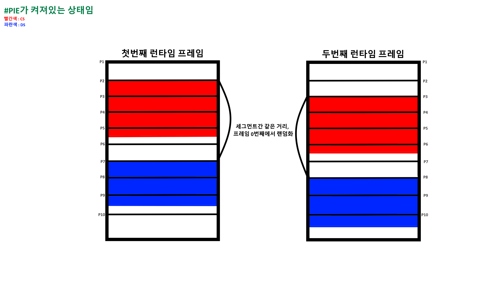
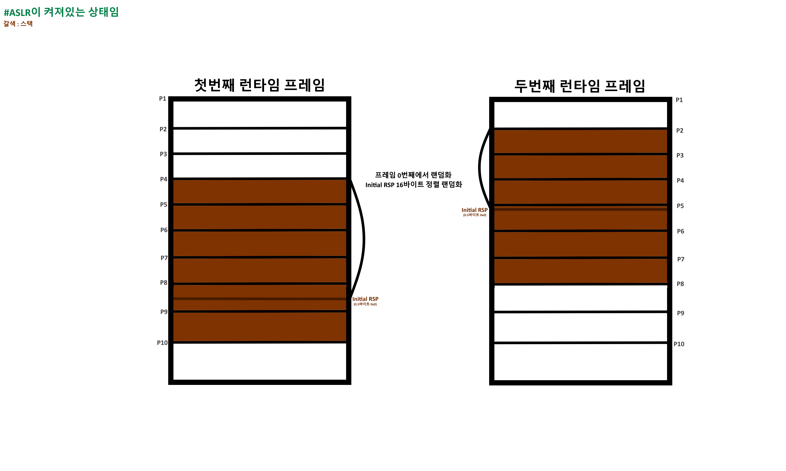
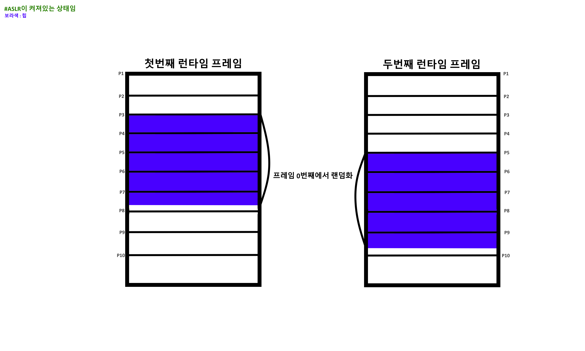

# 개요
기본적으로 ASLR, PIE를 옛날에 공부할땐,  
간단히 `PIE는 CS(Code Segment), DS(Data Segment)` 등을 랜덤화 하고, 
`ASLR은 SS(Stack Segment), HS(Heap Segment)`등을 랜덤화 시킨다는것 정도만 
기억하고 문제를 풀이 했었다. 하지만 점점 포너블 고렙들을 풀 수 록, 
랜덤화 된 주소중에서도 고정된 부분과 그에 따른 오프셋들을 이용하는 부분이 생각보다 많아서, 
이 참에 정리도 할 겸 각 랜덤화 기법의 고정된 부분과 오프셋 관련을 자세하게 정리하고자 한다.  

## PIE
`PIE는` 컴파일중 옵션으로 넣을 수 있는 보안 기법으로, 
대표적으로 `DS, CS를` 랜덤화시킴으로써, `ROP등을 막기 위해` 탄생하였으며, 
컴파일중 PIE 기능을 키지 않으면 활성화 되지 않기에, 안켜져있는 바이너리도 많으며, 
ELF의 경우는 `Checksec 명령어로` 활성화 여부를 확인할 수 있다.  

또한, PIE의 경우는 `모든 주소를 마음대로 섞는 것이 아니다.` 
PIE의 경우는 PIE 대상 세그먼트들을 하나로 묶어서 `묶음으로 랜덤화 시키며,`  
각 세그먼트들을 `랜덤한 프레임의 변위가 0인곳,` 즉 랜덤한 프레임 최상단에 위치시킨다. 

프레임 변위가 0인곳에 위치시키는 이유는, 기본적으로 모든 세그먼트는  
기본적으로 `메모리에 올릴때 변위가 0인곳에 올리는 규칙이 있기에,` 
PIE도 이 규칙을 꺠지 않기 위해 위와 같은 방식을 사용하게 된다.  

또한 ELF파일의 논리 주소는 x64 아키텍처 기준  
`상위 52바이트는` 페이지의 번호를, `하위 12비트는` 페이징 변위를 뜻한다. 
즉, 각 세그먼트의 최상단(Base) 주소는 PIE를 아무리 랜덤화 해도 
페이지의 번호는 바뀔지언정, 페이징 변위는 프레임 번호가 0이기에 `0x000으로` 고정된다.   

그래서 항상 포너블을 하다가 base를 구하면 모든 주소가  
0x5bb5171e2000, 0x77ec28111000 같이 `0x000으로 고정되어있는걸` 알 수 있는것이다. 

## ASLR 
`ASLR은` 커널에 내장된 기능으로, 대부분 기본 옵션이 켜져있기에, 
어느 바이너리든 컴파일 기능 상관없이 무조권 켜져있다고 보면 된다. 
또한 `익스플로잇을 하며 주소가 바로 노출되는것을 막기 위해` 탄생하였다. 
그래서 대부분 익스플로잇에서 주소가 노출되면 치명적인 세그먼트로 
대표적인 `SS, HS, VMMAP(libc,ld등)등을` 랜덤화 시킨다. 
또한 ASLR의 경우는 PIE와 다르게 각 세그먼트를 `단일적으로 각자 랜덤화시킨다.`  

### Stack ASLR
ASLR 대상 세그먼트중에서 `일단 스택에 대해 먼저 다뤄보자.` 

기본적으로 다른 세그먼트들은 `낮은 주소에서 높은 주소로` 값을 할당하며, 
세그먼트의 맨 윗주소이자 프레임 변위 0인 `Base를 첫 기준으로 시작해서 할당하게된다.`  

그에 반해서, `스택은 높은 주소에서 낮은 주소로 값을 할당하기에,` 
Base를 첫 기준으로 사용하지 않고, `높은 주소 어딘가를 첫 기준으로 시작해서 할당하게된다.` 
또`한 이러한 높은 주소 어딘가를` Initial RSP라고 부른다.  

다시 돌아와서 ASLR은 `그러한 스택의 Base를` 변위 규칙을 지키며 PIE처럼 랜덤화하고, 
추가적으로 `Initial RSP까지` 랜덤한 오프셋으로 랜덤화 하게된다. 
하지만, Initial RSP의 경우는 그냥 세그먼트 안 어딘가를 지정하는것이며, 
세그먼트의 상위도 아니기에, `1.5바이트가 0x000이라는 제약이 없다.` 
하지만, 대신 시작 주소는 16바이트 정렬을 맞춰야하기에, `하위 0.5바이트가 0x0으로 고정된다.`  

### Heap ASLR
이제 ASLR 대상 세그먼트중 `힙에 대해 다뤄보자.` 

Heap ASLR은 그냥 PIE랑 비슷하다고 생각하면 된다. 
기본적으로 `힙은 왠만한 세그먼트와 같이 낮은 주소에서 높은주소로` 할당하기에, 
`Base를 첫 기준으로` 사용해 할당한다.  

즉, Heap ASLR은 Base만 랜덤화하되, 변위 규칙을 지키기 위해 
`하위 1.5바이트를 0x000으로 고정하게 된다.` 
진짜 이게 끝이다. 
