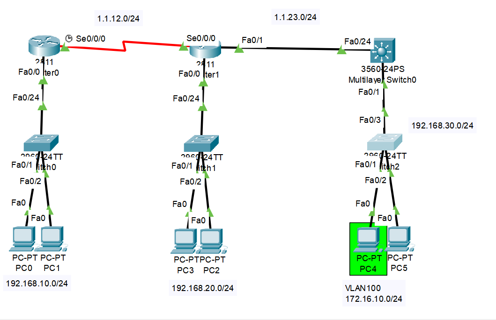
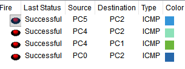
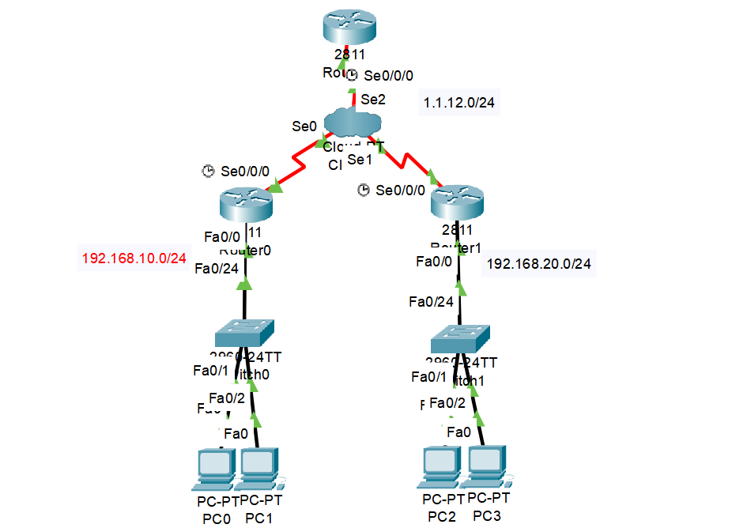
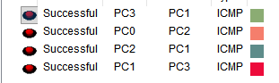

## 개요
이번 글은 기능경기대회 사이버보안 직종을 공부하며,<br>
RIP에 대해서 정리한 글이다!<br>
재밋게 봐주길 바란다!

## RIP란?
이전 포스트에서 처음 라우팅, 그중에서도 `정적 라우팅에 대해서` 소개하였다.<br>
기본적으로 정적 라우팅은 `직접 네트워크 관리자가`<br>
하나 하나씩 설정해줘야 하기 때문에, `넘무 넘무 귀찮다는것을` 언급한바있다.

그래서 만들어진 또 다른 라우팅 기술이 바로 `동적 라우팅이며,`<br>
이번 글에선 그 동적 라우팅중 하나인 `RIP에 대해 다뤄보고자 한다!`

기본적으로 RIP는 `브로드캐스트`, `멀티캐스트를` 통해 자신이 가지고 있는<br>
`네트워크 대역을 알리는 형식으로` 라우팅을 진행한다!

기본적으로 `버전 1`과 `버전 2`가 존재하며,<br>
`버전 1은` 브로드캐스트 형식으로써,<br>
`클래스풀한 네트워크만` 지원하며,<br>
`버전 2는` 멀티캐스트 형식으로써<br>
`서브넷팅된 네트워크까지` 지원하는 버전이다!

이제 직접 설정하며 이에 대해서 자세히 알아보도록 하자!

## RIP 설정
이제 RIP를 직접 설정해보도록 하자!<br>
일단 시작하기전 아래와 같이 토폴로지를 구성해주어야한다!<br>
추가로 간단한 라우팅과 아이피 설정은 미리 한 후 따라오길 바란다!


이제 아이피 설정을 마쳤으면 RIP 설정을 해보도록 하자!<br>
아래는 관련 명령어이다!
```text
<Router0>
Router> enable
Router# configure terminal
Router(config)# router rip
Router(config-router)# version 2 
Router(config-router)# no auto-summary
Router(config-router)# network 192.168.10.0
Router(config-router)# network 1.1.12.0

<Router1>
Router> enable
Router# configure terminal
Router(config)# router rip
Router(config-router)# version 2 
Router(config-router)# no auto-summary
Router(config-router)# network 192.168.20.0
Router(config-router)# network 1.1.12.0
Router(config-router)# network 1.1.23.0

<L3 Switch>
Switch> enable
Switch# configure terminal
Switch(config)# ip routing
Switch(config)# router rip
Switch(config-router)# version 2 
Switch(config-router)# no auto-summary
Switch(config-router)# network 192.168.30.0
Switch(config-router)# network 172.16.10.0
Switch(config-router)# network 1.1.23.0
```
일단 처음으로 Router0의 명령어를 해석해보도록 하자!<br>
기본적으로 RIP 설정은 `router rip` 명령어를 통해 설정할수 있기에,<br>
명령어를 쳐서 `라우터 설정 모드로` 들어가주었다!<br>
이후, `version 2`를 쳐서 RIP의 `버전을 2로` 만들어주었고,<br>
`no auto-summary` 명령어를 통해 `단편화 기능을 꺼주었다!`<br>
여기서 단편화란, 아이피의 서브넷을 확인하지 않고,<br>
`클래스 그대로 아이피를 홍보하는 기능을` 말한다!<br>
예를 들어 `1.1.12.0이라는 아이피를 홍보해야하지만,`<br>
단편화 기능이 켜져있으면 `1로 시작하는 아이피는 a 클래스이기에`, 1.0.0.0이 보내져서,<br>
결국 다른 라우터들이 요청을 받았을때, 1.1.12.0이라는 정확한 대역이 아닌,<br>
`1.~~~ 로 시작하는 가장 가까운 대역을 찾아버리는` 대참사가 일어나버린다<br>
그렇기에, 단편화 기능을 꺼주었다!<br>
이후엔, `network [아이피 대역]` 을 통해 현재 `s0/0/0의 대역과, fa0/0 대역을`<br>
넣어주었다!

두번째로 Router1의 명령어를 해석해보도록하자!<br>
처음에 `router rip`을 통해 `RIP 라우터 모드`로 변환하고,<br>
`version 2`와 `no auto-summary` 명령어를 통해 통신이 원할하도록 설정해주었다!<br>
이후에 `network [아이피 대역]` 을 통해<br>
현재 `s0/0/0 대역, s0/0/1 대역, fa0/0 대역을` 설정해주었다!

마지막으로 L3 Router의 명령어를 해석해보도록하자!<br>
처음 전역 설정 모드로 들어가서, `ip routing`을 통해<br>
L3 스위치의 `L3 기능을 켜주었다.`<br>
이후, `router rip`를 통해 `RIP 라우터 모드로` 변환하고<br>
`version 2`와 `no auto-summary` 명령어를 통해 기본 설정을 해주었다!<br>
이후에 `network [아이피 대역]` 을 통해<br>
현재 `s0/0/1 대역, 물리 네트워크(fa0/0) 대역, vlan 100(fa0/0) 대역을` 설정해주었다!

이제 마지막으로 핑을 날려보면 정말 잘 되는걸 볼 수 있었다!


## 프레임 릴레이 멀티 포인트에서의 RIP
기본적으로 프레임 릴레이는 `라우터와 라우터간의 연결에서,`<br>
여러개의 라우터와 연결할때, `조금이나마 랜선을 아끼기 위해`<br>
만든 프로토콜로, 중앙에 클라우드를 두고, 2계층 헤더에<br>
DLCI 값을 넣어 `스위치처럼 원하는 곳으로 패킷들을 보내는 방식을 사용하게 된다!`

그 방식중에는 두가지가 존재하는데,<br>
첫번째는 `PP (Point to Point)` 방식,<br>
두번째는 `MP (Multipoint)` 방식이다!

기본적으로 `PP는` 라우터마다 가는 `모든 경로에 관한 DLCI값을 정하고`<br>
가는 모든 경로에 `다른 대역을 할당해준후,`<br>
DLCI값에 따라 원하는 라우터로 `값을 보내는 형식이며,`

`MP는` 일단 모든 요청을 `한 라우터한테 보낸후,`<br>
이후 모든 요청을 받는 라우터가, 허브처럼 <br>
`원하는 라우터에 값을 보내주는 역할로써 통신하는 방식이다!`<br>
또한 MP 방식은 PP 방식과 다르게,<br>
`오직 하나의 대역만 가지고도 충분히 구축할 수 있다는 장점이 있다!`

하지만, 하나의 대역을 사용하는 `MP 방식 프레임 릴레이` 네트워크에서<br>
`RIP를` 사용하게 되면 문제가 생기게 되는데...

그 이유가 바로 `Split Horizion` 방식 때문이다!<br>
기본적으로 라우터가 `라우팅 정보를 받게 되면`<br>
그 정보는 오직 `다른 네트워크 대역 장비에게만`<br>
전송하게 되며, `그 방식을 Split Horizion 방식이라고 한다.`<br>
기본적으로, `Split Horizion 설정은 켜져있으며,`

만약 `MP 방식의` 프레임 릴레이안에서, `RIP를` 사용하게 되면,<br>
기준이 되는 라우터가 라우팅 정보를 모두 받은후, <br>
이후 `나머지 라우터들이 같은 대역이기에,`<br>
`정보를 공유하지 않는 상황이` 되어버리는거시다!

그렇기에, 라우터 안에서 `Split Horizion 기능을 꺼주기만 하면,`<br>
MP 프레임 릴레이에서도 `충분히 통신을 할 수 있다!`

아래는 실습을 위한 토폴로지이다!<br>
추가로 아이피 설정과 게이트웨이 설정은 미리 한 후 따라오길 바란다!<br>
(프레임 릴레이 : 1.1.12.0/24 대역)<br>
(라우터 0 : 192.168.10.0 대역, 라우터 1 : 192.168.20.0 대역)


이제 아이피 설정을 마쳤으면 RIP와 MP 프레임 릴레이 설정을 해보도록 하자!<br>
아래는 관련 명령어이다!
```text
<Router 0>
Router> enable
Router# configure terminal
Router(config)# interface s0/0/0
Router(config-if)# encapsulation frame-relay
Router(config-if)# ip add 1.1.12.1 255.255.255.0
Router(config-if)# frame-relay map ip 1.1.12.2 103
Router(config-if)# frame-relay map ip 1.1.12.3 103
Router(config-if)# no shutdown
Router(config-if)# exit
Router(config)# router rip
Router(config-router)# version 2
Router(config-router)# no auto-summary
Router(config-router)# network 1.1.12.0
Router(config-router)# network 192.168.10.0

<Router 1>
Router> enable
Router# configure terminal
Router(config)# interface s0/0/0
Router(config-if)# encapsulation frame-relay
Router(config-if)# ip add 1.1.12.2 255.255.255.0
Router(config-if)# frame-relay map ip 1.1.12.1 203
Router(config-if)# frame-relay map ip 1.1.12.3 203
Router(config-if)# no shutdown
Router(config-if)# exit
Router(config)# router rip
Router(config-router)# version 2
Router(config-router)# no auto-summary
Router(config-router)# network 1.1.12.0
Router(config-router)# network 192.168.20.0

<Router 2>
Router> enable
Router# configure terminal
Router(config)# interface s0/0/0
Router(config-subif)# encapsulation frame-relay
Router(config-subif)# no shutdown
Router(config-subif)# interface s0/0/0.123 multipoint
Router(config-subif)# no ip split-horizon
Router(config-subif)# ip add 1.1.12.3 255.255.255.0
Router(config-subif)# frame-relay map ip 1.1.12.1 301
Router(config-subif)# frame-relay map ip 1.1.12.2 302
Router(config-subif)# exit
Router(config)# router rip
Router(config-router)# version 2
Router(config-router)# no auto-summary
Router(config-router)# network 1.1.12.0

<Cloud Settings>
Serial 0 interface : 103
Serial 1 interface : 203
Serial 2 interface : 301, 302
Frame-Relay : 103 <-> 301 , 203 <-> 302
```
일단 `Router 0의` 명령어를 해석해보도록 하자!<br>
처음, 시리얼 인터페이스에 들어가 `encapsulation frame-relay` 명령어로<br>
프레임 릴레이 프로토콜을 활성화 해 주었고,<br>
`frame-relay map ip [갈 아이피] [붙힐 DLCI 값]`을 통해 <br>
2계층 헤더에 붙힐 `DLCI값을 지정해주었다.`<br>
여기서, DLCI값을 모든 아이피 대역에 대해 `똑같은 DLCI값을 할당해 주었는데,`<br>
나중에 `클라우드 장비에서` 지정한 103 DLCI `요청이 오면,` <br>
`모두 중심 라우터인 Router 2로 보내버리도록` 설정하기 위해 그렇게 설정하였다!<br>
또한 `Router rip`을 통해 `RIP 라우팅 모드로` 들어가주었고,<br>
이후 `version 2`, `no auto summary`를 통해 기본 설정을,<br>
`network [네트워크 대역]` 명령어를 통해 대역을 홍보해주었다.<br>
(라우터 1도 동일하므로 넘어가도록 하겟다)

이제 마지막으로 `Router 2의` 명령어를 해석해보도록 하자!<br>
처음, 시리얼 인터페이스에 들어가서 `encapsulation frame-relay` 명령어로<br>
`프레임 릴레이 프로토콜을` 켜주었고, s0/0/0 인터페이스에서 설정하는것이 아닌,<br>
`서브 인터페이스를 만들어서 사용해주었다`, 추가적으로 `인터페이스 뒤에 multipoint를` 붙힘으로써,<br>
`멀티포인트 논리 인터페이스로 만들어 주었다,`<br>
이후, `frame relay map ip [갈 아이피] [붙힐 DLCI 값]`을 통해<br>
2계층 헤더에 붙힐 DLCI 값을 지정해주었다,<br>
하지만 여기선 `Router 0, 1와 다르게`, DLCI값을 바꾸어주었다.<br>
왜냐하면, 들어온 모든 패킷을 `다시 올바른 DLCI값으로 붙혀서 클라우드 장비로 보냄으로써,`<br>
허브 역할을 수행해야하기에, `모두 다른 DLCI값을 추가해주었다.`<br>
또한 마지막으로 `no ip split horizion`을 쳐서<br>
`멀티캐스트가 원할하게 되도록` 설정해주었다!

추가적으로, 클라우드 장비에는 각각의 `DLCI값을 매핑함으로써,`<br>
`Router 0, 1의` 모든 요청은 `Router 2로,`<br>
`Router 2가` 보낸 요청은 각각 구별해서 `Router 0, 1로` 보내지도록 해주었다.

이제 핑을 날려서 확인해보면

정말 잘 되는걸 알 수 있다!

끗이다!