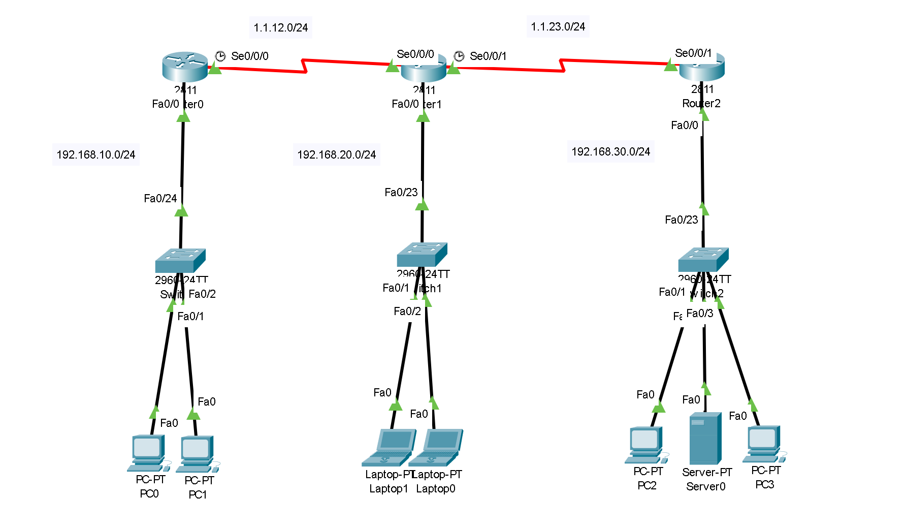

## 개요
이번 글은 기능경기대회 사이버보안 직종을 준비하며<br>
배운 Static Routing에 관해서 적은글이다! 재밋게 봐주길 바란다!

## 라우팅이란?
기본적으로, 스위치는 `모르는 프레임을 받게되면`<br>
플러딩을 통해 그 `출처를 찾고 데이터를 보내지만,`

라우터의 경우, `라우팅 테이블에 존재하지 않는 패킷은`<br>
그대로 `드롭하는 특징을` 가지고 있다!

그렇기에, `다른 네트워크로 패킷을 나가게 하기 위해선,`<br>
라우팅 테이블 업데이트 즉, `길을 알려주는 작업이` 반드시 필요하다!

라우팅에는 `Static, RIP, OSFP`등이 존재하지만,<br>
이번 글에선 `Static 라우팅에` 대해서 다루도록 하겠다!

일단, `Static 라우팅이란,`<br>
`"직접"` 하나 하나씩 경로를 지정해주는 방식으로,

반대의 설정방법인 `Dynamic 라우팅은` 네트워크 관리자가<br>
`모두 경로를 설정해줄 이유가 없는` 반면,<br>
`Static 라우팅은` 모든 경로를 네트워크 관리자가<br>
`지정해줘야 한다는 단점이` 존재한다!

하지만, `Dynamic 라우팅은` 출처를 찾는 과정이 존재해서 `느린` 반면,<br>
`Static 라우팅은` 적혀있는 그대로 보내버리기에,<br>
`부하가 적다는 장점` 또한 존재하는거시다!

## Static 라우팅 설정
이제 `Static 라우팅을` 직접 설정해보도록 하자!<br>
일단 실습을 위해 아래 `토폴로지를` 구생해보도록 하자!<br>
(기본적인 `아이피 설정은` 알아서 한 후 따라오길 바란다!)


이제 모든 아이피 설정을 끝맞쳤으면, Static 라우팅을 해보도록 하자!
아래는 관련 명령어이다! 
```network
[Router0]
Router> enable
Router# configure terminal
Router(config)# ip route 192.168.20.0 255.255.255.0 1.1.12.2
Router(config)# ip route 192.168.30.0 255.255.255.0 1.1.12.2

[Router1]
Router> enable
Router# configure terminal
Router(config)# ip route 192.168.10.0 255.255.255.0 s0/0/0
Router(config)# ip route 192.168.30.0 255.255.255.0 s0/0/1

[Router2]
Router> enable
Router# configure terminal
Router(config)# ip route 192.168.10.0 255.255.255.0 1.1.23.1
Router(config)# ip route 192.168.20.0 255.255.255.0 s0/0/1
```
이제 명령어를 해석해보도록 하자!
일단 기본적으로 Static으로 라우팅을 하는 방법은
`ip route [원하는대역] [서브넷마스크] [인터페이스,주소]`
를 통해 라우팅을 할 수 있다!

기본적으로 `이동할 부분을` 인터페이스로 지정할땐,
`현재 라우터의 인터페이스를` 적어줘야하며,
주소를 적을땐 바로 `옆 라우터의 인터페이스 주소를` 사용해야한다!

끗이다!