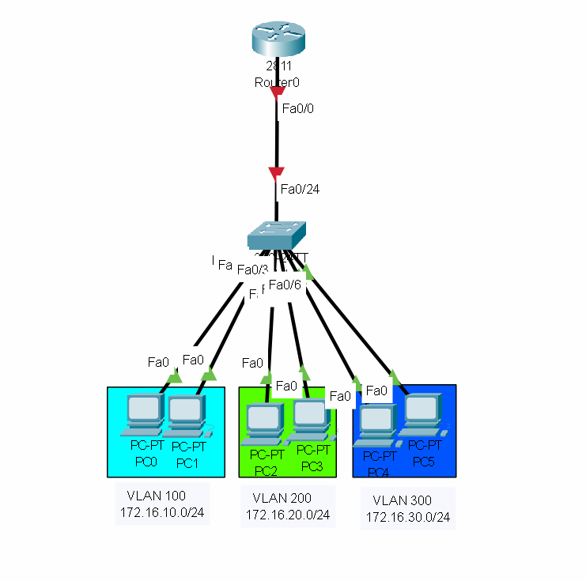
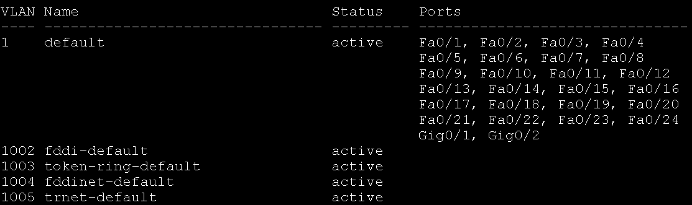
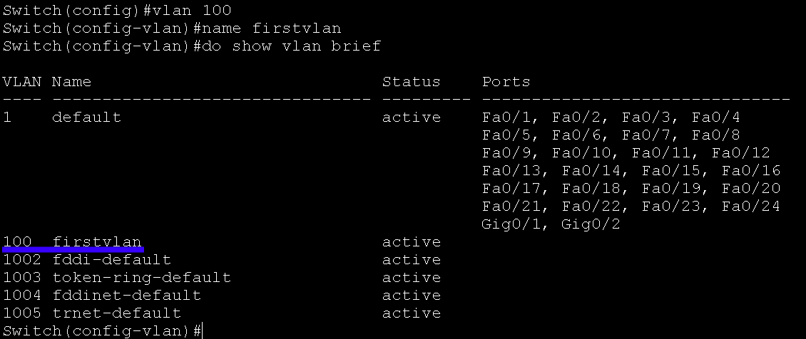
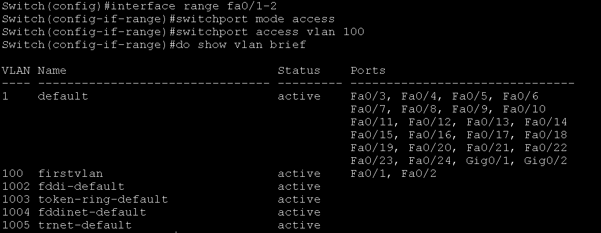
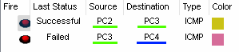
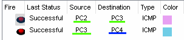
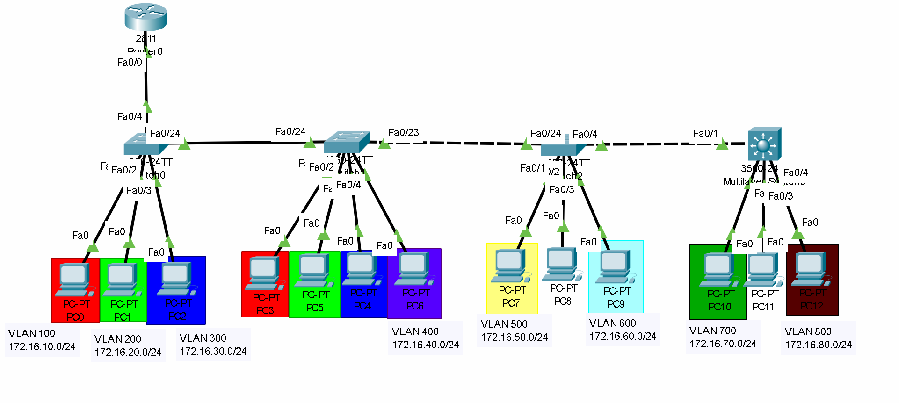

## 개요
이번 글은 기능경기대회 사이버보안 직종을 준비하며<br>
배운 VLAN에 관해서 적은글이다! 재밋게 봐주길 바란다!

## VLAN이란?
VLAN이란 `Virtual Local Area Network`의 줄인말로,<br>
`가상으로 네트워크를 나누는걸` 말한다.

이렇게 말하면 하나도 모르겠기 때문에 자세히 알아보도록 하자.

일단 기본적으로 인터넷상에는 여러가지 네트워크들이 존재한다.<br>
네트워크는 `브로드캐스트 요청이 날아가는 범위`에 따라 <br>
`같은 네트워크`와 `다른 네트워크`의 범위를 나눈다! 

기본적으로 네트워크를 나누는 방법으론 `서브넷팅`과 같이,<br>
`서브넷 마스크를 조정해` 네트워크 주소를 늘리는 방법도 있지만,<br>
스위치에 존재하는 `VLAN`이라는 기술을 통해,<br>
`논리적으로 네트워크를 나눌 수 있다!`

## VLAN 설정
VLAN을 설정하기 위해 일단 `토폴로지`를 아래와 같이 구성해보자!


이후, Switch를 눌러 관리자 모드에 들어간후, <br>
아래 명령어를 입력하면 현재 존재하는 VLAN과<br>
소속된 인터페이스들을 확인할 수 있다!
```network
Switch# show vlan brief
```

사진을 확인해보면, 모든 인터페이스인 `FastEthernet0/1~24`, `GigabitEthernet0/1~2`<br>
인터페이스가 `모두 VLAN 1에 소속`된걸 확인할 수 있었다!<br>
즉, 스위치에선 스위치에 장치를 연결하면 `기본 VLAN인 VLAN 1에 소속`되는걸 알 수 있었고,<br>
이 때문에 스위치에 처음 장치를 연결하면, 장치들끼리 통신이 가능한 이유도 <br>
`같은 VLAN인 VLAN 1`에 소속되어있기 떄문이었다!

즉, 새로운 VLAN을 만들어 인터페이스를 소속시켜주면, <br>
동일한 `VLAN에 소속된 인터페이스끼리만 통신`이 되도록 바꿀수 있다!

이제 직접 해보도록 하자!<br>
아래는 설정에 관련된 명령어다!
```network
Switch> enable (관리자 모드 전환!)
Switch# configure terminal (설정 모드 전환!)
Switch(config)# vlan 100 (100이라는 vlan 생성과 동시에 설정 모드로 전환!)
Switch(config-vlan)# name firstnetwork (Vlan 이름 설정!)
Switch(config-vlan)# interface range fa0/1-2 (fa0/1~2 인터페이스 모드로 전환!)
Switch(config-if-range)# switchport mode access (vlan 모드로 변환!)
Switch(config-if-range)# switchport access vlan 100 (vlan 100번에 소속!)
```
이제 위 명령어들을 해석해보도록 하자!

일단 vlan설정은 설정 모드에서 할 수 있다.<br>
설정 모드에서 `vlan (번호)` 를 입력해, <br>
vlan을 생성함과 동시에 vlan 설정 모드로 변환할수 있으며,<br>
vlan 설정 모드로 변환한 이후, `name (이름)` 을 통해<br>
vlan의 이름을 설정할수 있다!<br>
추가로 `do show vlan brief` 를 사용하면, vlan이 생성된걸<br>
확인할수 있으며, 아래는 vlan이 잘 생성되었는지 확인하는 스샷이다!


이후, 인터페이스를 다른 vlan에 소속시키기 위해선,<br>
인터페이스 설정 모드로 변환해야만 한다,<br>
그렇기에 `interface range fa0/1-2` 를 통해 <br>
한번에 `여러개의 인터페이스를 선택`해 설정 모드로 변환할 수 있다

이후, `switchport mode access` 를 통해 인터페이스를<br>
`vlan 전용 인터페이스`로 만들수 있다.<br>
vlan 전용 인터페이스란, `지정한 vlan 소속 패킷만` <br>
인터페이스를 통과할수 있는 설정이다!

이제 vlan 전용 인터페이스로 설정을 바꿨다면,<br>
어떤 vlan만 인터페이스를 통과할수 있는지 설정을 바꿔줘야 한다!<br>
바로 그 명령어는 `switchport access vlan 100` 인 거시다!

이제 위 명령어를 치고 난후, vlan 상태를 확인해보면,<br>
vlan 100에 `FastEthernet0/1`, `FastEthernet0/2`<br>
두개의 인터페이스가 소속되도록 바뀐것을 볼 수 있었다!


이제 아까 토폴로지에서 적힌대로,<br>
`fa0/1-2`는 `vlan 100`,<br>
`fa0/3-4`는 `vlan 200`,<br>
`fa0/5-6`은 `vlan 300`,<br>
으로 설정하고, 모든 pc에 아이피를 할당해준후,<br>
각각 `같은 vlan과 다른 vlan끼리` 핑을 날려보면,<br>
`같은 vlan끼리는` 통신이 되고, `다른 vlan끼리`는 통신이 되지 않는걸 알 수 있었다!


## 다른 VLAN끼리의 통신<br>
다른 VLAN끼리 통신하기 위해선 `L3 장비가 필요하다`.<br>
왜냐하면 VLAN은 가상으로 네트워크를 나눈거긴 하지만,<br>
결국은 다른 네트워크이기 때문이다!

또한 각 VLAN마다 하나의 네트워크라고 가정하면,<br>
아까 사용한 토폴로지에선 `같은 라우터를 공유하게 되어버린다`.<br>
하지만 한 집안에는 하나의 현관문만 있어야되므로!!<br>
라우터의 `서브 인터페이스를` 사용해 각 VLAN의 게이트웨이를 할당시켜줄것이다!

기본적으로 라우터에서 서브 인터페이스를 접속해,<br>
vlan과 아이피를 설정하는 명령어는 다음과 같다!
```network
Router> enable
Router# configure terminal
Router(config)# interface fa0/0.100
Router(config-subif)# encapsulation dot1q 100
Router(config-subif)# ip address 172.16.10.1 255.255.255.0
```
이제 위 명령어를 해석해보도록 하자!

일단, 라우터의 인터페이스 모드로 변환하려면 설정 모드에서 할 수 있다<br>
설정 모드에서 interface fa0/0.100과 같이 인터페이스에 `.100` 등의 <br>
`서브 번호`를 붙혀서 `서브 인터페이스` 설정 모드로 변환 할 수 있다!

이후, `encapsulation dot1q 100` 명령어를 통해 이 서브 인터페이스는<br>
`vlan 100의 패킷만` 들어올수 있도록 설정할 수 있다!<br>
여기서 dot1q란, 이더넷 헤더에서 프레임에 VLAN 번호를 넣는 표준 방법으로,<br>
대부분은 VLAN을 식별할때 dot1q 방식을 사용하므로, <br>
결국 위 명령어는, `dot1q 방식으로 설정된 vlan 100의 패킷만` 허용한다는 명령어가 되는거시다!

이제 아이피 설정이다!<br>
아이피 설정은 물리 인터페이스와 동일하게 ip address 명령어를 통해 설정할수 있다!<br>
추가적으로 각 VLAN끼리는 `다른 네트워크`로 취급하므로, `각 VLAN마다 다른 대역의 아이피 주소`를 <br>
사용해줘야 한다!

이제 모든 서브 인터페이스에 vlan과 아이피를,<br>
물리 인터페이스에 아이피를 설정해준후,<br>
`다른 vlan`끼리 ping을 날려보면, 설정하기전과 동일하게<br>
다른 vlan끼리는 `통신이 안되는걸` 알 수 있었다!


왜냐하면 바로 `Trunking`이 되지 않았기 때문이다!

## Trunking이란?
기본적으로 스위치의 인터페이스에는 두가지의 모드가 존재한다.<br>
바로 `access` 모드와 `trunk` 모드이다!

`access 모드`는 아까 봤던것과 동일하게,<br>
특정 vlan을 지정해서, `한가지의 vlan 패킷만` 인터페이스를<br>
사용할수 있도록 설정하는 모드이다

그에 반에 `trunk 모드`는 모든 vlan 패킷이<br>
`인터페이스를 자유롭게` 사용하도록 설정하는 모드이다!

다시 토폴로지로 돌아와서, 스위치에서 라우터로 가는 인터페이스인<br>
`fa0/24 부분`은, 결국 모든 `vlan 패킷이 지나가서 라우터로 가는 통로`이다<br>
즉, 모든 패킷이 이동해야되는 부분인거시다!

한마디로, 스위치에서 `fa0/24 인터페이스를 trunk 모드로` 바꿔줘야만,<br>
`모든 패킷이 라우터로` 감으로써, 통신이 원할하게 될수 있다!

아래는 모드를 바꾸는 명령어이다!
```network
Switch> enable
Switch# configure terminal
Switch(config)# interface fa0/24
Switch(config)# switchport mode trunk
```
이제 위 명령어를 해석해보도록 하자!

정말 간단하다!<br>
그냥 설정모드로 들어가서 원하는 인터페이스를 지정한후<br>
`switchport mode trunk` 만 쳐주면 끝이 나는거시다!

이제 모든 설정을 마쳤으니, <br>
다른 vlan끼리 통신을 해보도록 하자!


`와!`

통신이 성공하였다!

## 기타 유의할점!

여러 네트워크를 만지작거리다 보면, `스위치와 스위치를` 연결하고,<br>
각 스위치마다 동일한 vlan을 사용할때가 가끔씩 생긴다.

그것이 바로 위에 토폴로지이다,<br>
일단, 오른쪽부터 각각 `스위치1, 스위치2, 스위치3, 스위치4`라고 가정한다면!<br>
원래대로 설정했다고 했을때, `스위치1`에는 `vlan 100~300`을 만들었을것이고,<br>
`스위치2`에는 `vlan 100~400`을 만들었을것이다!

하지만, `스위치1`은 `스위치2`가 `라우터를 지나기 위해서 꼭 거쳐야 하는 부분`이므로!<br>
`vlan 400`의 패킷도 `스위치1`을 지날것이다!

하지만, 스위치는 `학습되지 않은 vlan 패킷`이 오게 되면,<br>
`패킷을 그대로 드롭`시켜버린다.<br>
즉 패킷들이 모두 사라져버리는것이다!

하지만 모든 패킷은 라우터로 가기를 원하기에!<br>
`스위치1`에는 연결된 `모든 스위치에 vlan을` 학습시켜줘야 될거시다!

즉, 모든 스위치는 현재 연결된 모든 vlan을 학습하고 있어야하기에,<br>
`모든 스위치에게 vlan 100~800`를 모두 만들어줘야 되는것이다!!

추가로, `스위치 4`는 다른 스위치와 먼가 다르게 생겻다.<br>
그 이유는 `스위치 4`는 `L3 스위치`이기 때문이다!<br>
`L3 스위치`란, 라우터처럼 3계층의 일까지 수행하는 `엄청난 스위치`이다!

이 `엄청난 스위치`는 트렁킹을 하기 위해서 적어줘야할 명령어가 하나 더 존재한다!<br>
아래는 `엄청난 스위치`의 트렁킹 설정을 하는 명령어이다!
```network
Switch> enable
Switch# configure terminal
Switch(config)# interface fa0/1
Switch(config-if)# switchport trunk encapsulation dot1q
Switch(config-if)# switchport mode trunk
```

이제 이 엄청난 스위치의 명령어를 자세히 보면<br>
`switchport trunk encapsulation dot1q` 이 명령어가 새로 생긴걸 알 수 있었다!<br>
이제 이 명령어에 대해서 자세히 알아보도록 하자!

기본적으로 스위치는 dot1q 규격만 제공한다.<br>
즉, `switchport mode trunk`만 적어도 <br>
알아서 `dot1q로 인식`하고 사용한다는거시다!

하지만, L3 스위치는 dot1q 규격을 제외한 여러가지<br>
`규격을 제공`하기에, `dot1q 규격이라고 제대로 지정`을 해줘야만 한다!

끗이다.