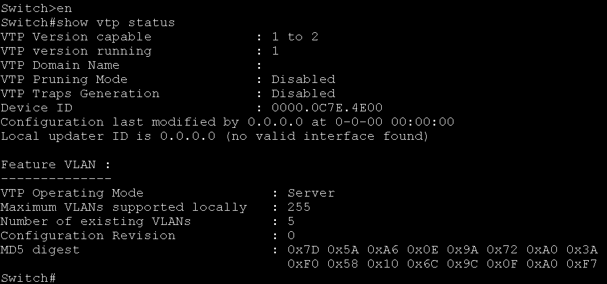
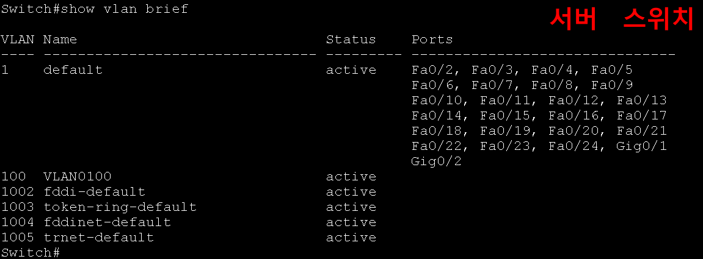
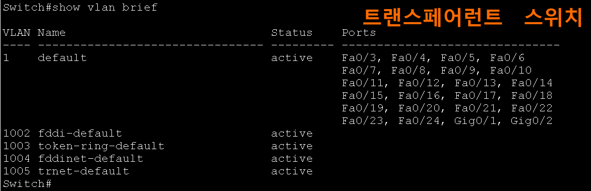
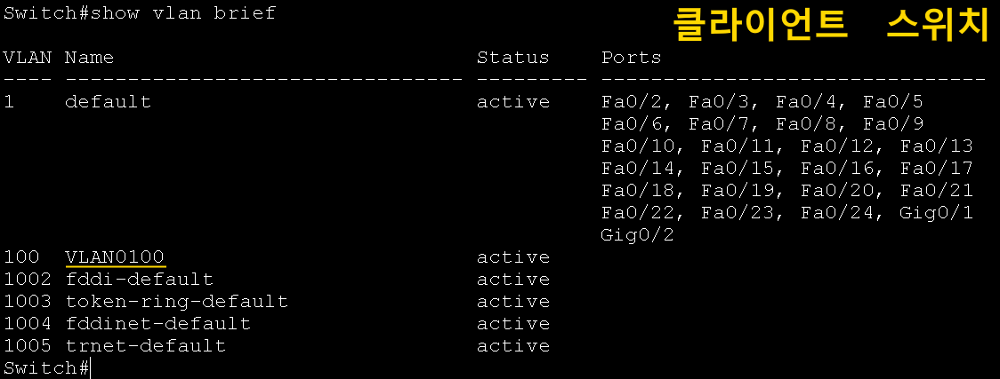
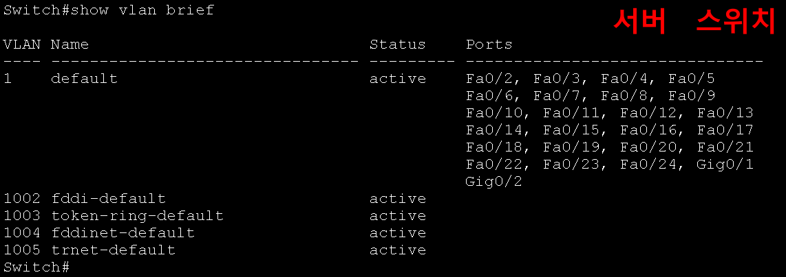
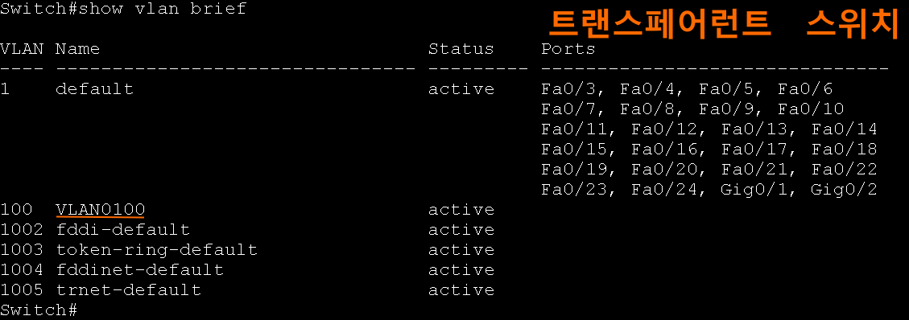
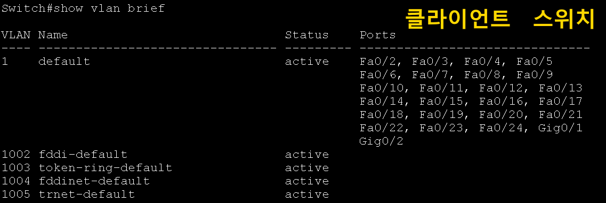
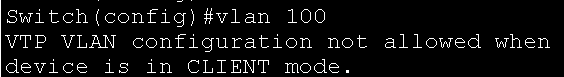

## 개요
이번 글은 기능경기대회 사이버보안 직종을 공부하며, <br>
VT 프로토콜에 대해 정리한 글이다!<br>
재밋게 봐주길 바란다!

## VTP 이란?
우린 이전 VLAN 글에서 `스위치와 스위치가` 연결되어있을때,<br>
어떤식으로 VLAN을 구성해야하는지 배웠다.

기본적으로 스위치간의 패킷이 지나가는 인터페이스에는 트렁킹을 해주어야했고,<br>
또한 현재 스위치에서 `특정 VLAN을 사용하지 않더라도,`<br>
연결된 다른 스위치에서 VLAN을 사용한다면,<br>
꼭 `현재 스위치에 특정 VLAN을 만들어 줘야 한다는 거였다!`

즉, 물리적으로 연결된 네트워크에 있는 모든 VLAN을<br>
`모든 스위치마다 생성해줘야만`,정상적인 통신이 가능한다는것이다!

**`하지만`**

위와 같이 모든 스위치에 VLAN을 만들어주는것은,<br>
`소형 네트워크에서는` 어느정도 쉽게 할 수 있지만,<br>
`스위치가 몇십대가 넘어가는 네트워크에선`,<br>
특정 스위치에 VLAN 설정을 바꾸면 <br>
몇십대의 스위치도 동일하게 바꿔줘야하는 `엄청난 상황이` 일어나게 되는거시다!

그래서, 시스코는 이 엄청난 상황을 막기 위해 프로토콜을 만들게 되는데 <br>
그거시 바로 `"Virtual Lan Area Network Trunking Protocol"` 이다!<br>
(이름 엄청기네 ;;)

## VTP 기본 개념
그래서 이제부터 `VTP에 대해서` 알아보도록 하자!   <br>

일단 VTP에는 `스위치 모드가` 존재하게 되는데,<br>
바로 `Server 모드, Client 모드, Transparent 모드`<br>
총 3가지가 존재하게 되는것이다!

일단 기본적으로 스위치는 `처음 만들어질때 Server 모드로` 존재하게 되며,<br>
`Server 모드는` VLAN을 `마음대로 설정할 수 있고,` 근처에 VTP로 연결된 스위치가 있다면,<br>
`현재 설정에 관한 정보를 넘겨주는 모드이다!`

`Client 모드는` VLAN을 `마음대로 설정할 수 없고`<br>
Server 모드에서 온 `VLAN정보를 그대로 업데이트 하는 기능을 가지고 있다!`<br>
또한 추가로 근처에 VTP로 연결된 다른 스위치가 있다면 <br>
`현재 설정에 관한 정보를 그대로 넘겨주는 모드이다!`

또한 `Transparent 모드는` VLAN을 `마음대로 설정할 수 있지만`,<br>
Server 모드에서 온 `VLAN 정보를 업데이트 하지 않고`, <br>
VTP로 연결된 다른 스위치가 있다면 `그대로 넘겨주는 모드이다!`

## VTP 설정
앞서, 스위치는 기본적으로 `처음엔 Server 모드로 설정 되어있다고 했다.`<br>
이제 앞서 말한 내용이 진짜인지 확인해보도록 하자!

일단 기본적으로 VTP에 관한 설정을 확인하기 위해선, <br>
관리자 모드안에서 아래 명령어를 적으면 된다!
```network
Switch# show vtp status
```

이걸 직접 처음 꺼낸 스위치에 적어보면

`Server 모드로 설정되어있는걸` 알 수 있다!

이제 Server 모드인것이 확인되었으니,<br>
직접 VTP를 쓰며 익혀보도록 하자

일단, VTP를 익히기위해 아래 토폴로지를 구성해보도록하자!

구성이 끝났으면,<br>
빨간색 스위치는 `Server 모드,`<br>
주황색 스위치는 `Transparent 모드,`<br>
노란색 스위치는 `Client 모드로` 지정을 해줄것이다!

### 빨간색 스위치 설정정
아래는 빨간색 스위치에 관한 설정이다!
```network
Switch> enable
Switch# configure terminal
Switch(config)# vtp domain cisco
Switch(config)# vtp password 1234

Switch(config)# interface fa0/1
Switch(config)# switchport mode trunk
```
이제 명령어를 해석해보도록 하자!<br>
기본적으로 vtp 설정은 `설정 모드에서` 할 수 있다.<br>
그래서 설정 모드로 변환해준후 `도메인과 비밀번호를 설정해주었다!`<br>
왜냐하면, vtp를 활성화하기 위해선, 기본적인 비밀번호와 도메인을<br>
`무조권적으로 설정해주어야하기` 때문이다!<br>
이후, 주황색 스위치가 연결되어있는 `1번 포트를 트렁킹 해주었다!`<br>
왜냐하면, 기본적으로 VTP 패킷은 VLAN 정보에 관한 프로토콜이기에,<br>
`트렁킹된 인터페이스에서만 보내질수 있도록 되어있기 때문이다!`<br>
(추가적으로 모드를 설정해주지 않은 이유는 스위치가 `이미 서버 모드이기` 때문이다!)

### 주황색 스위치 설정
```network
Switch> enable
Switch# configure terminal
Switch(config)# vtp mode transparent
Switch(config)# vtp domain cisco
Switch(config)# vtp password 1234

Switch(config)# interface fa0/2
Switch(config)# switchport mode trunk
```
이제 명령어를 해석해보도록 하자!<br>
앞서 말했듯, vtp 설정은 `설정 모드에서` 가능하므로,  <br>
설정 모드로 변환해준후 `모드와 도메인, 비밀번호를 설정해주었다!`<br>
또한 여기서, 빨간색,노란색 스위치와 vtp를 연결하기 위해선,<br>
`같은 호스트와 같은 도메인을 사용해주어야만 연결이 된다는걸` 잊지 말도록 하자!<br>
이후, 노란색 스위치가 연결되어있는 `2번 포트를 트렁킹 해주었다!`<br>
추가적으로 1번 포트에 트렁킹을 하지 않은 이유는<br>
`빨간색 스위치의 1번 포트에 이미 트렁킹이 되어있기 때문이다!`

### 주황색 스위치 설정
```network
Switch> enable
Switch# configure terminal
Switch(config)# vtp mode client
Switch(config)# vtp domain cisco
Switch(config)# vtp password 1234
```
이제 명령어를 해석해보도록 하자!<br>
앞서 말했듯, vtp 설정은 `설정 모드에서` 가능하므로,  <br>
설정 모드로 변환해준후 `모드와 도메인, 비밀번호를 설정해주었다!`<br>
또한 여기서, 주황색 스위치와 vtp를 연결하기 위해선,<br>
`같은 호스트와 같은 도메인을 사용해주어야만 연결이 된다는걸` 잊지 말도록 하자!<br>
추가적으로 모든 인터페이스에 `아무 트렁킹도 해주지 않은` 이유는<br>
`주황색 스위치의 2번 포트에 이미 트렁킹이 되어있기 때문이다!`

## 서버 모드 스위치 정보 변경
이제 모든 설정을 마쳤으니, 직접 `서버 모드 스위치의 vlan을 만들어보도록 하자!`<br>
아래는 vlan을 만드는 명령어이다!
```network
Switch> enable
Switch# configure terminal
Switch(config)# vlan 100
```

아래는 서버 스위치에서 vlan을 만든뒤, 각각의 스위치의 vlan 상태를 출력한것이다!



이제 사진을 분석해보도록 하자.

일단, `서버 스위치에는` 당연하게도 `vlan 100이 만들어진걸 알수 있다.`<br>
또한 Transparent 모드인 `주황색 스위치는` 아무 vlan도 `만들어지지 않은걸` 볼수있다!<br>
왜냐하면 Transparent 모드는 vlan에 정보가 오게 되면, 옆에 스위치로 그대로 넘기고,<br>
`정보에 대한 업데이트는 하지 않는것이` 특징이다.<br>
그럼, 이 상태에서 예측할수 있는건, 노란색 스위치에게 vlan 정보를 그대로 넘기고,<br>
자신은 업데이트 하지 않은걸 알 수 있다.<br>
이제 Client모드인 `노란색 스위치를` 확인해보면 `vlan 100이 만들어진걸` 알 수 있다!<br>
왜냐하면 Client모드는 vlan 정보가 오게되면, 그`대로 수용하는 역할을 하기 때문이다!`

## 트랜스페어런트 모드 스위치 정보 변경<br>
이제 서버모드의 스위치를 변경해보았으니, 모든 스위치에 vlan 정보를 지운후,<br>
`트렌스페어런트 모드인 주황색에 다시 한번 vlan을 만들어보도록 하자!`<br>
아래는 vlan을 만드는 명령어이다!
```network
Switch> enable
Switch# configure terminal
Switch(config)# vlan 100
```

아래는 서버 스위치에서 vlan을 만든뒤, 각각의 스위치의 vlan 상태를 출력한것이다!



이제 사진을 분석해보도록 하자.

일단 Transparent 모드인 `주황색 스위치에는` 당연하게도 `Vlan이 생성된걸 볼 수 있다.`<br>
하지만, 서버 스위치와 클라이언트 스위치는 `VLAN이 만들어지지 않은걸 볼 수 있었다!`<br>
왜냐하면, Transparent 모드는 요청이 왔을때만,<br>
그 요청을 `그대로 옆으로 보내는 역할을 하고` 자신이 설정을 바꿀때는, <br>
`아무 스위치한테도 정보를 주지 않는 모드이기 때문이다!`

## 클라이언트 모드 스위치 정보 변경
일단 클라이언트 모드에서 VLAN을 만들어보면 다른 스위치와 다르게,<br>
아래 사진처럼 `에러가 뜨는걸 알 수 있다!`

왜냐하면, client 모드는 정보가 오면 그 정보를 업데이트 할 뿐,<br>
`자신이 직접 정보를 수정할수 없기 때문이다!`

## 마치며
이제 글이 끝나게 되었다!<br>
소감은 항상 각각의 스위치마다 VLAN 추가해주는게 엄청 귀찮았는데<br>
이번 기회에 좋은거 배워가는거 같다!

`끗이다!`