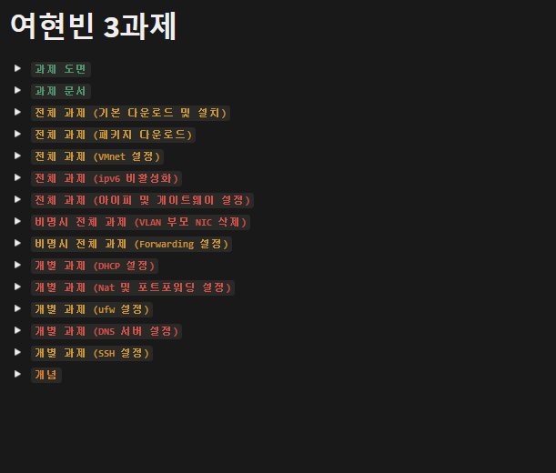
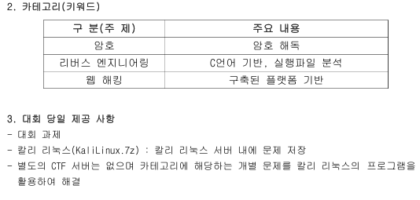
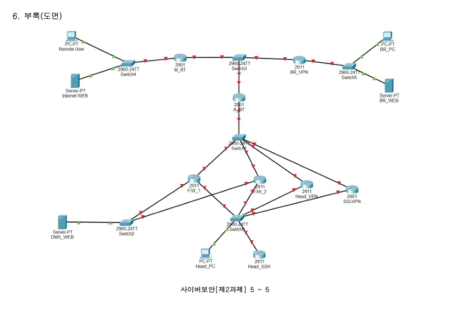
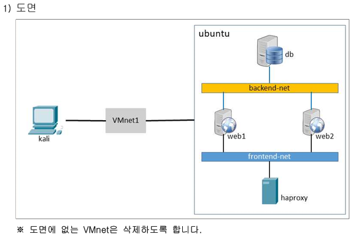
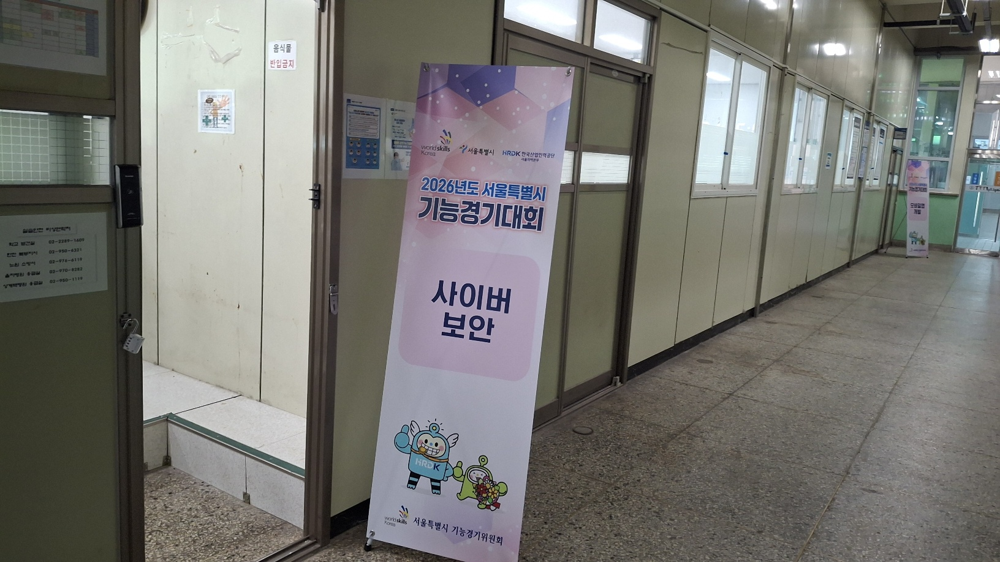
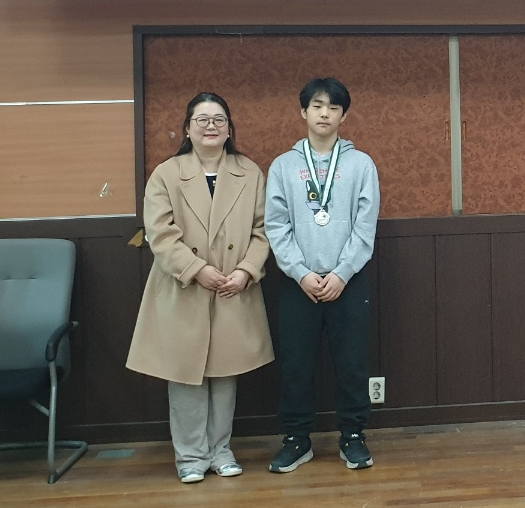

## 개요
저번주 월화수에 `서울기능경기대회 사이버보안에` 출전했고, 
`은상` 쌀먹이랑 `전국 대회 출전권을` 얻고 왔다 
이제 이번 포스트로 지방 대회 후기를 남겨보도록 하겠다! 

## 들어가며
나는 학교에서 기능경기대회 준비반을 지원하는걸 보고 2025년 12월에 지원하여 들어가게 되었다.  
이후 기능반에 들어간 이후 사실 몇달동안은 느슨하게 작년 `지방 2,3과제를` 깔짝거리며 놀다가  
방학이 끝난후 정신차리고 `2,3과제 기출을` 풀어보며 팀 노션에 정리하면서 공부하기 시작했던거같다  

그리고 2,3과제 정리를 하면서 시간을 보내다가, 대회 날짜 한달전이 되었다  
또한 2026년도 2,3과제가 공개되었는데, 각 과제 후기는 아래에서 풀도록 하겠다  

## 1과제 준비
1과제는 CTF `암호학, 리버싱, 웹 분야`였는데, 본인은 포너블이 주분야인지라 
각 분야 문제들을 드림핵에서 쌀먹하면서 풀다가 출전하게 되었다. 
그리고 CTF같은경우는 진짜 딱 분야만 알려줘서 그냥 `드림핵 1~3레벨만` 밀고 있었는데, 
사실 대회 제공 파일로 `칼리 VM만` 제공해준다고 적혀있었고 기능대회는 인터넷을 끊고하기에 
`리버싱은` 어셈블리로만, `웹은` Burpsuite 없이, `크립토는` Sagemath 없이  
푸는 방식을 연습하였다. 또한 2,3과제를 외우느라 1과제에 많이 시간을 못써서
아쉬운 부분도 있었던 과제였다.  

## 2과제 준비
2과제 같은 경우는 `패킷 트레이서를 통해 토폴로지를` 구축하는것이었는데, 
대회 진행 한달전에 문제를 공개해주어서, 싹다 풀어보고 외우는식으로 진행했다 
또한 2과제의 경우, `문제 요구사항, 문제지, 채점 기준표는` 제공해주었지만, 
토폴로지 채점 파일인 `pka 파일을 제공 안해줘서`, 이미지 그대로 토폴로지를  
`직접 구축한후` 진행 하게 되었다. 추가적으로 작년 2과제는 구축해야할것이 생각보다 개많아서   
살짝 쫄아있는 상태였는데 막상 공개된 문제는 생각보다 할만해서 좋았던거 같다. 

## 3과제 준비
3과제는 리눅스 서버 구축이었다 Vmware에서 `도커를 통해` 서버를 구축하는것이었는데 
포너블하면서 `도커를 많이 만져봤어서` 처음 공개되고 풀어볼때 작년에 비해 쉽게 풀었던거 같다 
왜냐하면 작년은 도커를 통한 구축이 아니라 실제 리눅스 설정 파일을 고치는것이었기 때문이다 

## 대회 당일
대회 당일날 서울 대회는 `경기기계공업고등학교에서` 진행하였다. 
특히, 경기기계공업고등학교는 이전에 `대학 캠퍼스였다고` 들었는데 고등학교 치고 엄청 커서 
조금 놀랐다 (길도 살짝 잃었었다 ㅎ) 

 

### 1과제 실전
대회 당일 월요일날에는 1과제를 진행하게 되었다. 
이전에 공개된게 분야밖에 없어서 개쫄아있는 상태로 문제 파일을 열었는데. 
리버싱 2문제, 웹 2문제, 크립토 4문제였었고 
생각보다 쉬운 문제들이었다 (`기초 SQLI, Base64 디코딩, 역연산등`) 
근데 문제 풀면서 당황했던건, 최소 칼리에 GDB는 깔려있을줄 알고  
어셈블리로 연습했었는데 아예 `GDB도 제공을 안해줘서` 상당히 당황했었다.  
(그래서 그냥 `objdump로` 풀이했다;)  

또한 왠만한 CTF의 경우 리모트 환경을 제공해줘서 로컬에서 플래그를 가져오는걸 
방지하는 방식으로 진행하는데, 기능 대회는 그냥 `로컬에 플래그를 박아둬서` 좀 많이 당황했다. 
(특히 웹쪽은 소스 찾으려고 find 쳤는데 소스안에 플래그가 있어서 많이 당황했다)  

그리고, 암호학쪽은 뭐가 나올지 몰라서 `RSA, Aes 벼락치기를` 했는데  
진짜 그냥 파이썬 역연산이어서 좀 당황했다.  

일단 결과는 2문제 제외 모두 솔브하였다.  
`리버싱` 하나랑 `크립토` 하나였는데 남은 리버싱 하나는 
`모든 대회 참여자가 풀이하지 못했다.` 리버싱 문제 같은 경우는 
칼리 안에 `radare2라는 디버거가` 있긴 했는데 
이걸 활용하는 문제였던거 같다 왜냐하면 Objdump의 경우, 
정적으로만 분석할수 있었기에, `스택이나 DS에 어떤 값이` 들어있는지 
확인을 못했다 그에 반에 radare2는 디버거라서 그게 가능했다. 
근데 본인은 `radare2 명령어를` 몰라서 풀이하지 못했다. 
(아니 누가 요즘 들어보지도 못한 radare2를 쓰냐고)  

추가적으로 크립토 문제는 그냥 내가 멍청해서 못풀었다  
복호화 로직을 다 짰는데 모듈러 연산을 `아스키 전체 범위만` 시도하고 
`알파벳 단위로` 돌릴생각을 하지 못했다  
(금상 탄 학교 친구는 이 문제를 풀어서 금상을 탔다) 

### 2과제 실전
대회 당일 화요일날에는 2과제를 진행하게 되었다. 
사실 어짜피 암기 과목이기도 하고, 기능반 친구들이랑 모의대회를 
진행했을때 항상 `왠만해선 다 맞았어서` 딱히 전날 준비를 빡세게 하고 가진 않았다 
이후 대회 당일날 제공된 Pka를 통해서 문제를 풀이하였는데 
Pka에 문제에 `명시되어있지도 않은 필터링이 걸려있어서` 다 풀이하고도 점수가 깎였었다 
그 외에는 모두 잘 했고 채점기준표에도 모두 맞게 구성해서 
Pka 오류만 제외하면 만점으로 넘어가게 되었다. 
(어짜피 Pka오류는 참가자 모두한테 해당되는거라 사실상 만점이었다)   

### 3과제 실전
대회 당일 수요일날에는 `3과제를 진행하게 되었다.` 
3과제 또한 암기 과목이기도 하고 모의대회에서 왠만해선 다 맞았어서 
전날 딱히 준비하고 가지 않았다. 3과제 같은 경우는 딱히 문제에 오류는 없었고 
그냥 깔끔하게 하던대로 해서 `만점으로` 넘어가게 되었다 
(내 컴퓨터만 압축 푸는데 5분 넘게 걸리는 이슈가 있긴했다) 

## 수상식
수상식은 3과제가 끝난 당일날 진행하게 되었다. 
상은 은상을 받았고, 아쉽게 `1과제 한문제 차이로 은상을` 받게 되었다 
또한 대회를 직접 뛰어보기전에는 어짜피 `취업보단 특기자가 목표라` 
`지방 대회상이랑 적당한 실적만` 먹고 다시 주 분야인 `포너블을` 공부하려했는데 
지방이 생각보다 쉬워서 전국도 할 만 할거같다는 생각을 하게 되었다 
끗이다 

